# Đề Toán vào 6 — Lê Văn Thiêm (2024)

câu 1 đến câu 14 vào tờ giấy kiếm tra)

Câu 1. 3 giờ 45 phút = … giờ. Số thập phân thích hợp điền vào chỗ chấm (…) là:

A. 3,25 giờ

B. 3,75 giờ

C. 3,45 giờ

D. 3,075 giờ

Câu 2. Phân số 65 10 gấp số 0,65 mấy lần?

A. 10 lần

B. 0,1 lần

C. 100 lần

D. $$\dfrac{1}{000}$$ lần

Câu 3. Hai số a và b có 𝑎 – 𝑏 = 45,9 và a b = 5 2 . Vậy số a là:

A. 67,5

B. 66,5

C. 3,06

D. 76,5

Câu 4. Một hình tròn có diện tích là $$12{,}56\,\mathrm{cm}^{2}$$ . Chu vi của hình tròn đó là:

A. 12,56 cm

B. 6,28 cm

C. 125,6 cm

D. 50,24 cm

Câu 5. Hai số có trung bình cộng là 13,9 và hiệu hai số là 4,8. Số bé là:

A. 16,3

B. 12,5

C. 11,5

D. 4,55

Câu 6. Một bể nước dạng hình hộp chữ nhật có thề tích là $$3{,}6\,\mathrm{m}^{3}$$ , chiều dài 2 m, chiều rộng 1,5 m. Vậy chiều cao của bể nước đó là:

A. 1,8 m

B. 0,12 m

C. 12 m

D. 1,2 m

Câu 7. Nếu 6 người cùng làm một công việc thì xong trong 15 ngày. Biết mức làm của mỗi người đều như nhau thì muốn làm xong công việc đó trong 10 ngày cần phải bổ sung thêm số người là:

A. 4 người

B. 5 người

C. 3 người

D. 9 người

Câu 8. Biết 15% của a là 4,5. Số a là:

A. 30

B. 3

C. 300

D. 67.5

Câu 9. Lúc 6 giờ sáng, một xe tải đi từ A để đến B với vận tốc trung bình 56 km/h. Lúc 7 giờ sáng cùng ngày, một xe khách đi từ B đến A với vận tốc trung bình 60 km/h. Hỏi hai xe gặp nhau lúc mây giờ? (biết rằng quãng đường AB dài 346 km).

A. 9 giờ 25 phút

B. 9 giờ 30 phút

C. 8 giờ 25 phút

D. 8 giờ 30 phút

Câu 10. Diện tích của một hình chữ nhật thay đổi thế nào nếu đồng thời tăng chiều dài thêm 20% và giảm chiều rộng đi 10% độ dài của nó?

A. Diện tích tăng thêm 10%

B. Diện tích tăng thêm 8%

C. Diện tích tăng thêm 15%

D. Diện tích tăng thêm 0,8%

Câu 11. Trên một đoạn đường thẳng có độ dài 1,5 km người ta trồng cây bóng mát hai bên đường. Biết rằng cứ hai cây liền nhau đều cách nhau 6 m và hai bên đầu đường đều trồng cây. Hỏi người ta đã trồng tất cả bao nhiêu cây trên đoạn đường đó?

A. 251

B. 250

C. 502

D. 500

Câu 12. Hiện nay, tuổi mẹ gấp 5 lần tuồi con. Khi tuổi con bằng tuổi mẹ hiện nay thì tồng số tuổi của hai mẹ con là 84 tuổi. Tuổi con hiện nay là:

A. 5 tuổi

B. 4 tuổi

C. 7 tuổi

D. 6 tuổi

Câu 13. Có bao nhiêu số tự nhiên khác 0 nhỏ hơn 1 000 chia hết cho 3 nhưng không chia hết cho 5?

A. 133

B. 268

C. 267

D. 266

Câu 14. Số tiếp theo của dãy số 4; 6; 10; 14; 22; 26; 34; … là:

A. 46

B. 38

C. 36

D. 44

B. PHẦN TỰ LUẬN (3 điểm):

Câu 15.

a) Tính bằng cách hơp lý: 8 14 17 + 6 3 17 - 5 2 3

b) Tìm x, biết: 6 + 7 + 8 + 9 + … + 𝑥 = 195 (các số hạng là các số tự nhiên liên tiếp)

Câu 16. Cho hình vuông ABCD. Trên AB lấy điểm M sao cho AM=MB, nối M với D, M với C.

a) Hỏi diện tích hình tam giác DMC gấp mấy lần diện tích hình tam giác DMA?

b) AC cắt MD tại N. Biết diện tích tam giác AND là $$5\,\mathrm{cm}^{2}$$ . Tính diện tích hình vuông ABCD.

--- HẾT ---

## Hình minh họa

*(Ảnh trang đề / scan — có thể là cả trang)*

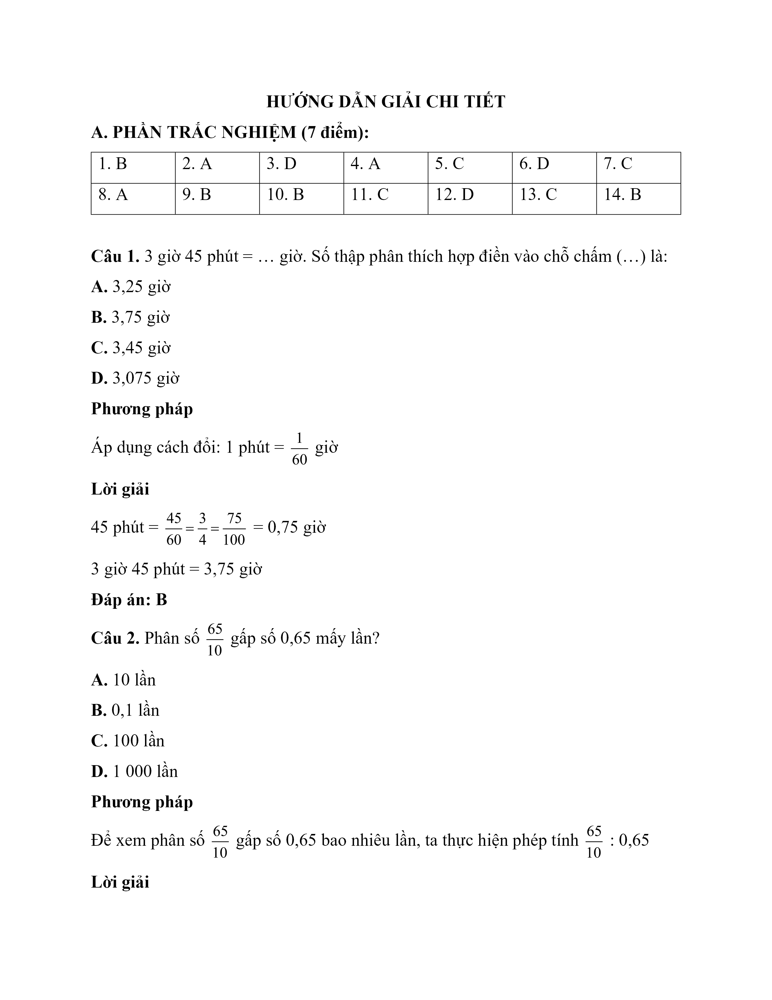

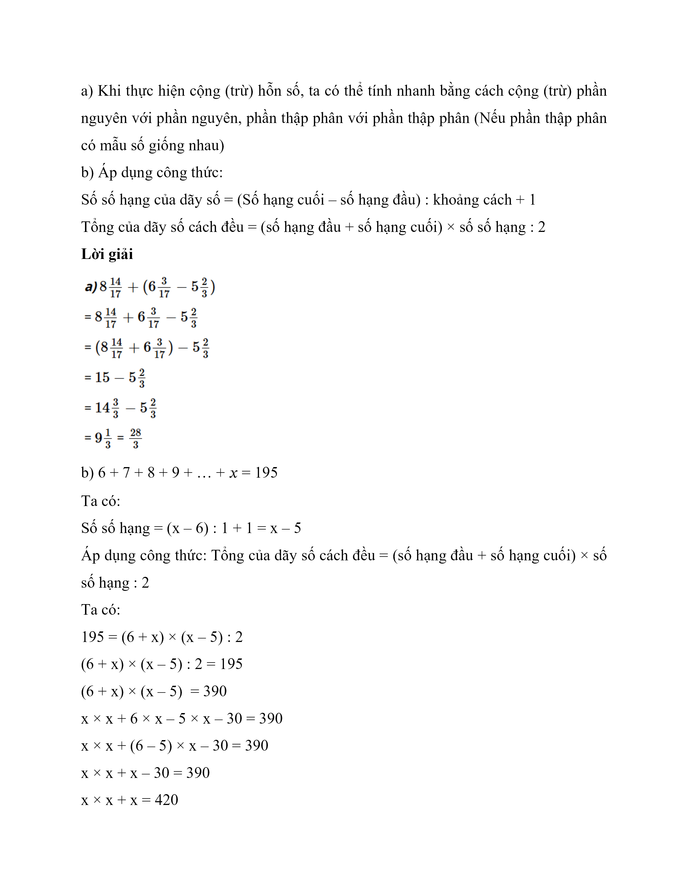

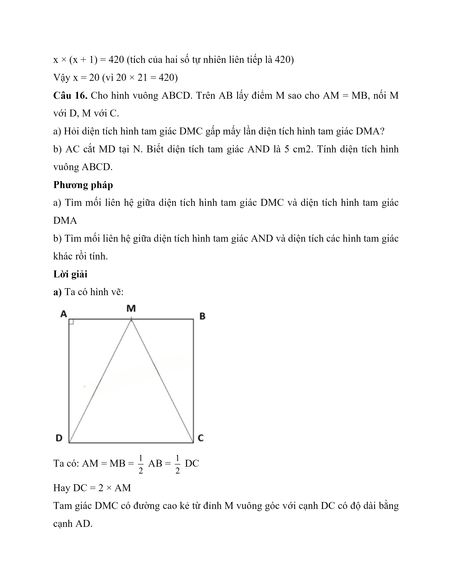

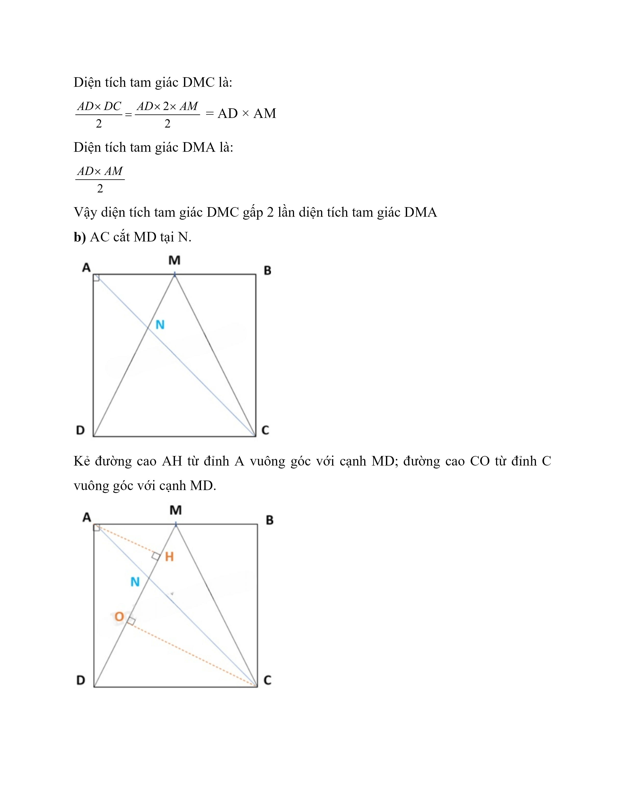

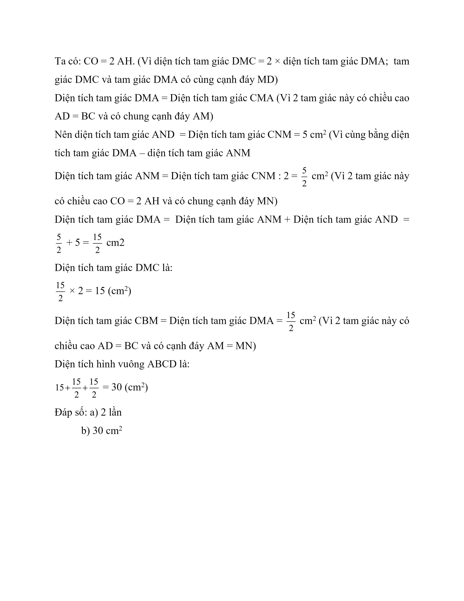

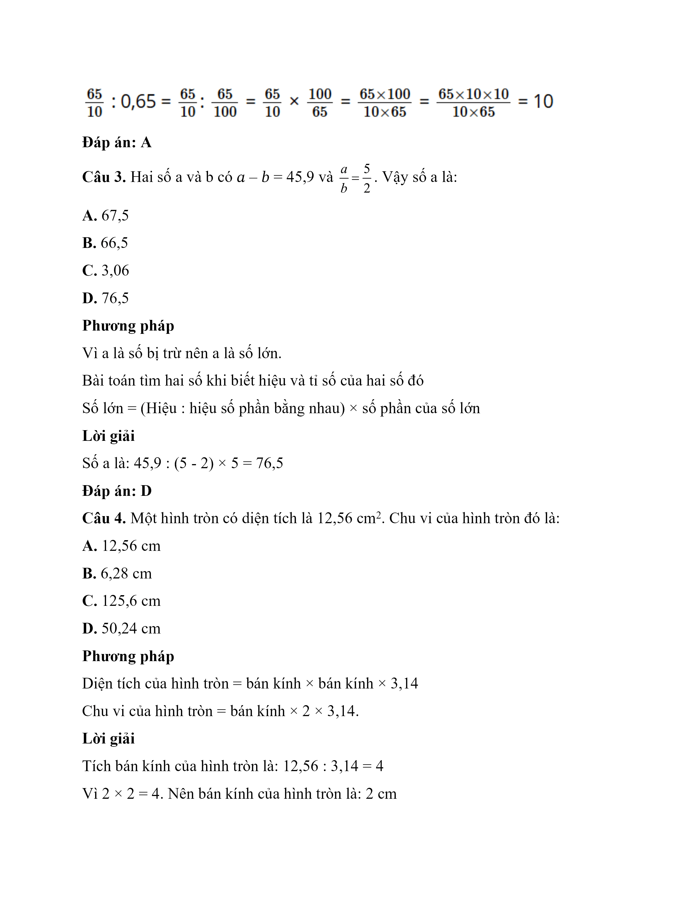

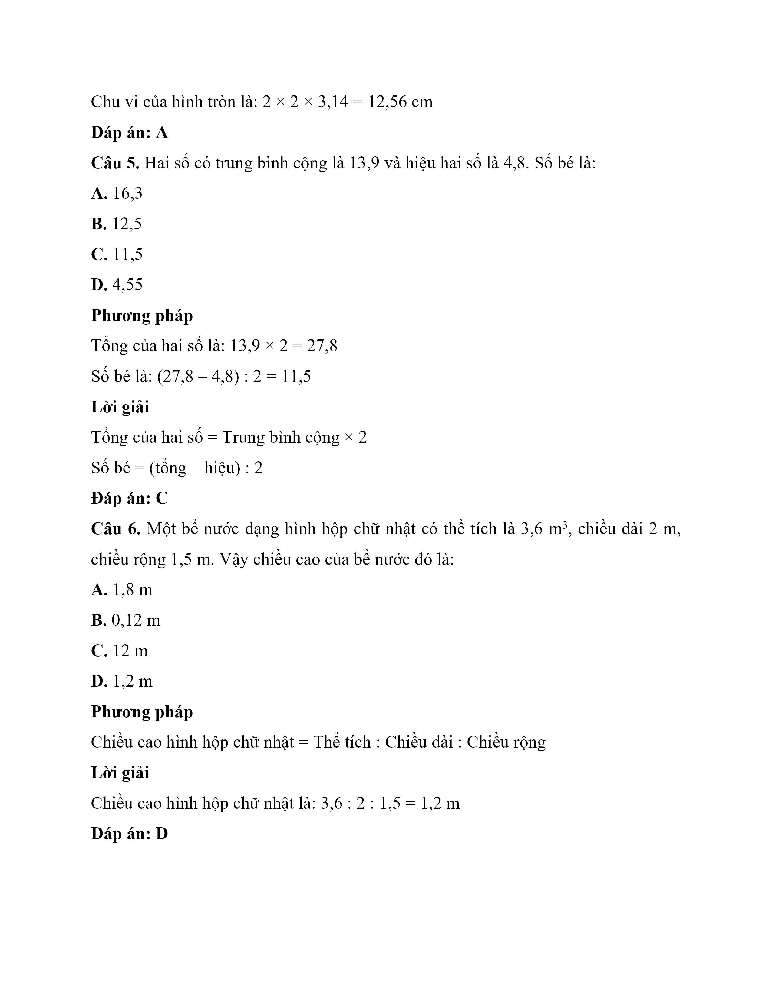

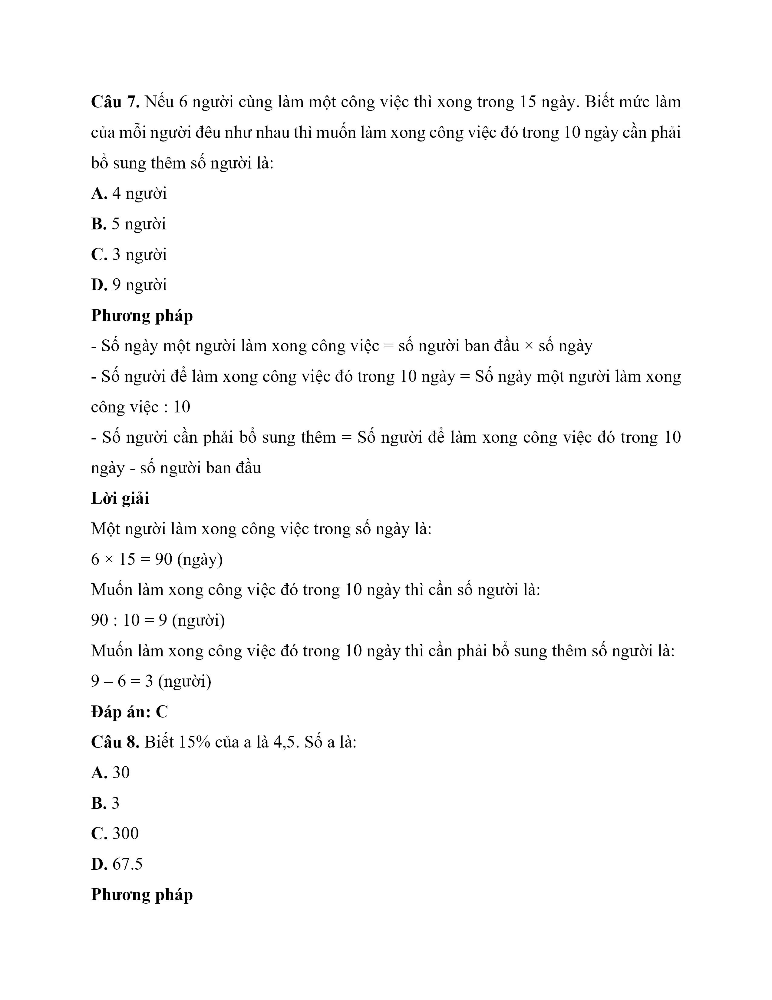

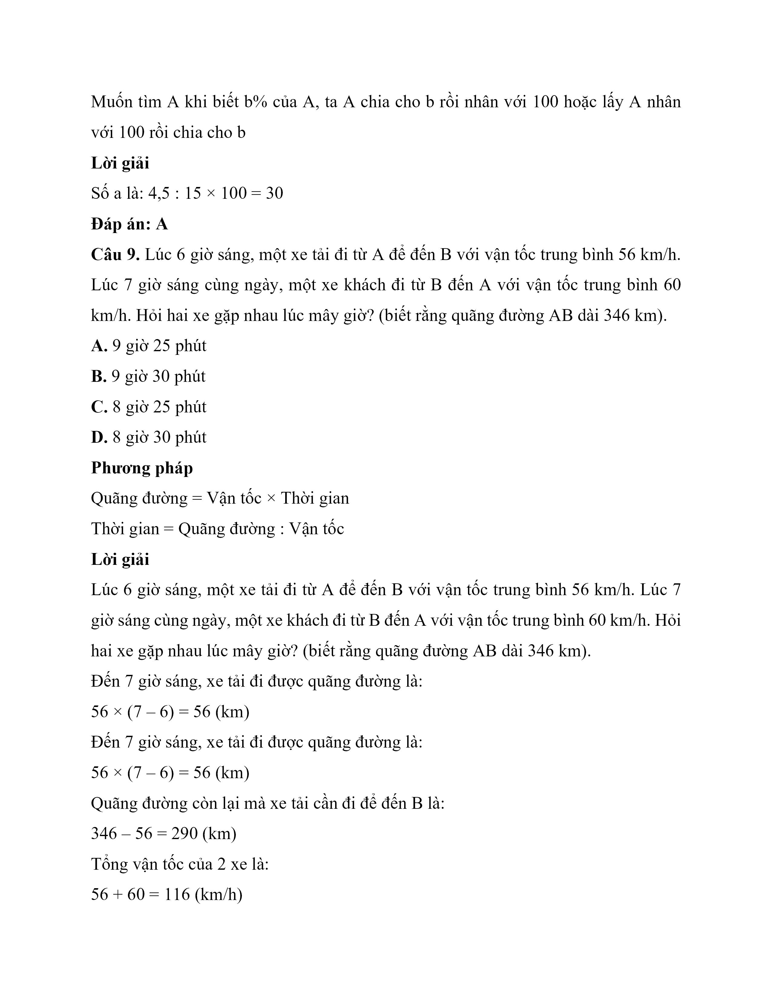

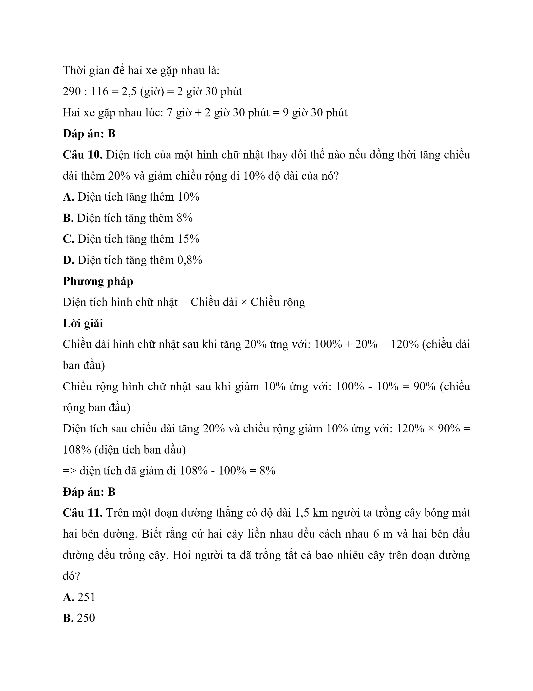

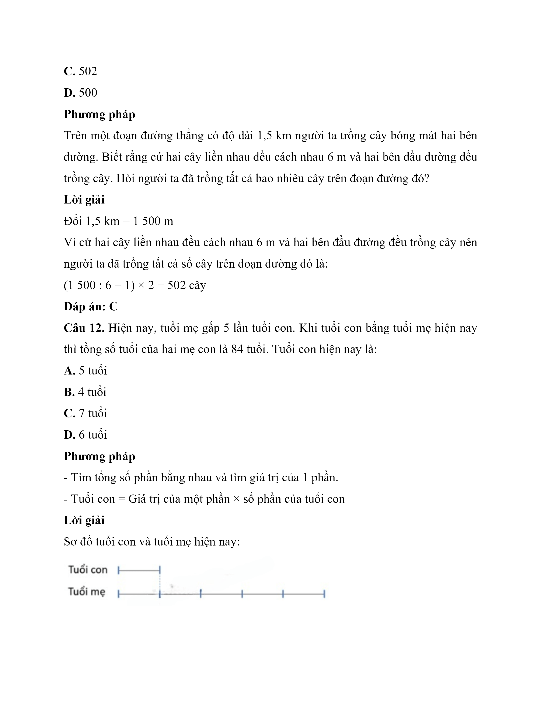

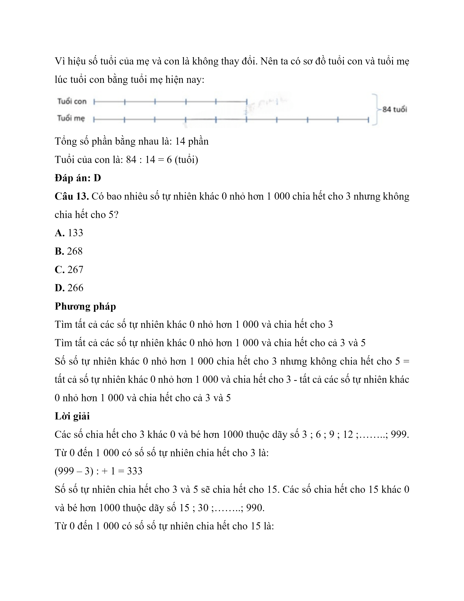

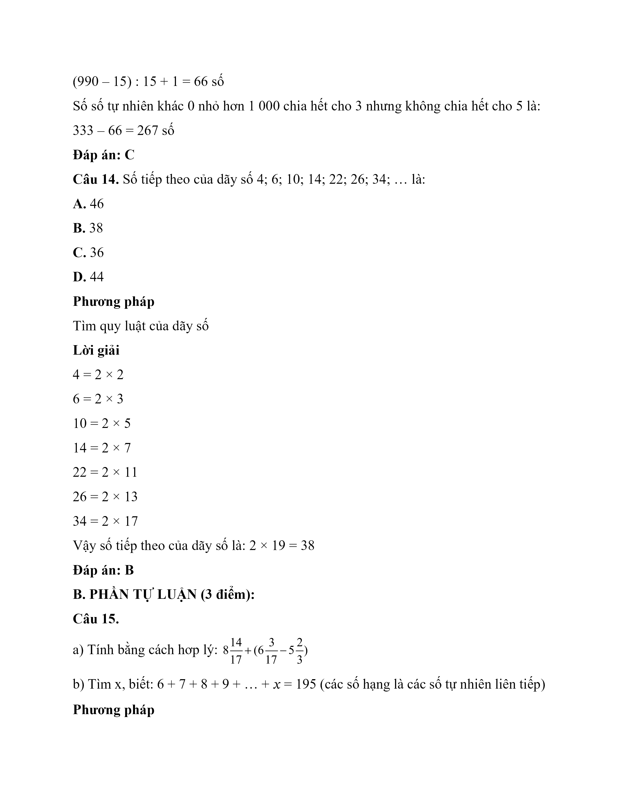
