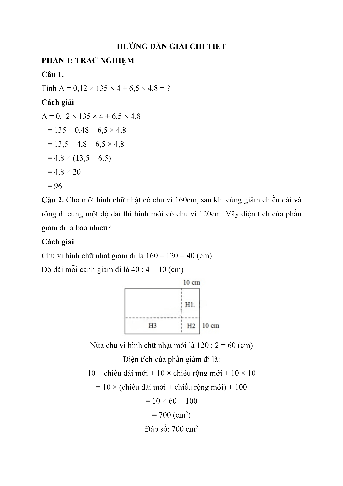
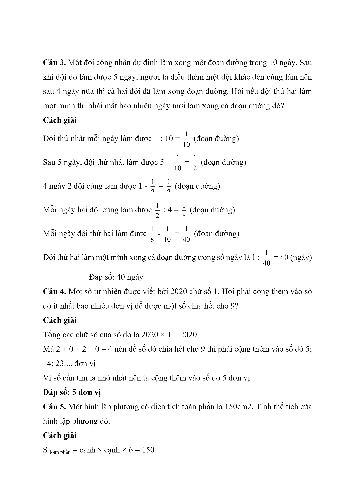
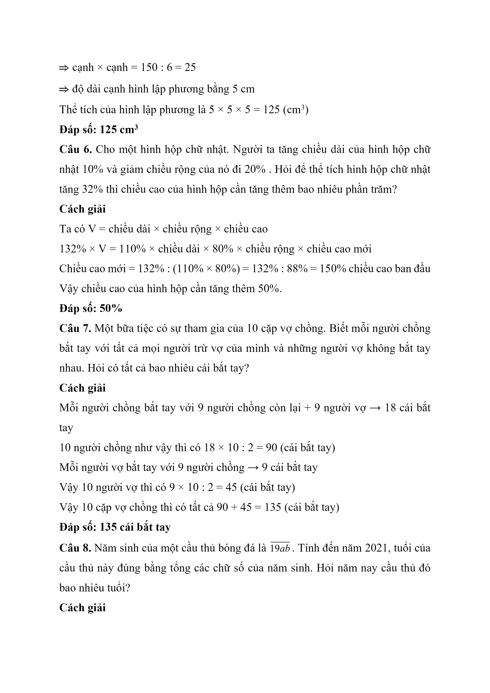
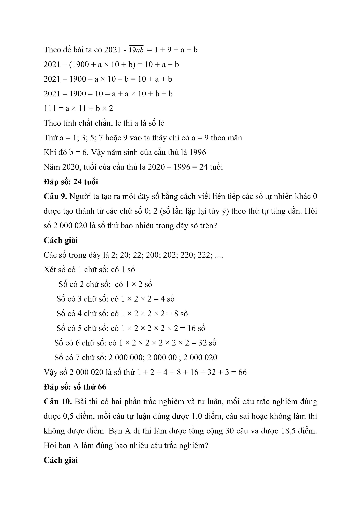
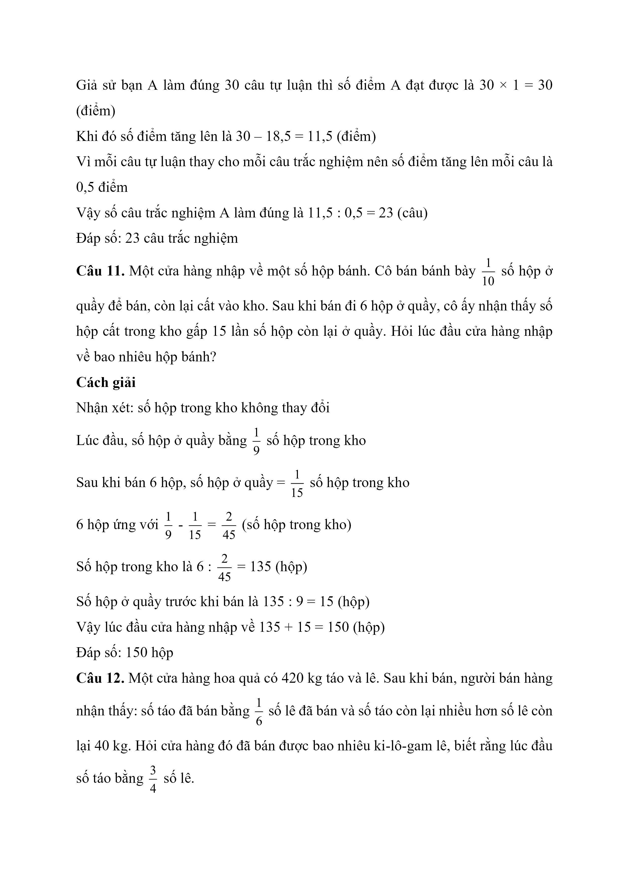
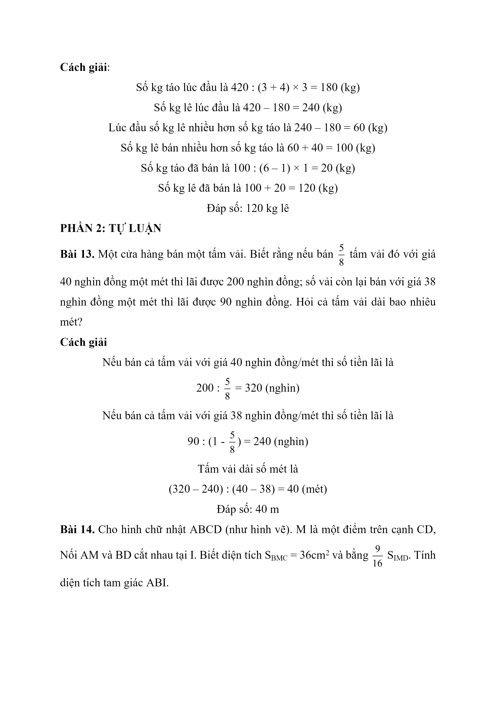
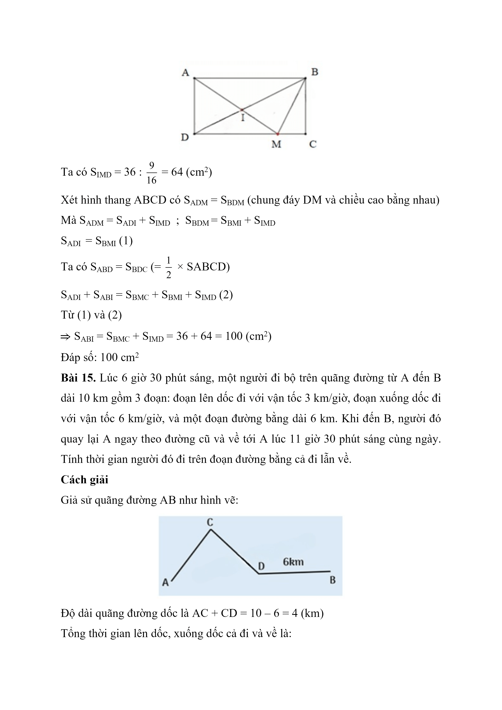
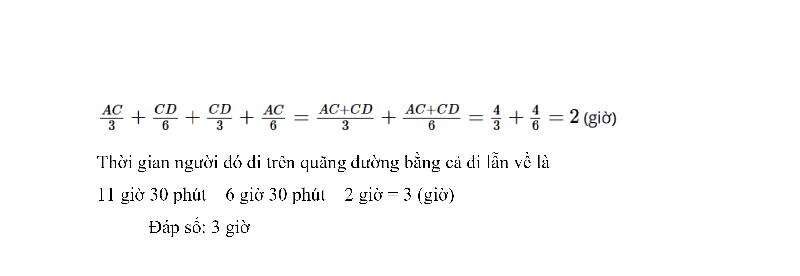

# Đề Toán vào 6 — Amsterdam 2020–2021

Bài 13. Một cửa hàng bán một tấm vải. Biết rằng nếu bán 5 8 tấm vải đó với giá 40 nghìn đồng một mét thì lãi được 200 nghìn đồng; số vải còn lại bán với giá 38 nghìn đồng một mét thì lãi được 90 nghìn đồng. Hỏi cả tấm vải dài bao nhiêu mét?

Bài 14. Cho hình chữ nhật ABCD (như hình vẽ). M là một điểm trên cạnh CD, Nối AM và BD cắt nhau tại I. Biết diện tích S BMC = $$36\,\mathrm{cm}^{2}$$ và bằng 9 16 S IMD . Tính diện tích tam giác ABI.

Bài 15. Lúc 6 giờ 30 phút sáng, một người đi bộ trên quãng đường từ A đến B dài 10 km gồm 3 đoạn: đoạn lên dốc đi với vận tốc 3 km/giờ, đoạn xuống dốc đi với vận tốc 6 km/giờ, và một đoạn đường bằng dài 6 km. Khi đến B, người đó quay lại A ngay theo đường cũ và về tới A lúc 11 giờ 30 phút sáng cùng ngày. Tính thời gian người đó đi trên đoạn đường bằng cả đi lẫn về.

## Hình minh họa

*(Ảnh trang đề / scan — có thể là cả trang)*

