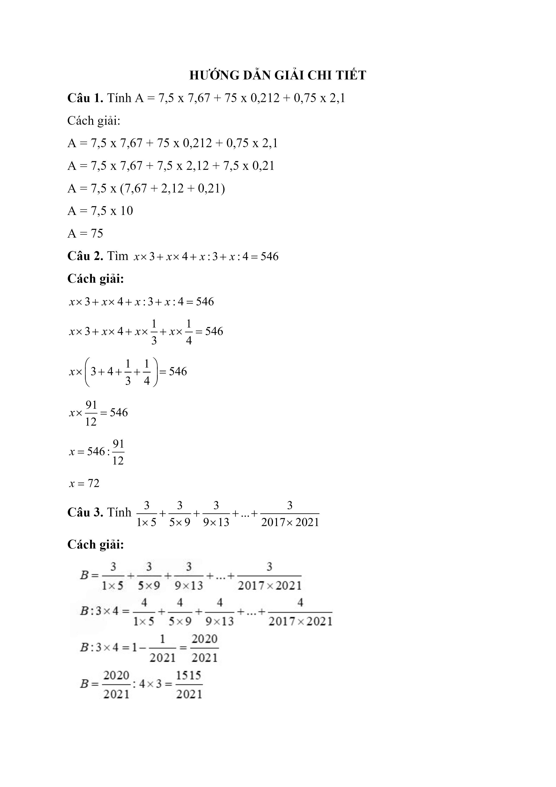
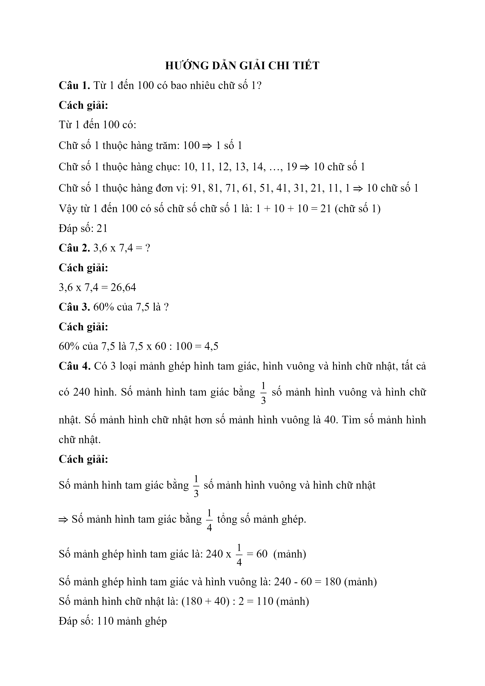
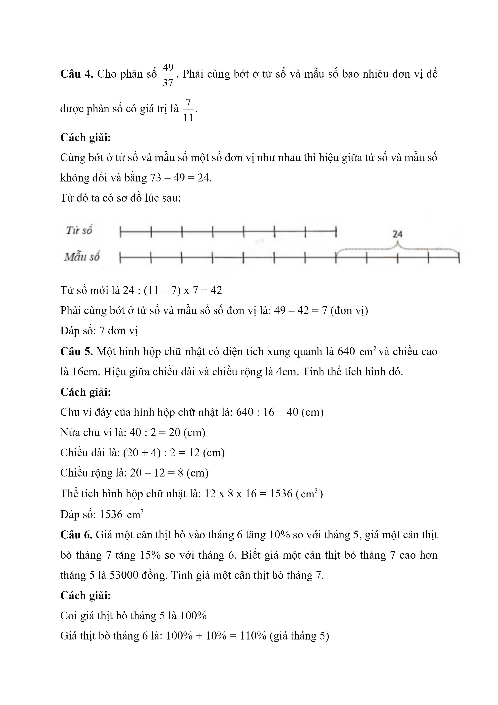
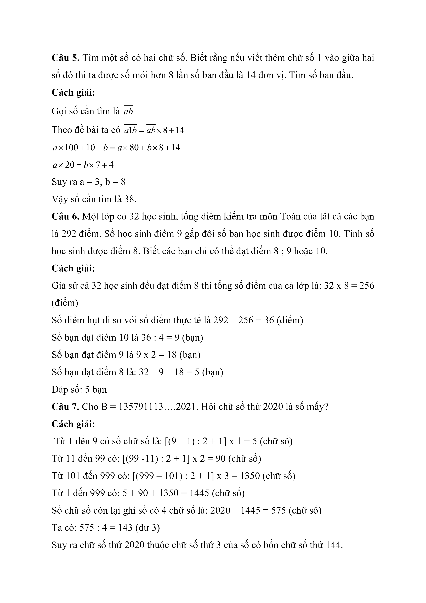
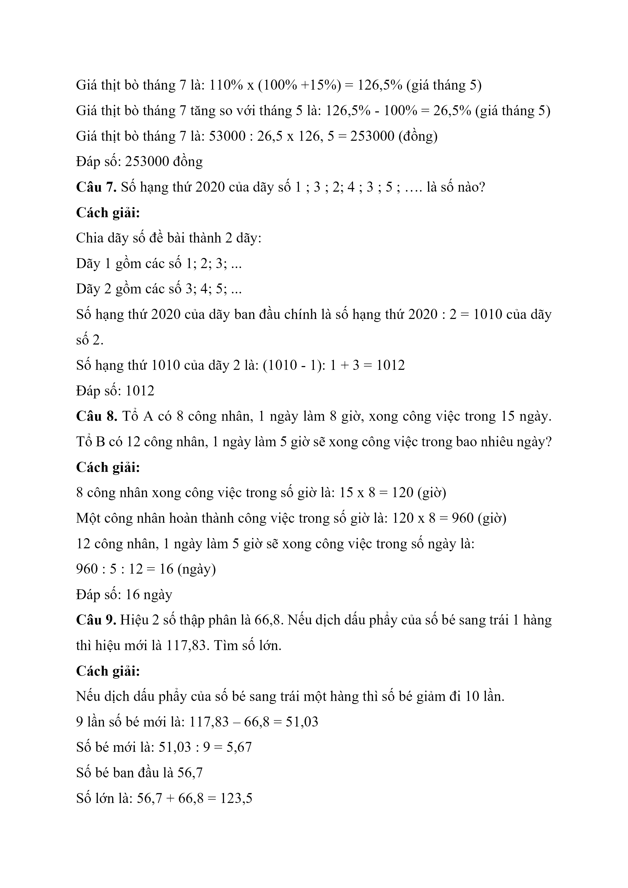
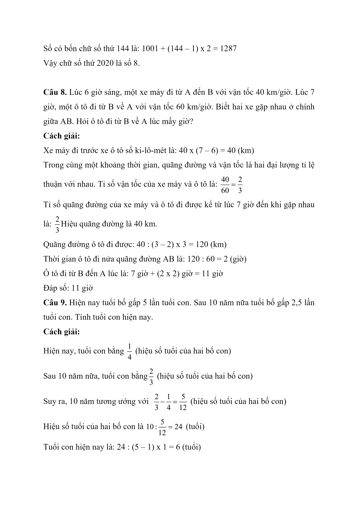
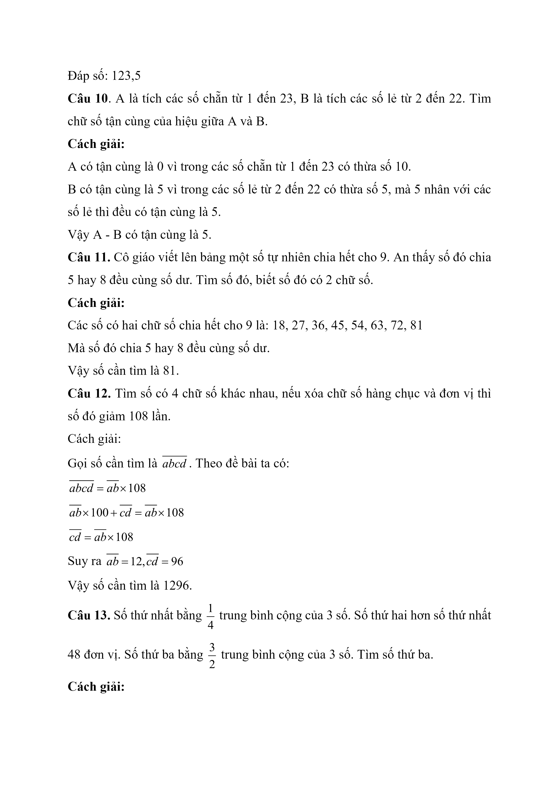
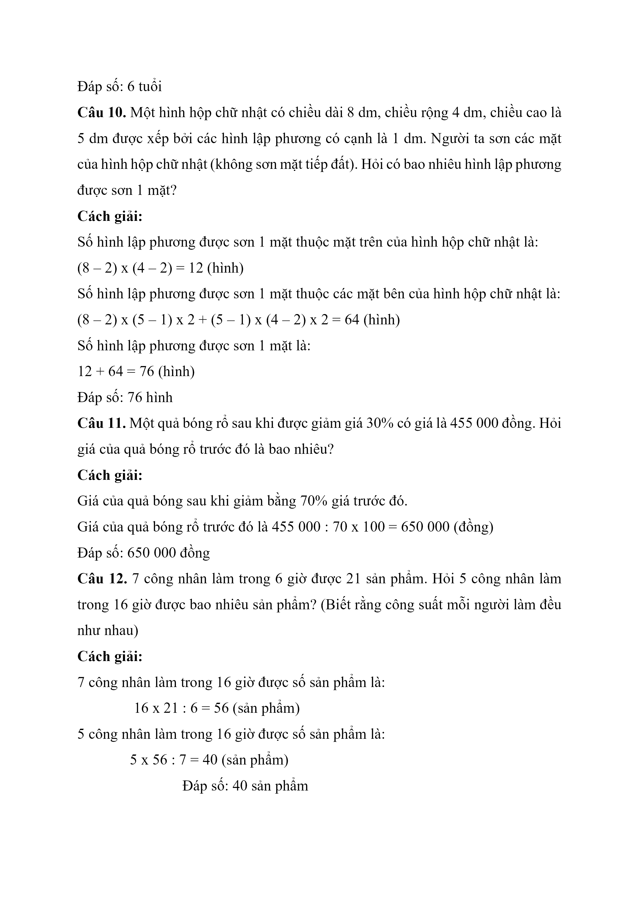

# Đề Toán vào 6 — Archimedes (2020, cơ bản)

Câu 1. Từ 1 đến 100 có bao nhiêu chữ số 1?

Câu 2. 3,6 x 7,4 = ?

Câu 3. 60% của 7,5 là ?

Câu 4. Có 3 loại mảnh ghép hình tam giác, hình vuông và hình chữ nhật, tất cả có 240 hình. Số mảnh hình tam giác bằng $$\dfrac{1}{3}$$ số mảnh hình vuông và hình chữ nhật. Số mảnh hình chữ nhật hơn số mảnh hình vuông là 40. Tìm số mảnh hình chữ nhật.

Câu 5. Tìm một số có hai chữ số. Biết rằng nếu viết thêm chữ số 1 vào giữa hai số đó thì ta được số mới hơn 8 lần số ban đầu là 14 đơn vị. Tìm số ban đầu.

Câu 6. Một lớp có 32 học sinh, tổng điểm kiểm tra môn Toán của tất cả các bạn là 292 điểm. Số học sinh điểm 9 gấp đôi số bạn học sinh được điểm 10. Tính số học sinh được điểm 8. Biết các bạn chỉ có thể đạt điểm 8 ; 9 hoặc 10.

Câu 7. Cho B = 135791113….2021. Hỏi chữ số thứ 2020 là số mấy?

Câu 8. Lúc 6 giờ sáng, một xe máy đi từ A đến B với vận tốc 40 km/giờ. Lúc 7 giờ, một ô tô đi từ B về A với vận tốc 60 km/giờ. Biết hai xe gặp nhau ở chính giữa AB. Hỏi ô tô đi từ B về A lúc mấy giờ?

Câu 9. Hiện nay tuổi bố gấp 5 lần tuổi con. Sau 10 năm nữa tuổi bố gấp 2,5 lần tuổi con. Tính tuổi con hiện nay.

Câu 10 . Một hình hộp chữ nhật có chiều dài 8 dm, chiều rộng 4 dm, chiều cao là 5 dm được xếp bởi các hình lập phương có cạnh là 1 dm. Người ta sơn các mặt của hình hộp chữ nhật (không sơn mặt tiếp đất). Hỏi có bao nhiêu hình lập phương được sơn 1 mặt?

Câu 11. Một quả bóng rổ sau khi được giảm giá 30% có giá là 455 000 đồng. Hỏi giá của quả bóng rổ trước đó là bao nhiêu?

Câu 12. 7 công nhân làm trong 6 giờ được 21 sản phẩm. Hỏi 5 công nhân làm trong 16 giờ được bao nhiêu sản phẩm? (Biết rằng công suất mỗi người làm đều như nhau)

Câu 13. Có một hình chữ nhật, chiều dài hơn chiều rộng 10m. Nếu tăng chiều rộng thêm 25% và giảm chiều dài đi 8m thì diện tích ko thay đổi. Tính diện tích hình chữ nhật.

Câu 14. Tính tổng dãy số cách đều sau 3 + 5 + 7 + 9 + …. + 35

Câu 15. Tìm hai số tròn chục liên tiếp có tổng bằng 570.

Câu 16. Trung bình cộng của bốn số là 17, thêm số thứ năm vào thì trung bình cộng của năm số là 19. Tính số thứ năm.

Câu 17. Khi viết thêm số 9 vào bên phải của một số thì được số mới tăng thêm .... lần và … đơn vị.

## Hình minh họa

