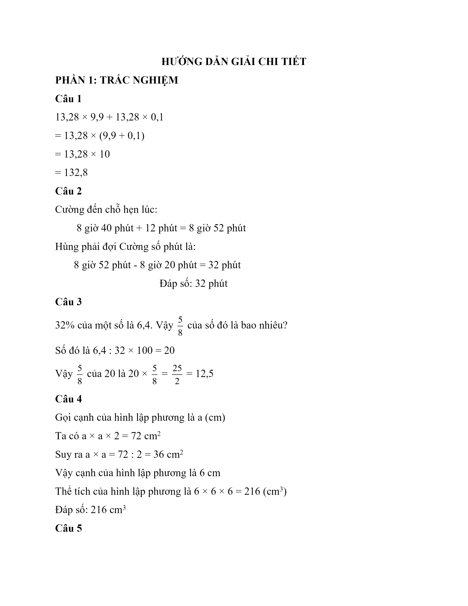
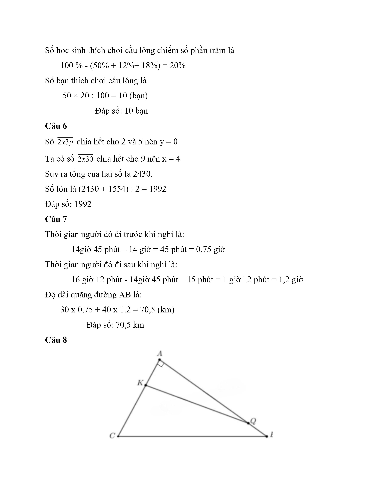
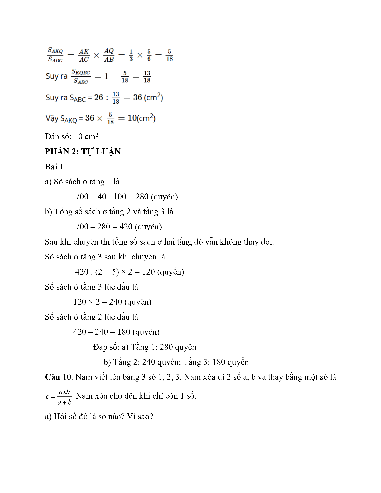
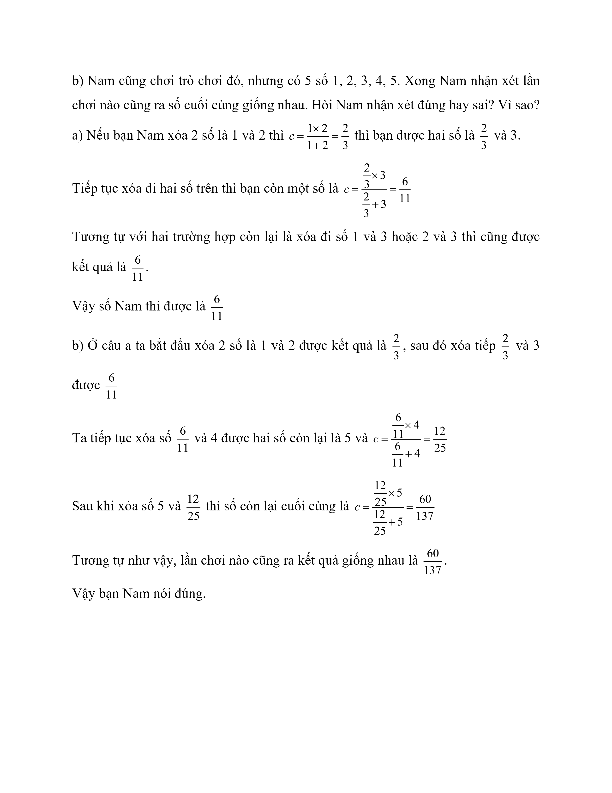

# Đề Toán vào 6 — Cầu Giấy (2020)

PHẦN 1: ĐIỀN ĐÁP SỐ (Mỗi câu hỏi 0,75 điểm)

Câu 1. Tính giá trị biểu thức: B = 13,28 × 9,9 + 13,28 × 0,1

Câu 2. Hùng và Cường hẹn nhau lúc 8 giờ 40 phút. Hùng đến lúc 8 giờ 20 phút. Cường đến muộn 12 phút. Hỏi Hùng phải đợi Cường bao nhiêu lâu?

Câu 3. 32% của một số là 6,4. Vậy $$\dfrac{5}{8}$$ của số đó là bao nhiêu?

Câu 4. Cho 1 hình lập phương có diện tích toàn phần lớn hơn diện tích xung quanh là $$72\,\mathrm{cm}^{2}$$ . Tính thể tích hình lập lương đó?

Câu 5. Lớp 5A có 50 học sinh. Trong đó có 50% bạn thích đá bóng, 12% bạn thích chạy, 18% bạn thích đá cầu. Số còn lại thích chơi cầu lông. Hỏi số bạn thích chơi cầu lông là bao nhiêu?

Câu 6. Hai số có hiệu là 1554. Tổng của 2 số là 2 $$\overline{x3y}$$ chia hết cho 2, 5 và 9. Hỏi số lớn là số nào?

Câu 7. Lúc 14h một xe đi từ A đến B với vận tốc 30km/giờ. Đến 14giờ 45 phút, xe đó nghỉ 15 phút. Sau đó xe đó đi nốt quãng đường với vận tốc 40km/giờ. Đến 16 giờ 12 phút thì xe tới B. Tính độ dài quãng đường AB ?

Câu 8. Cho hình vẽ, biết S KQBC = $$26\,\mathrm{cm}^{2}$$ và B Q A B = 1 6 ; A K A C = 1 3 . Tính S AKQ .

PHẦN 2: TỰ LUẬN (mỗi câu 2 điểm)

Câu 9. Cho kệ sách có 3 tầng với 700 quyển sách. 40% số sách ở tầng 1.

a) Tính số sách ở tầng 1.

b) Nếu chuyển nửa số sách từ tầng 3 sang tầng 2 thì số sách tầng 3 bằng $$\dfrac{2}{5}$$ số sách ở tầng 2. Tính số sách mỗi tầng ban đầu?

Câu 10. Nam viết lên bảng 3 số 1, 2, 3. Nam xóa đi 2 số a, b và thay bằng một số là c= a x b a + b Nam xóa cho đến khi chỉ còn 1 số.

a) Hỏi số đó là số nào? Vì sao?

b) Nam cũng chơi trò chơi đó, nhưng có 5 số 1, 2, 3, 4, 5. Xong Nam nhận xét lần chơi nào cũng ra số cuối cùng giống nhau. Hỏi Nam nhận xét đúng hay sai? Vì sao?

## Hình minh họa

*(Ảnh trang đề / scan — có thể là cả trang)*

