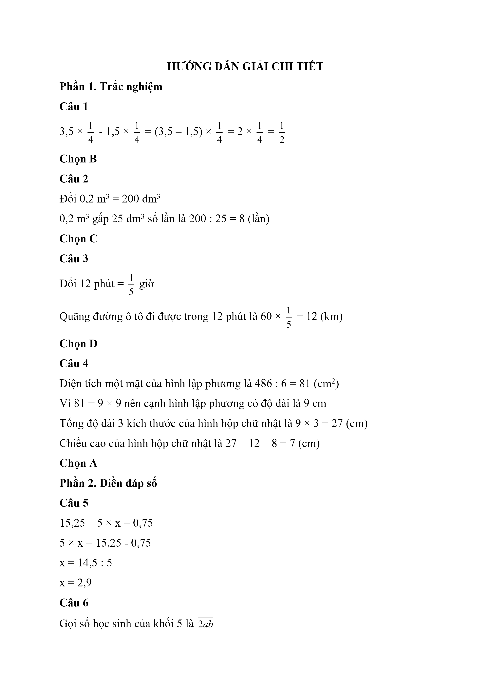
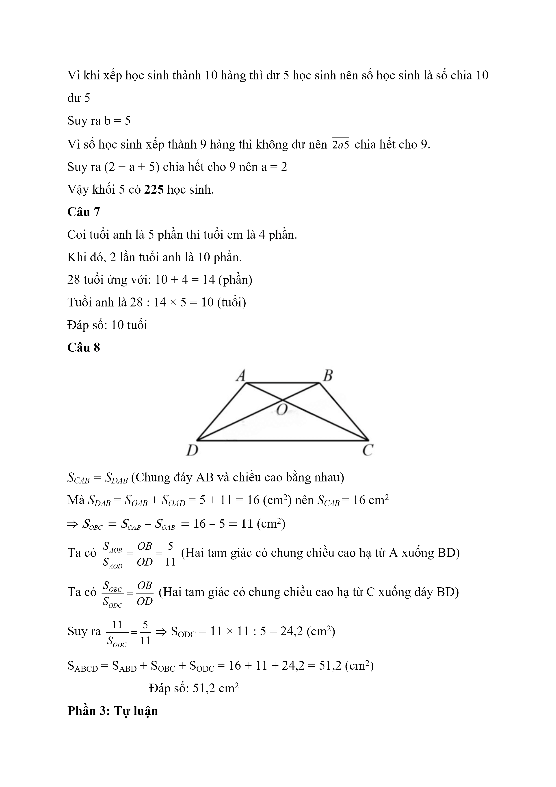
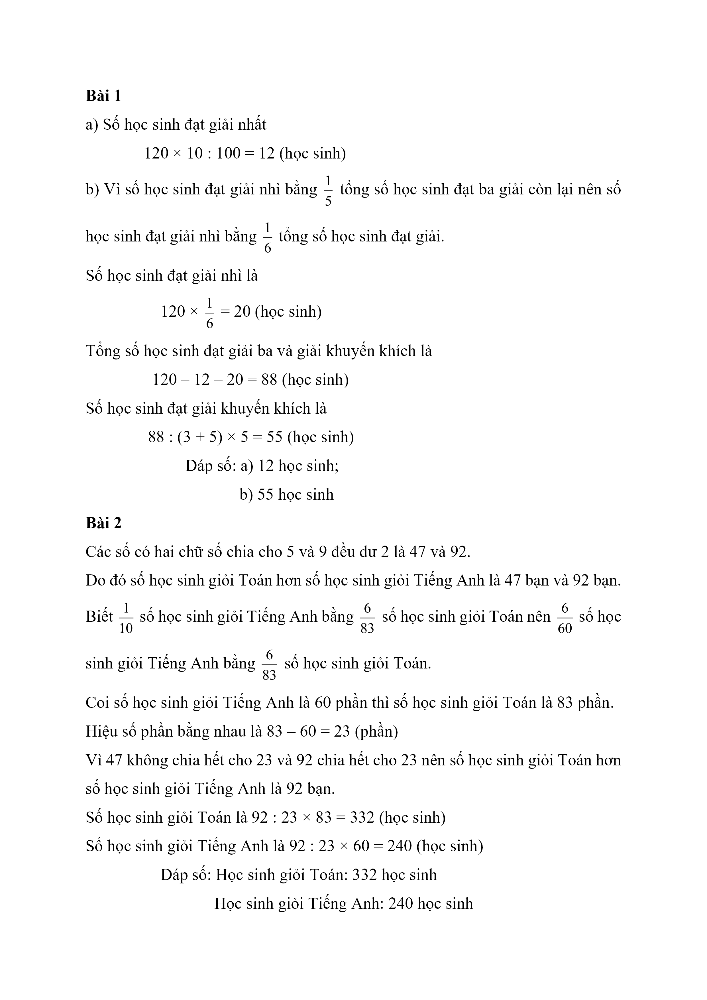

# Đề Toán vào 6 — Cầu Giấy (2022)

Phần 1: Trắc nghiệm (Mỗi câu hỏi 0,75 điểm)

Câu 1. Tính: 3, 5 × 1 4 - 1,5 × 1 4

A. 0

B. 1 2

C. 5 4

D. 1 8

Câu 2. $$0{,}2\,\mathrm{m}^{3}$$ gấp $$25\,\mathrm{dm}^{3}$$ số lần là

A. 0,008

B. 0,8

C. 8

D. 80

Câu 3. Một ô tô đi với vận tốc 60 km/giờ, tính quãng đường ô tô đi được trong 12 phút.

A. 0,2 km

B. 5 km

C. 720 km

D. 12 km

Câu 4. Một hình hộp hình chữ nhật có chiều dài là 12 cm, chiều rộng là 8 cm. Một hình lập phương có cạnh bằng trung bình cộng ba kích thước của hình hộp chữ nhật và có diện tích toàn phần là $$486\,\mathrm{cm}^{2}$$ . Tìm chiều cao của hình hộp chữ nhật.

A. 7 cm

B. 8 cm

C. 9 cm

D. 81 cm

Phần 2: Điền đáp số (Mỗi câu 1 điềm)

Câu 5. Tìm 𝑥, biết: 15,25 – 5 × 𝑥 = 0,75

Câu 6. Tổng số học sinh khối 5 của một trường tiểu học là một số có ba chữ số và chữ số hàng trăm là 2. Biết khi xếp học sinh thành 10 hàng thì dư 5 học sinh và xếp thành 9 hàng thì không dư. Hỏi số học sinh khối 5 là bao nhiêu?

Câu 7. Tuổi anh bằng $$\dfrac{5}{4}$$ tuổi em. Biết hai lần tuổi anh cộng với tuổi em là 28 tuổi. Tính số tuổi của anh.

Câu 8. Cho hình thang ABCD có hai đáy AB, CD. Hai đường chéo AC và BD cắt nhau tại O. Biết diện tích tam giác OAD là $$11\,\mathrm{cm}^{2}$$ , diện tích tam giác OAB là $$5\,\mathrm{cm}^{2}$$ . Tính diện tích hình thang ABCD.

Phần 3: Tự luận

Bài 1 (2 điểm). Một cuộc thi vẽ có 120 học sinh đạt giải. Số học sinh đạt giải nhất bằng 10% tổng số học sinh đạt giải, số học sinh đạt giải nhì bằng $$\dfrac{1}{5}$$ tổng số học sinh đạt ba giải còn lại, số học sinh đạt giải ba bằng $$\dfrac{3}{5}$$ số học sinh đạt giải khuyến khích.

a) Tính số học sinh đạt giải nhất.

b) Tính số học sinh đạt giải khuyến khích

Bài 2 (1 điểm). Trong kì thi chọn HSG có 2 môn thi là Toán và Tiếng Anh. Biết $$\dfrac{1}{10}$$ số học sinh giỏi Tiếng Anh bằng $$\dfrac{6}{83}$$ số học sinh giỏi Toán. Số học sinh giỏi Toán hơn số học sinh giỏi Tiếng Anh là một số có hai chữ số, chia cho 5 và 9 đều dư 2. Tính số học sinh giỏi Toán, số học sinh giỏi Tiếng Anh.

## Hình minh họa

*(Ảnh trang đề / scan — có thể là cả trang)*

