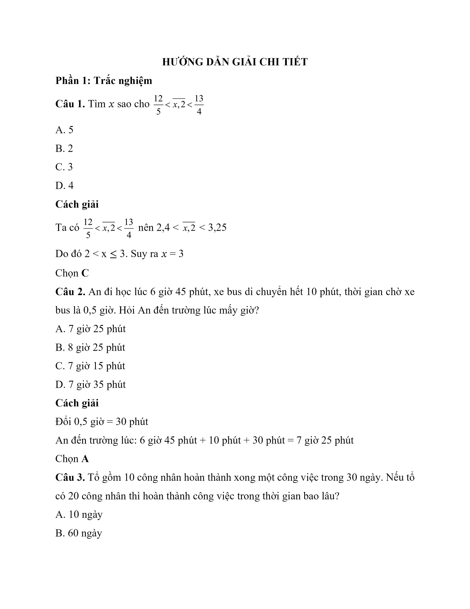
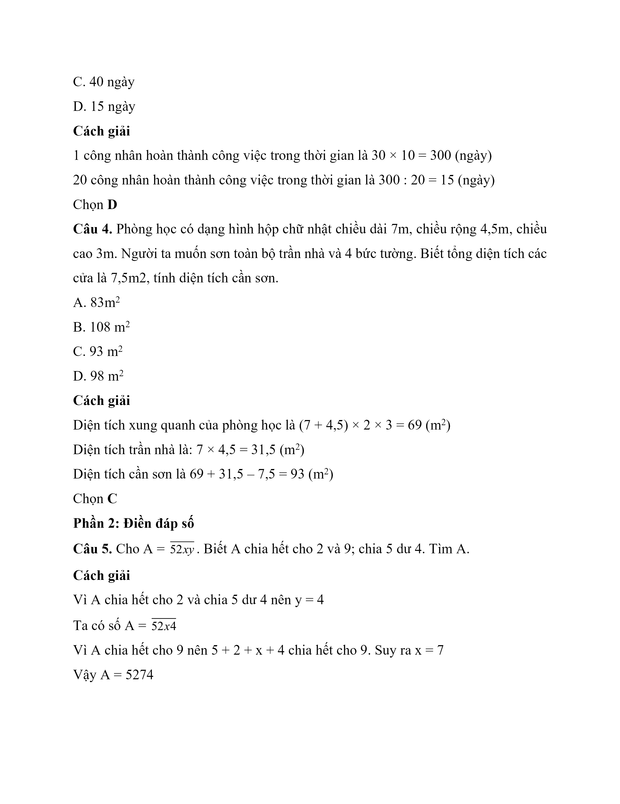
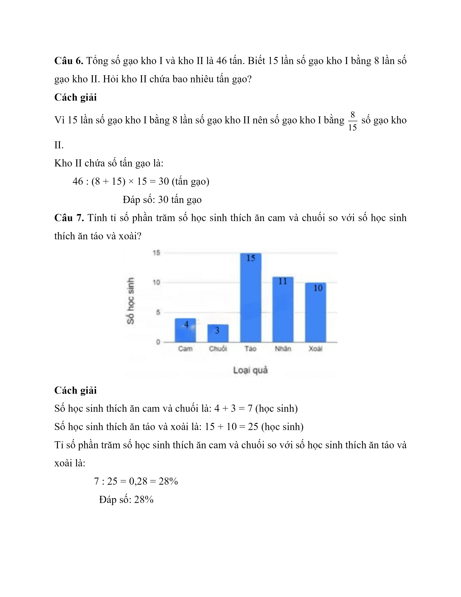
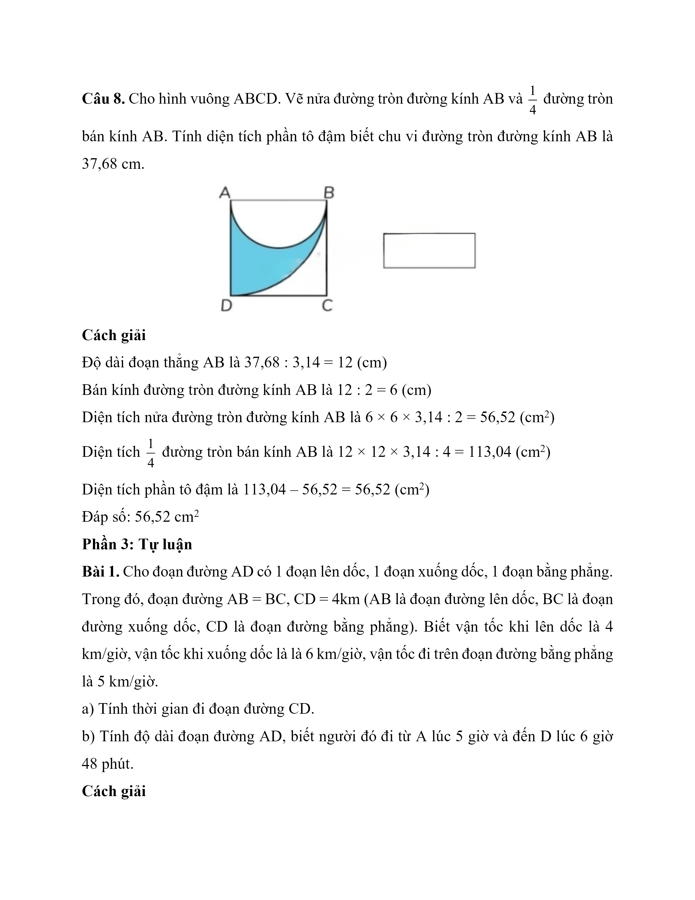
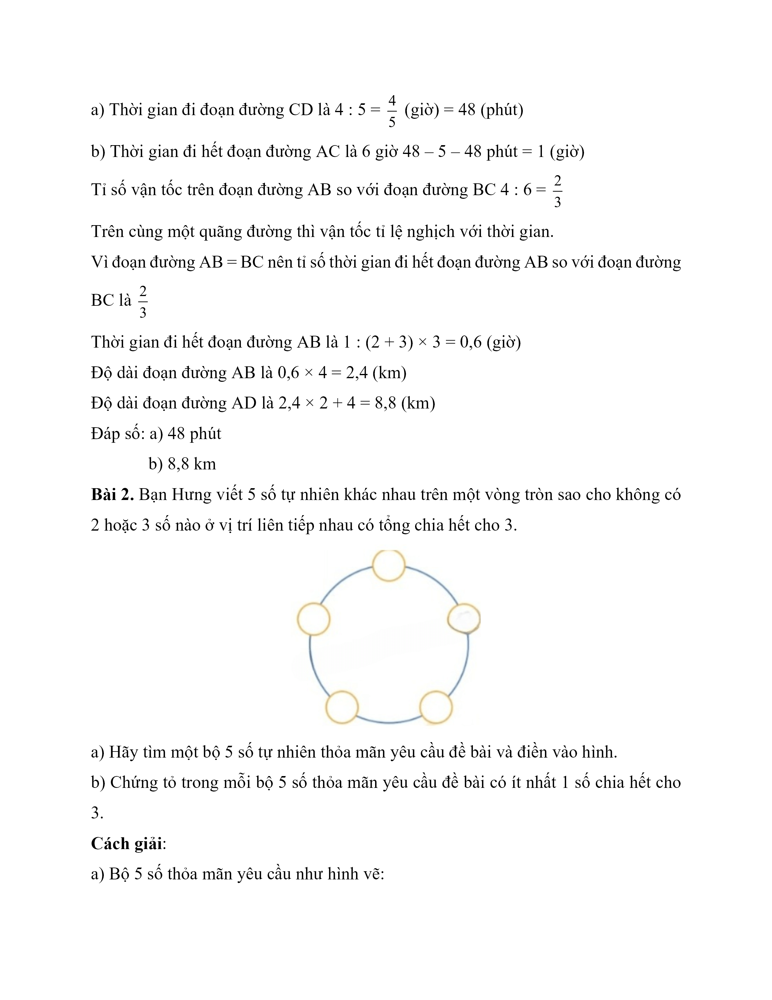
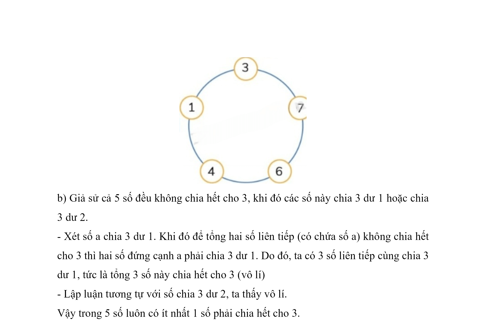
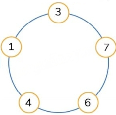

# Đề Toán vào 6 — Cầu Giấy 2023–2024

Phần 1: Trắc nghiệm

Câu 1. Tìm x sao cho  $$\dfrac{{12}}{5} < \overline {x,2} < \dfrac{{13}}{4}$$

A. 5

B. 2

C. 3

D. 4

Câu 2. An đi học lúc 6 giờ 45 phút, xe bus di chuyển hết 10 phút, thời gian chờ xe bus là 0,5 giờ. Hỏi An đến trường lúc mấy giờ?

A. 7 giờ 25 phút

B. 8 giờ 25 phút

C. 7 giờ 15 phút

D. 7 giờ 35 phút

Câu 3. Tổ gồm 10 công nhân hoàn thành xong một công việc trong 30 ngày. Nếu tổ có 20 công nhân thì hoàn thành công việc trong thời gian bao lâu?

A. 10 ngày

B. 60 ngày

C. 40 ngày

D. 15 ngày

Câu 4. Phòng học có dạng hình hộp chữ nhật chiều dài 7m, chiều rộng 4,5m, chiều cao 3m. Người ta muốn sơn toàn bộ trần nhà và 4 bức tường. Biết tổng diện tích các cửa là $$7{,}5\,\mathrm{m}^{2}$$, tính diện tích cần sơn.

A. $$83\,\mathrm{m}^{2}$$

B. $$108\,\mathrm{m}^{2}$$

C. $$93\,\mathrm{m}^{2}$$

D. $$98\,\mathrm{m}^{2}$$

## Phần 2: Điền đáp số

Câu 5. Cho A = $$\overline {52xy}$$ . Biết A chia hết cho 2 và 9; chia 5 dư 4. Tìm A.

Câu 6. Tổng số gạo kho I và kho II là 46 tấn. Biết 15 lần số gạo kho I bằng 8 lần số gạo kho II. Hỏi kho II chứa bao nhiêu tấn gạo?

Câu 7. Tính tỉ số phần trăm số học sinh thích ăn cam và chuối so với số học sinh thích ăn táo và xoài?

Câu 8. Cho hình vuông ABCD. Vẽ nửa đường tròn đường kính AB và  $$\dfrac{1}{4}$$ đường tròn bán kính AB. Tính diện tích phần tô đậm biết chu vi đường tròn đường kính AB là 37,68 cm.

## Phần 3: Tự luận

Bài 1. Cho đoạn đường AD có 1 đoạn lên dốc, 1 đoạn xuống dốc, 1 đoạn bằng phẳng. Trong đó, đoạn đường AB = BC, CD = 4km (AB là đoạn đường lên dốc, BC là đoạn đường xuống dốc, CD là đoạn đường bằng phẳng). Biết vận tốc khi lên dốc là 4 km/giờ, vận tốc khi xuống dốc là là 6 km/giờ, vận tốc đi trên đoạn đường bằng phẳng là 5 km/giờ.

a) Tính thời gian đi đoạn đường CD.

b) Tính độ dài đoạn đường AD, biết người đó đi từ A lúc 5 giờ và đến D lúc 6 giờ 48 phút.

Bài 2 . Bạn Hưng viết 5 số tự nhiên khác nhau trên một vòng tròn sao cho không có 2 hoặc 3 số nào ở vị trí liên tiếp nhau có tổng chia hết cho 3.

a) Hãy tìm một bộ 5 số tự nhiên thỏa mãn yêu cầu đề bài và điền vào hình.

b) Chứng tỏ trong mỗi bộ 5 số thỏa mãn yêu cầu đề bài có ít nhất 1 số chia hết cho 3.

## Hình minh họa

*(Ảnh trang đề / scan — có thể là cả trang)*

