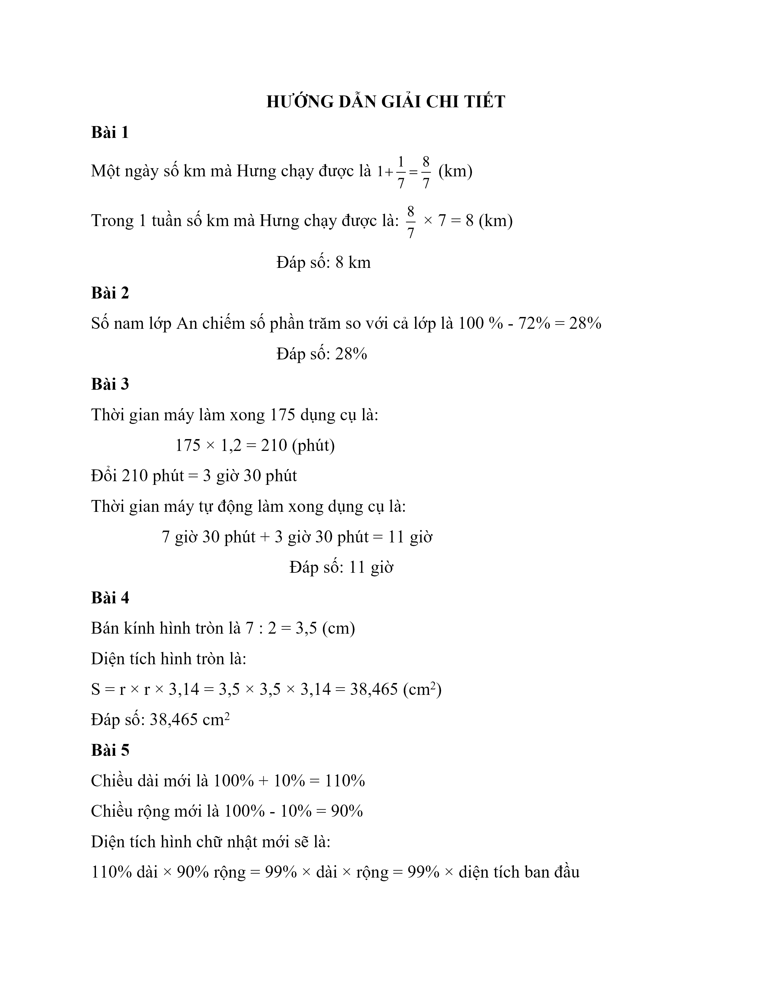
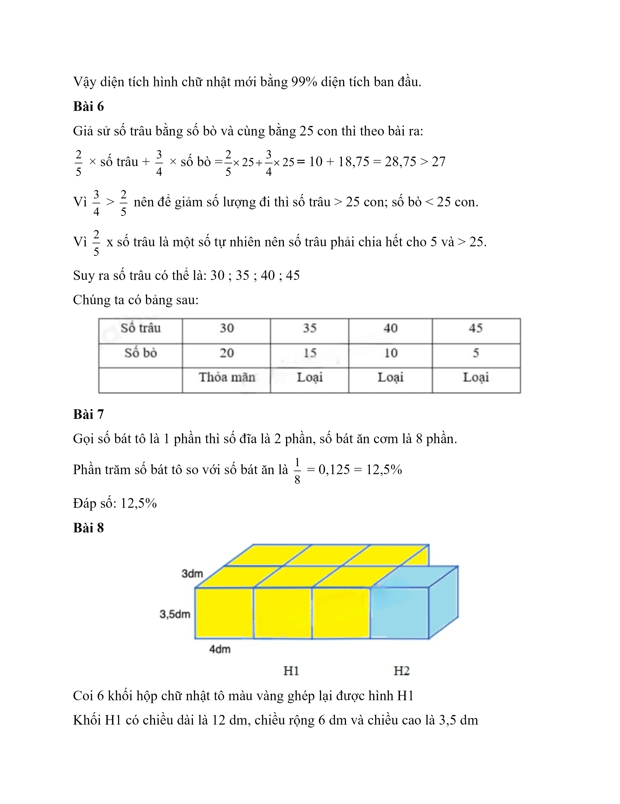
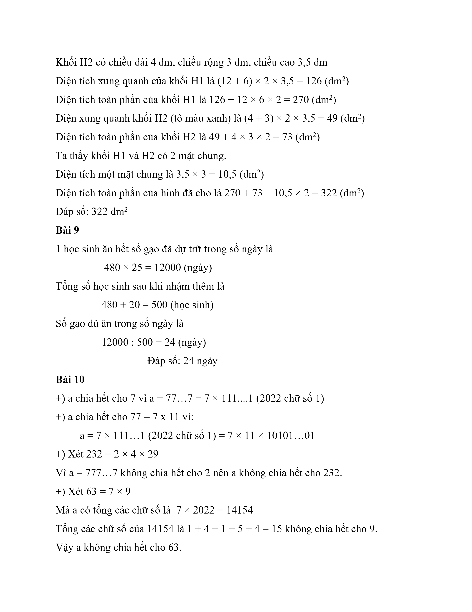

# Đề Toán vào 6 — Lương Thế Vinh (2021)

Bài 1. Hằng ngày, bạn Hưng chạy bộ được 1 và $$\dfrac{1}{7}$$ km. hỏi trong 1 tuần bạn Hưng chạy được bao nhiêu ki-lô-mét?

Bài 2. Lớp An có 72% các bạn là nữ. Hỏi số nam lớp An so với cả lớp là bao nhiêu %?

Bài 3. Một máy tự động có thể làm 1 dụng cụ trong 1,2 phút. Nếu máy làm 175 dụng cụ và bắt đầu lúc 7 giờ 30 phút thì máy làm xong lúc mấy giờ?

Bài 4. Tính diện tích hình tròn có đường kính 7 cm?

Bài 5. Có một hình chữ nhật đã được tăng chiều dài thêm 10% và giảm chiều rộng đi 10% thì diện tích hình chữ nhật đó thay đổi như thế nào?

Bài 6. Cả đàn có tất cả 50 con bò và trâu, biết rằng nếu đếm $$\dfrac{2}{5}$$ số trâu và $$\dfrac{3}{4}$$ số bò thì có tất cả 27 con. Tính số trâu và số bò?

Bài 7. Lan đếm số bát đĩa trong tủ thì thấy:

– Số đĩa gấp đôi số bát to

– Số bát ăn cơm gấp 4 lần số đĩa

Hỏi số bát to nhà Lan bằng bao nhiêu phần trăm số bát ăn cơm?

Bài 8. Tính diện tích toàn phần hình bên dưới, biết các hình nhỏ đều bằng nhau, chiều dài 4dm, chiều rộng 3dm, chiều cao 3,5 dm.

Bài 9. Một trường bán trú dự trữ gạo đủ cho 480 học sinh ăn trong 25 ngày. Nhà trường mới nhận thêm 20 em học sinh nữa. Hỏi số gạo trên đủ trong bao nhiêu ngày?

Bài 10. Cho a = 77… 7 (Có 2022 chữ số 7). Hỏi a không chia hết cho số nào sau đây: 7; 77; 232; 63?

## Hình minh họa

*(Ảnh trang đề / scan — có thể là cả trang)*

