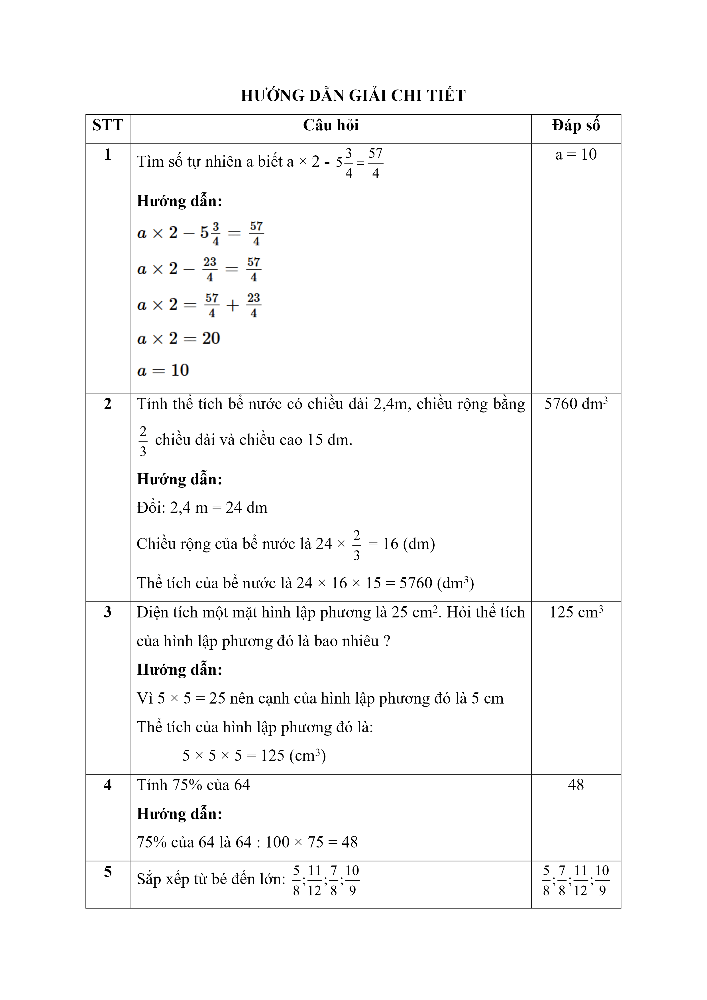
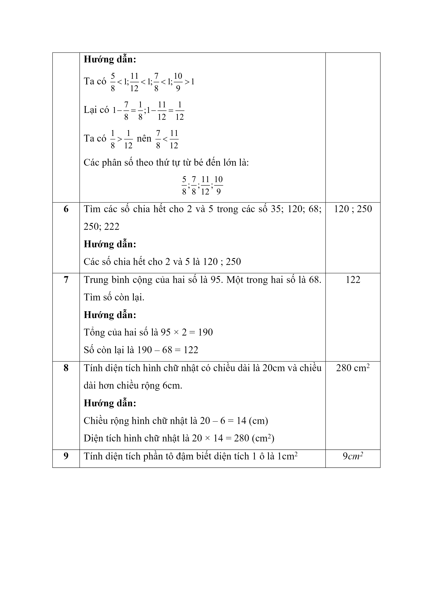
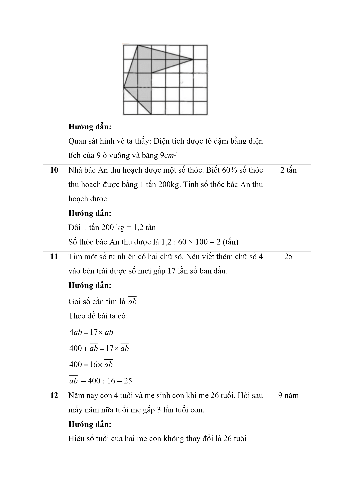
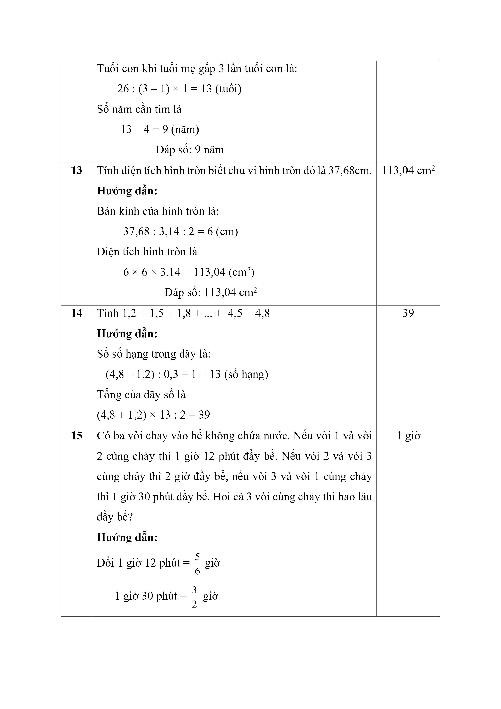
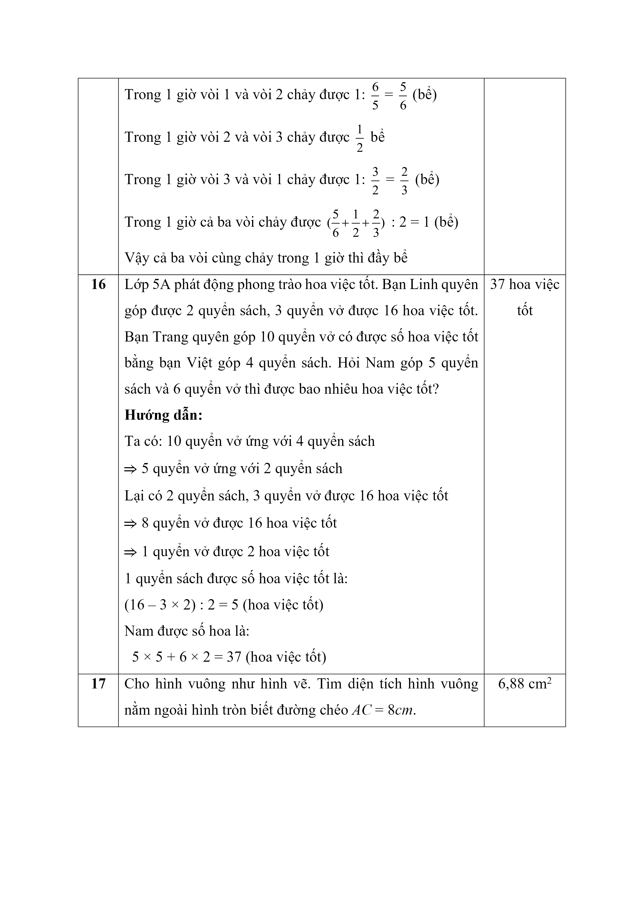
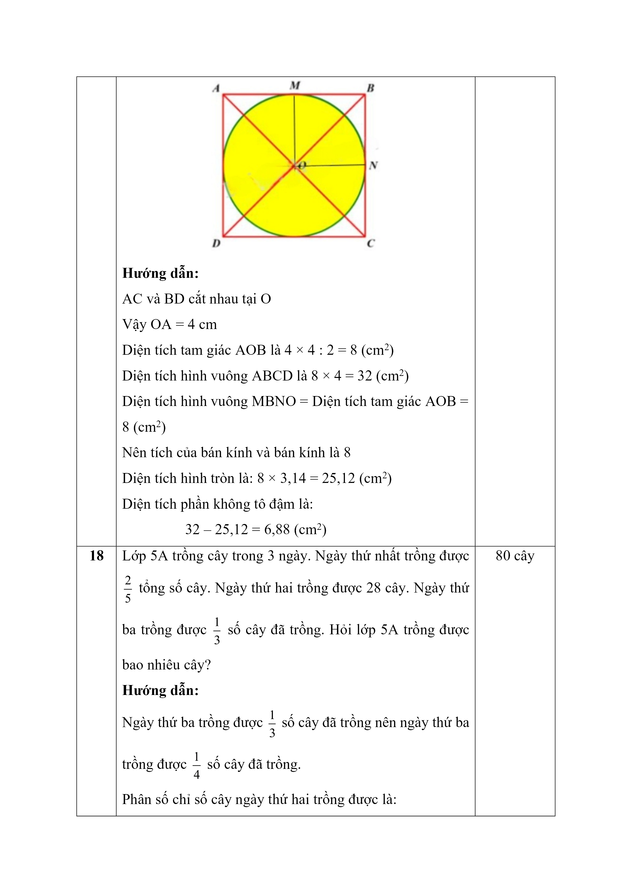
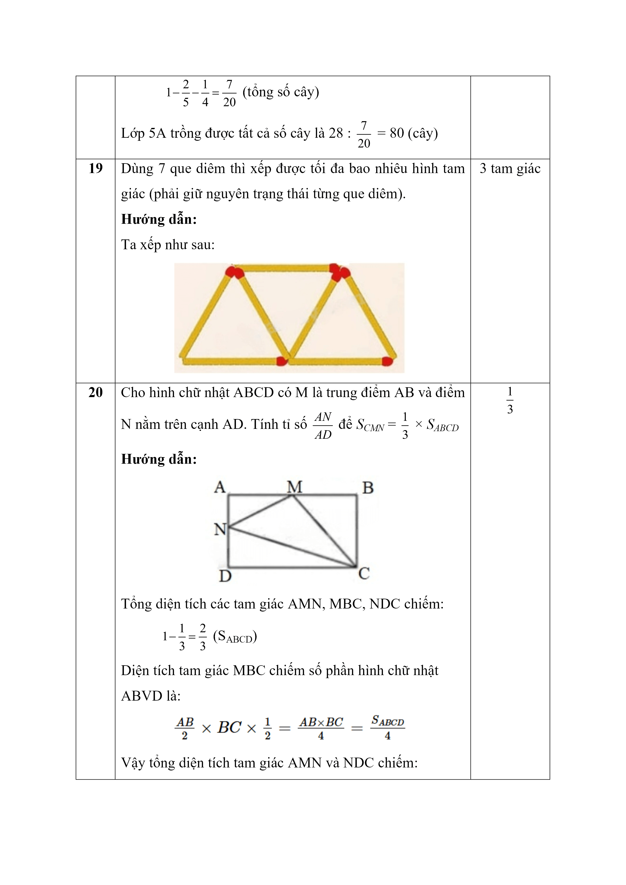
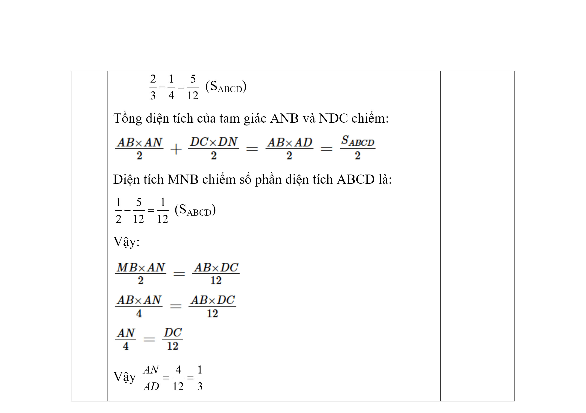

# Đề Toán vào 6 — Lương Thế Vinh 2023–2024

Bài 1 : Tìm số tự nhiên a biết a x  $$2 - 5\dfrac{3}{4} = \dfrac{{57}}{4}$$

Bài 2 : Tính thể tích bể nước có chiều dài 2,4m, chiều rộng bằng  $$\dfrac{2}{3}$$ chiều dài và chiều cao 15 dm.

Bài 3 : Diện tích một mặt hình lập phương là $$25\,\mathrm{cm}^{2}$$ . Hỏi thể tích của hình lập phương đó là bao nhiêu ?

Bài 4 : Tính 75% của 64

Bài 5 : Sắp xếp từ bé đến lớn:  $$\dfrac{5}{8}$$ ; $$\dfrac{11}{12}$$ ; $$\dfrac{7}{8}$$ ; $$\dfrac{10}{9}$$
Ta có  $$\dfrac{5}{8}$$ <1;  $$\dfrac{11}{12}$$ <1; $$\dfrac{7}{8}$$ <1; $$\dfrac{10}{9}$$ >1

Lại có 1 -  $$\dfrac{7}{8}$$ =  $$\dfrac{1}{8}$$ ; 1 -  $$\dfrac{11}{12}$$ =  $$\dfrac{1}{12}$$ Ta có  $$\dfrac{1}{8}$$ > $$\dfrac{1}{12}$$ nên  $$\dfrac{7}{8}$$ < $$\dfrac{11}{12}$$ Các phân số theo thứ tự từ bé đến lớn là:

$$\dfrac{5}{8}$$ ; $$\dfrac{7}{8}$$ ; $$\dfrac{11}{12}$$ ; $$\dfrac{10}{9}$$ Bài 6 : Tìm các số chia hết cho 2 và 5 trong các số 35; 120; 68; 250; 222

Bài 7 : Trung bình cộng của hai số là 95. Một trong hai số là 68. Tìm số còn lại.

Bài 8 : Tính diện tích hình chữ nhật có chiều dài là 20cm và chiều dài hơn chiều rộng 6cm.

Bài 9 : Tính diện tích phần tô đậm biết diện tích 1 ô là $$1\,\mathrm{cm}^{2}$$

Bài 10 : Nhà bác An thu hoạch được một số thóc. Biết 60% số thóc thu hoạch được bằng 1 tấn 200kg. Tính số thóc bác An thu hoạch được.

Bài 11 : Tìm một số tự nhiên có hai chữ số. Nếu viết thêm chữ số 4 vào bên trái được số mới gấp 17 lần số ban đầu.

Bài 12 : Năm nay con 4 tuổi và mẹ sinh con khi mẹ 26 tuổi. Hỏi sau mấy năm nữa tuổi mẹ gấp 3 lần tuổi con.

Bài 13 : Tính diện tích hình tròn biết chu vi hình tròn đó là 37,68cm.

Bài 14 : Tính 1,2 + 1,5 + 1,8 + ... +  4,5 + 4,8

Bài 15 : Có ba vòi chảy vào bể không chứa nước. Nếu vòi 1 và vòi 2 cùng chảy thì 1 giờ 12 phút đầy bể. Nếu vòi 2 và vòi 3 cùng chảy thì 2 giờ đầy bể, nếu vòi 3 và vòi 1 cùng chảy thì 1 giờ 30 phút đầy bể. Hỏi cả 3 vòi cùng chảy thì bao lâu đầy bể?

Bài 16 : Lớp 5A phát động phong trào hoa việc tốt. Bạn Linh quyên góp được 2 quyển sách, 3 quyển vở được 16 hoa việc tốt. Bạn Trang quyên góp 10 quyển vở có được số hoa việc tốt bằng bạn Việt góp 4 quyển sách. Hỏi Nam góp 5 quyển sách và 6 quyển vở thì được bao nhiêu hoa việc tốt?

Bài 17 : Cho hình vuông như hình vẽ. Tìm diện tích hình vuông phần nằm ngoài hình tròn biết đường chéo  AC  =  8cm .

Bài 18 : Lớp 5A trồng cây trong 3 ngày. Ngày thứ nhất trồng được  $$\dfrac{2}{5}$$ tổng số cây. Ngày thứ hai trồng được 28 cây. Ngày thứ ba trồng được  $$\dfrac{1}{3}$$ số cây đã trồng. Hỏi lớp 5A trồng được bao nhiêu cây?

Bài 19 : Dùng 7 que diêm thì xếp được tối đa bao nhiêu hình tam giác (phải giữ nguyên trạng thái từng que diêm).

Bài 20 : Cho hình chữ nhật ABCD có M là trung điểm AB và điểm N nằm trên cạnh AD. Tính tỉ số  $$\dfrac{AN}{AD}$$ để  $${S_{CMN}}$$  =  $$\dfrac{1}{3}$$ x  $$​​​​{S_{ABCD}}$$

## Hình minh họa

*(Ảnh trang đề / scan — có thể là cả trang)*

