# Đề Toán vào 6 — Marie Curie (2022)

Câu 1: Tích sau có tận cùng bao nhiêu chữ số 0?

23 $$\overline{x24x}$$25 $$\overline{x26x}$$27 $$\overline{x28x}$$29 $$\overline{x30x}$$31 $$\overline{x32A}$$. 4 chữ số 0

B. 1 chữ số 0

C. 3 chữ số 0

D. 2 chữ số 0

Câu 2: Quãng đường AB dài 180km. Một ô tô đi 1 6 quãng đường AB hết 35 phút, trên quãng đường còn lại ô tô đi với vận tốc 40km/giờ. Hỏi ô tô đi hết quãng đường AB trong bao lâu?

A. 4 giờ 20 phút

B. 3 giờ 45 phút

C. 1 giờ 10 phút

D. 45 phút

Câu 3: Một hình bình hành có độ dài đáy bằng 24cm, chiều cao bằng $$\dfrac{3}{8}$$ độ dài đáy. Diện tích của hình bình hành đó là:

A. $$216\,\mathrm{cm}^{2}$$

B. $$108\,\mathrm{cm}^{2}$$

C. $$9\,\mathrm{cm}^{2}$$

D. 216cm

Câu 4: Số đo thể tích nào lớn nhất trong các số đo dưới đây?

A. $$6{,}407\,\mathrm{m}^{3}$$

B. 6047ℓ

C. 6 4 $$7\,\mathrm{m}^{3}$$

D. 6 470 $$000\,\mathrm{cm}^{3}$$

Câu 5: Hiệu số tuổi của bố và con là 30 tuổi. Tuổi con bằng $$\dfrac{1}{4}$$ tuổi bố. Tuổi bố là:

A. 6 tuổi

B. 10 tuổi

C. 24 tuổi

D. 40 tuổi

Câu 6: Một hình thang có đáy lớn a, đáy bé là b, chiều cao là h (a, b, h cùng đơn vị đo) thì công thức tính diện tích S của hình thang đó là:

A. S = a × b × $$\overline{h2B}$$. S = ( a + b ) × $$\overline{h2C}$$. S = ( a + b ) × 2 × h

D. S = a × h 2

Câu 7: Hình hộp chữ nhật có ...... mặt, ...... cạnh, ... đỉnh.

Số thích hợp lần lượt điền vào chỗ chấm là:

A. 6 ; 12 ; 8

B. 8; 12; 6

C. 6; 8; 12

D. 12; 6; 8

Câu 8: Biết $$1\,\mathrm{m}^{3}$$ nước bằng 1000ℓ nước và mỗi chai nước chứa $$0{,}75\,\mathrm{dm}^{3}$$ nước. Hỏi một bể chứa 2250ℓ nước có thể đóng vào bao nhiêu chai nước nói trên?

A. 300 chai

B. 3000ℓ

C. 30 000 chai

D. 3000 chai

Câu 9: Cho ba chữ số 2; 3; 5. Có bao nhiêu số tự nhiên có ba chữ số chia hết cho 5 được tạo thành từ ba chữ số trên?

A. 9 số

B. 7 số

C. 2 số

D. 6 số

Câu 10: Diện tích hình tam giác có độ dài đáy 4,7dm và chiều cao 35cm là:

A. $$16{,}45\,\mathrm{cm}^{2}$$

B. $$8{,}225\,\mathrm{dm}^{2}$$

C. $$82{,}25\,\mathrm{dm}^{2}$$

D. $$82{,}25\,\mathrm{cm}^{2}$$

Câu 11: Tỉ số phần trăm của 9 và 20 là:

A. 0,45%

B. 45%

C. 4,5%

D. 45

Câu 12: Số lớn nhất có bốn chữ số khác nhau và chia hết cho 9 là:

A. 9870

B. 9876

C. 9873

D. 9999

Câu 13: Trường hợp nào dưới đây làm diện tích hình chữ nhật giảm đi 40%?

A. Giảm chiều rộng đi 15%, giảm chiều dài đi 25%

B. Giảm chiều rộng đi 25%, giảm chiều dài đi 15%

C. Giảm chiều rộng đi 40%, giữ nguyên chiều dài

D. Cùng giảm chiều dài và chiều rộng đi 20%

Câu 14: Số thích hợp viết vào chỗ chấm để 56g = ......kg là:

A. 5,6

B. 56 000

C. 0,056

D. 0,56

Câu 15: Phân số 25 8 viết dưới dạng phân số thập phân là:

A. 3,125

B. 31250 10000

C. 312,5%

D. 100 32

Câu 16: Nếu gấp bán kính của hình tròn lên 3,5 lần thì chu vi hình tròn đó gấp lên số lần là:

A. 3,5 lần

B. 12,25 lần

C. 14 lần

D. 7 lần

Câu 17: Chữ số thích hợp điền vào chỗ chấm để 32,...8 < 32,18 là:

A. 8

B. 4

C. 9

D. 0

Câu 18: Cho một số tự nhiên gồm các số tự nhiên liên tiếp từ 1 đến 2021 được viết theo thứ tự liền nhau như sau:

1 2 3 4 5 6 7 8 9 10 11 12 13 ... 2019 2020 2021

Tính tổng của tất cả các chữ số đó.

A. 27 851

B. 27 850

C. 28 149

D. 28 150

Câu 19: Tuổi trung bình của cô giáo và 29 học sinh là 12 tuổi. Biết tuổi của cô giáo nhiều hơn tuổi trung bình của 29 học sinh là 30 tuổi. Tính tuổi của cô giáo.

A. 41 tuổi

B. 33 tuổi

C. 36 tuổi

D. 30 tuổi

Câu 20: Thể tích của hình lập phương có độ dài cạnh bằng 2,6dm là:

A. $$6{,}76\,\mathrm{dm}^{3}$$

B. $$40{,}56\,\mathrm{dm}^{3}$$

C. 17 $$576\,\mathrm{dm}^{3}$$

D. $$17{,}576\,\mathrm{dm}^{3}$$

Câu 21: Một mảnh đất hình chữ nhật có chiều dài bằng 560m, chiều rộng bằng 250m. Tính chu vi của mảnh đất đó trên bản đồ tỉ lệ 1 : 1000.

A. 0,81m

B. 0,162m

C. 162cm

D. 81cm

Câu 22: Khi dịch chuyển dấu phẩy của số thập phân sang bên trái một chữ số, số đó thay đổi thế nào?

A. Gấp 100 lần

B. Gấp 10 lần

C. Giảm 100 lần

D. Giảm 10 lần

Câu 23: Số thập phân gồm 3 đơn vị, 4 phần mười, 6 phần nghìn là:

A. 3,046

B. 0,346

C. 3,406

D. 3,46

Câu 24: Tìm x, biết 4 × x = 7 giờ 40 phút.

A. x = 155 phút

B. x = 29 giờ 40 phút

C. x = 1 giờ 55 phút

D. x = 1 giờ 15 phút

Câu 25: Một người thợ may 5 cái quần hết 4 giờ và may 5 cái áo hết 3 giờ 20 phút. Thời gian trung bình để may mỗi bộ quần áo như vậy là:

A. 44 phút

B. 7 giờ 20 phút

C. 1 giờ 28 phút

D. 1 giờ 4 phút

Câu 26: Đổi 50 $$326\,\mathrm{m}^{2}$$ = ….... ha ……. m 2 , ta được kết quả là:

A. 503ha $$26\,\mathrm{m}^{2}$$

B. 5ha $$326\,\mathrm{m}^{2}$$

C. 5ha $$3260\,\mathrm{m}^{2}$$

D. 50ha $$326\,\mathrm{m}^{2}$$

Câu 27: Sổ thích hợp viết vào chỗ chấm để 276 phút = ……. giờ là:

A. 4,06

B. 16 560

C. 2,36

D. 4,6

Câu 28: Dãy số thập phân nào dưới đây được sắp xếp theo thứ tự tăng dần?

A. 9,697; 9,769; 9,796; 9,976

B. 8,697; 8,769; 8,976; 8,967

C. 13,097; 13,079; 13,907; 13,709

D. 45,326; 45,336; 43,999; 46,73

Câu 29: Một hình hộp chữ nhật có chiều dài, chiều rộng, chiều cao lần lượt là 4,5cm; 3,5cm; 2,8cm. Diện tích xung quanh của hình hộp chữ nhật đó là:

A. $$76{,}3\,\mathrm{cm}^{2}$$

B. $$44{,}8\,\mathrm{cm}^{2}$$

C. $$31{,}5\,\mathrm{cm}^{2}$$

D. $$22{,}4\,\mathrm{cm}^{2}$$

Câu 30: Phân số $$\dfrac{18}{7}$$ bằng hỗn số nào dưới đây?

A. 2 4 7

B. 2 1 7

C. 2 3 7

D. 2 2 7

Câu 31: Số thích hợp viết vào chỗ chấm để $$\dfrac{2}{5}$$ km = ......m là:

A. 40

B. 400

C. 0,4

D. 25

Câu 32: 250% bằng:

A. 25 1000

B. 25 100

C. 2 1 20

D. 2 1 2

Câu 33: Biết $$\dfrac{2}{5}$$ chiều dài của một mảnh đất hình chữ nhật là 10m, chiều dài hơn chiều rộng 7m. Diện tích của hình chữ nhật đó là:

A. $$450\,\mathrm{m}^{2}$$

B. $$44\,\mathrm{m}^{2}$$

C. $$800\,\mathrm{m}^{2}$$

D. $$28\,\mathrm{m}^{2}$$

Câu 34: Biết 12 người làm xong một công việc trong 8 ngày. Hỏi muốn làm xong công việc đó trong 4 ngày cần bao nhiêu người? (mức làm của mỗi người như nhau)

A. 24 ngày

B. 6 ngày

C. 6 người

D. 24 người

Câu 35: Phát biểu nào dưới đây sai?

A. Mọi phân số có tử số bằng mẫu sổ đều viết được dưới dạng số tự nhiên.

B. Mọi phân số có mẫu số bằng 1 đều viết được dưới dạng số tự nhiên.

C. Mọi phân số có tử số bằng 1 đều viết được dưới dạng số tự nhiên.

D. Phân số có tử số bằng 0 có giá trị bằng 0.

Câu 36: Một vận động viên chạy được 576m trong 1 phút 36 giây. Vận tốc chạy của vận động viên đó là:

A. 6m

B. 6m/phút

C. 6m/giây

D. 6km/giờ

Câu 37: Mua 12 chiếc bút chì phải trả 54 000 đồng. Mua 5 chiếc bút chì như vậy phải trả số tiền là:

A. 22 500 đồng

B. 20 500 đồng

C. 27 000 đồng

D. 45 000 đồng

Câu 38: Một bể nước dạng hình hộp chữ nhật có chiều dài bằng 2,4m, chiều rộng bằng 1,5m, chiều cao bằng 1,2m. Khi bể chứa đầy nước, người ta tháo ra $$1{,}5\,\mathrm{m}^{3}$$ nước. Hỏi sau khi tháo, trong bể còn lại bao nhiêu mét khối nước?

A. $$2{,}82\,\mathrm{dm}^{3}$$

B. $$2{,}82\,\mathrm{m}^{3}$$

C. $$4{,}32\,\mathrm{m}^{3}$$

D. $$5{,}82\,\mathrm{m}^{3}$$

Câu 39: Năm nay mẹ hơn con 28 tuổi. Hỏi 10 năm nữa mẹ hơn con bao nhiêu tuổi?

A. 48 tuổi

B. 28 tuổi

C. 18 tuổi

D. 38 tuổi

Câu 40: Số thập phân 0,36 viết thành phân số tối giản là:

A. 18 5

B. 18 50

C. 9 25

D. 9 20

## Hình minh họa

*(Ảnh trang đề / scan — có thể là cả trang)*

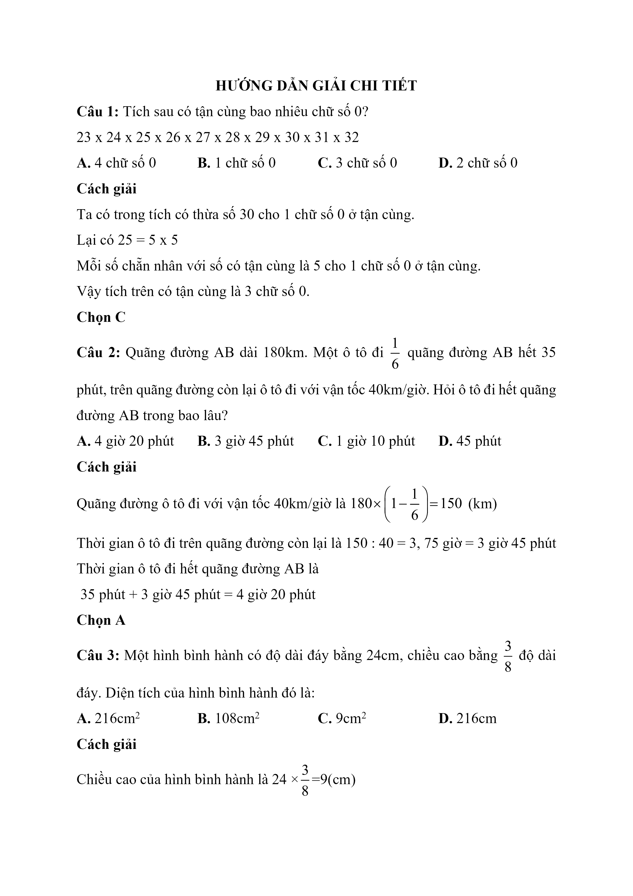

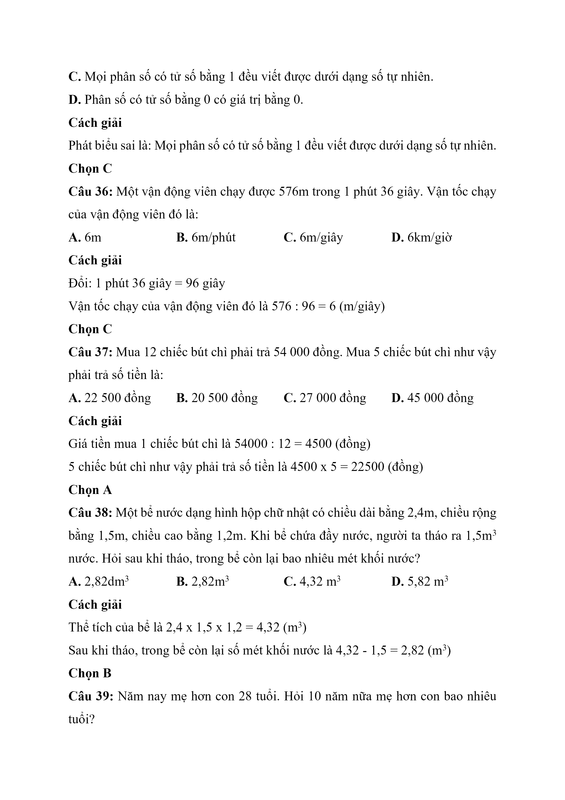

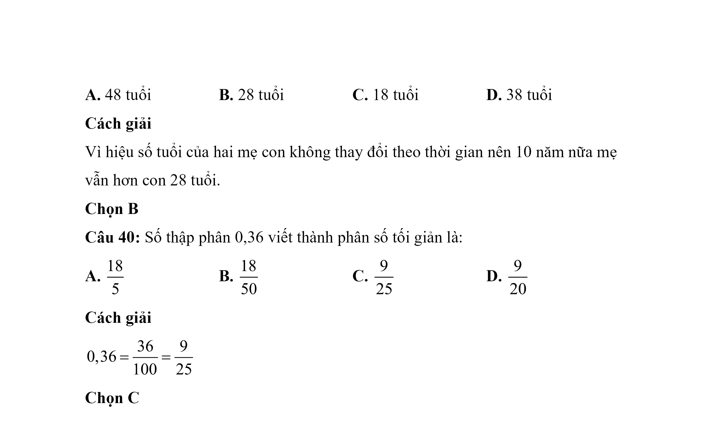

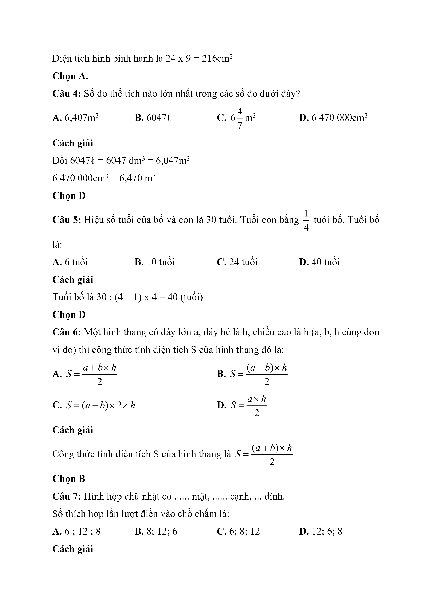

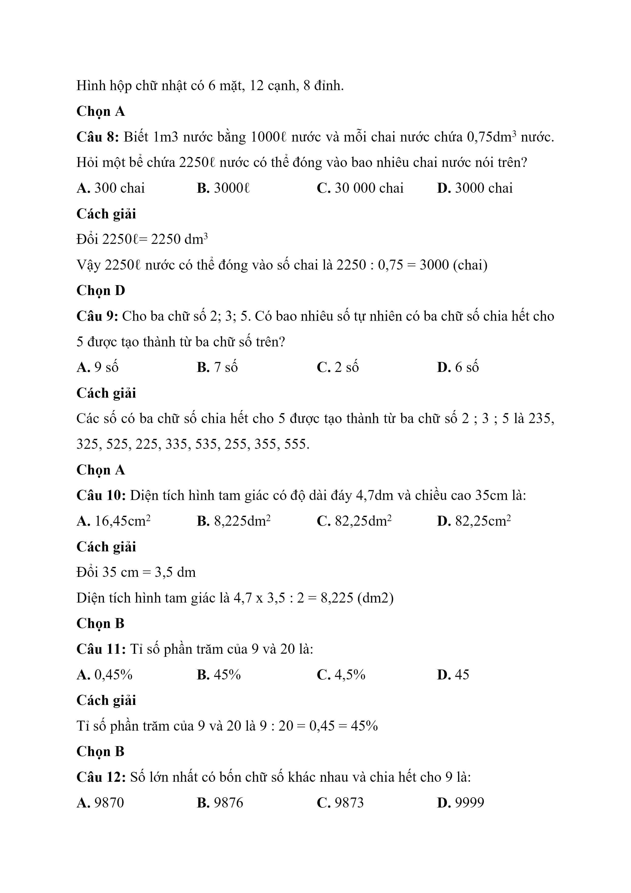

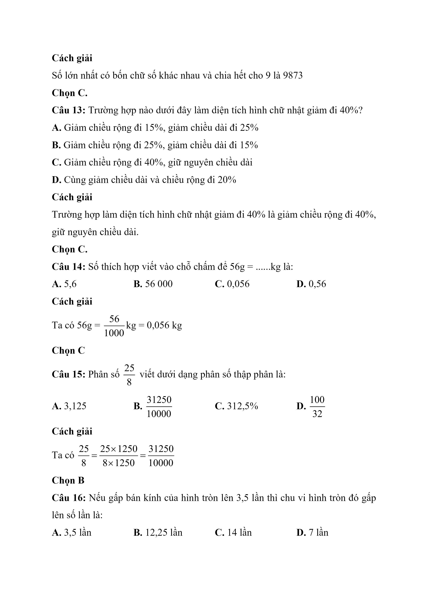

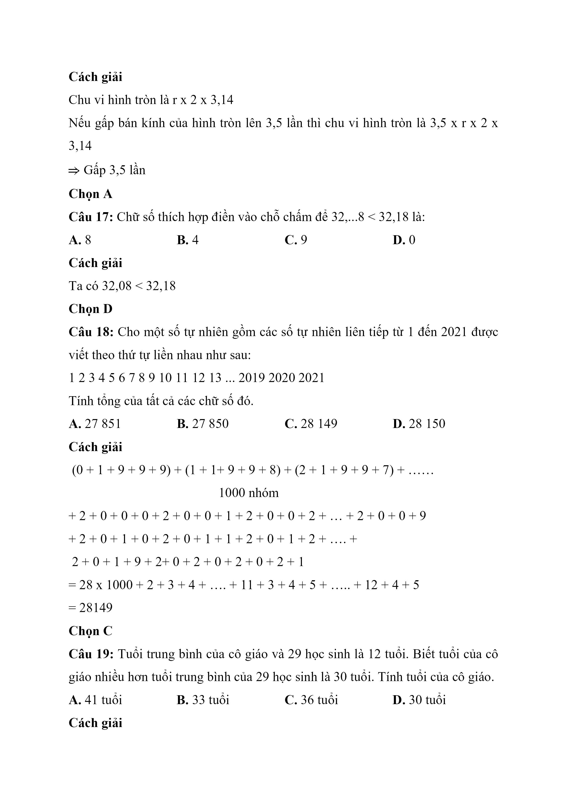

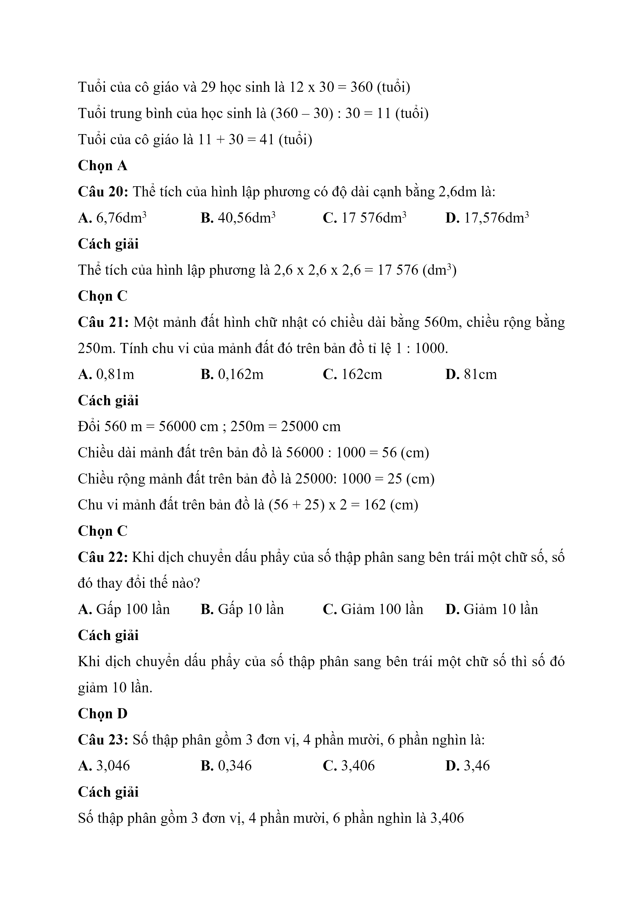

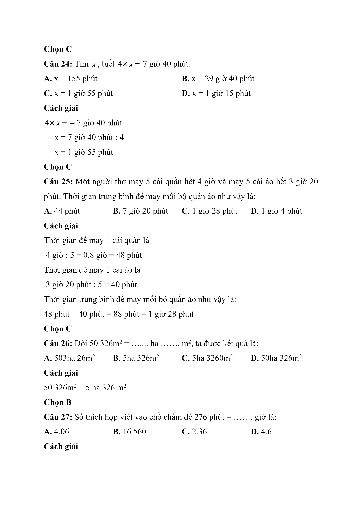

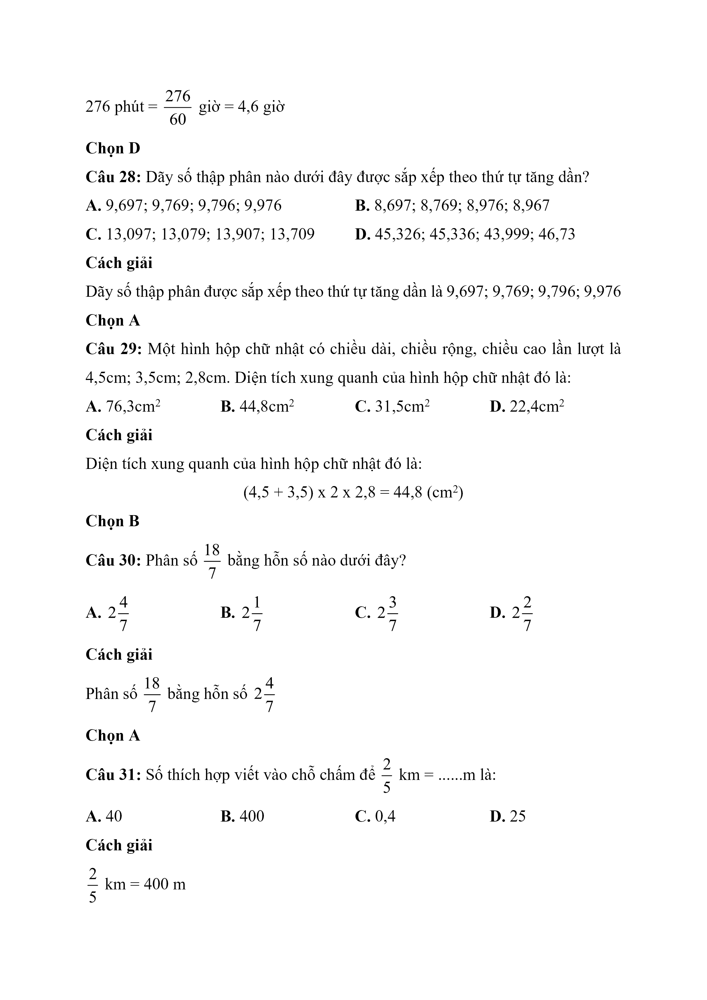

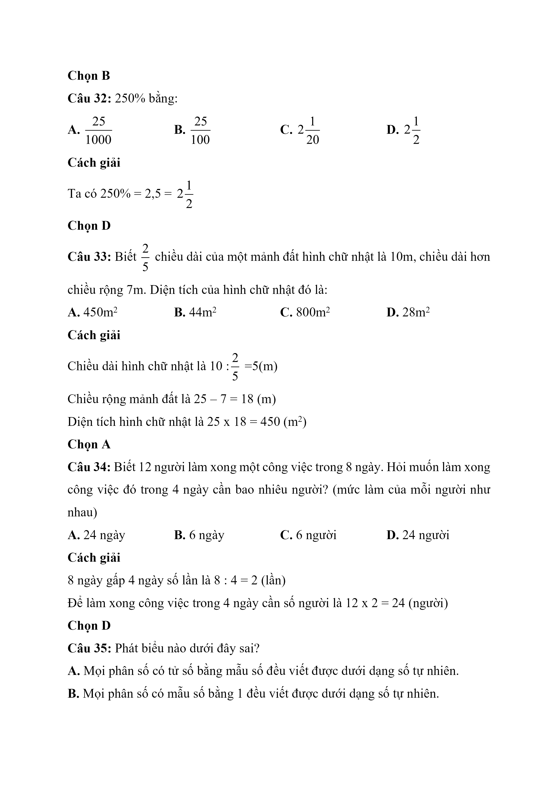
