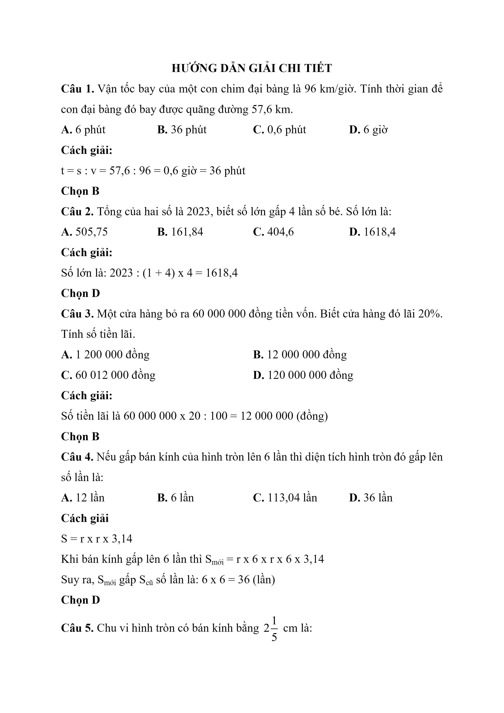
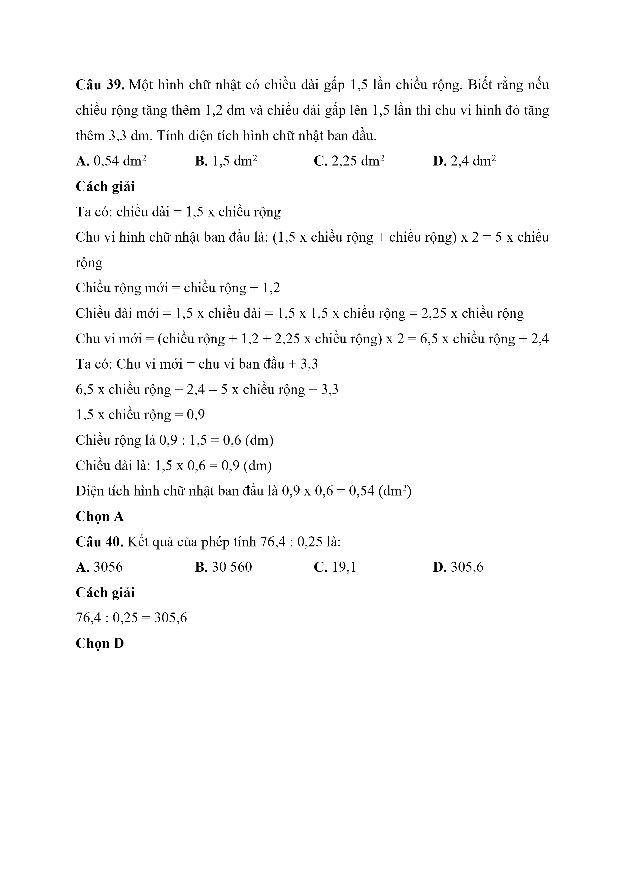
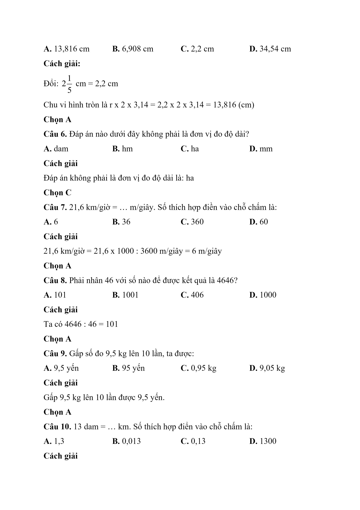
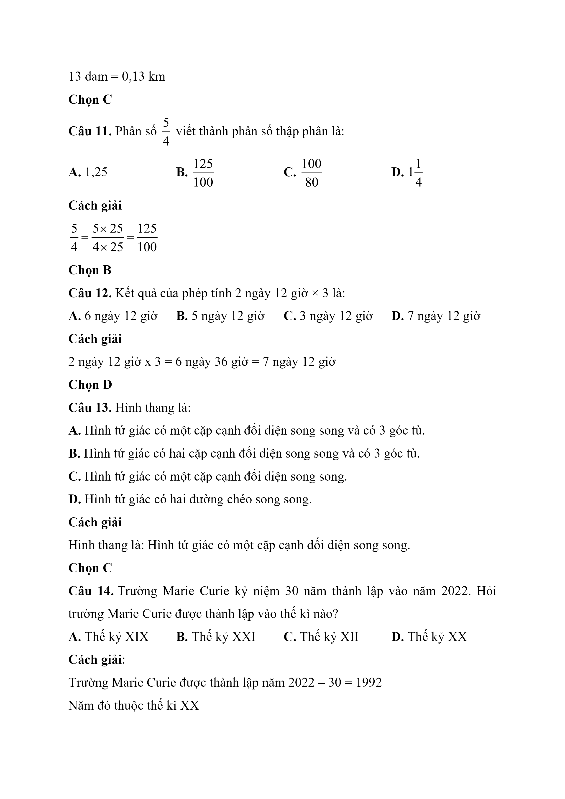
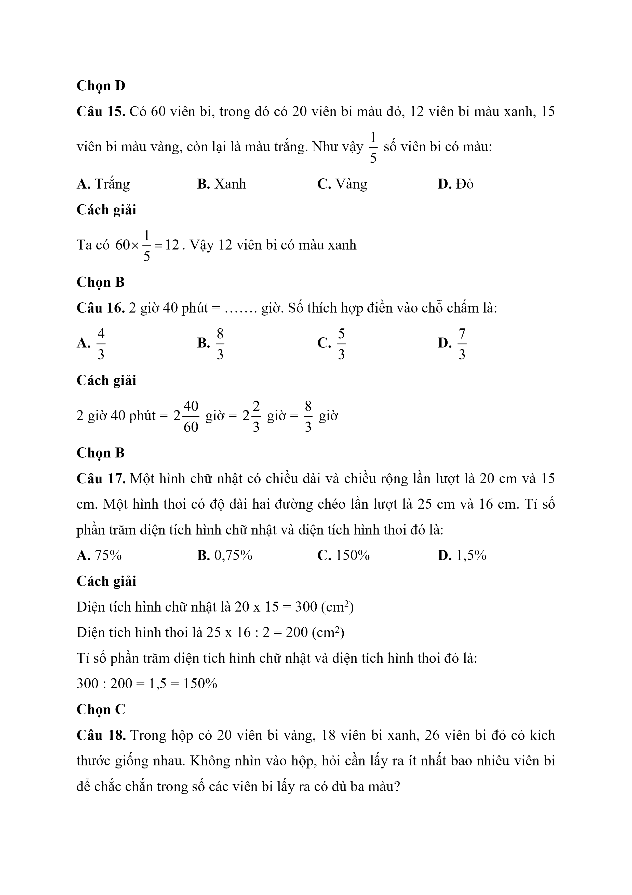
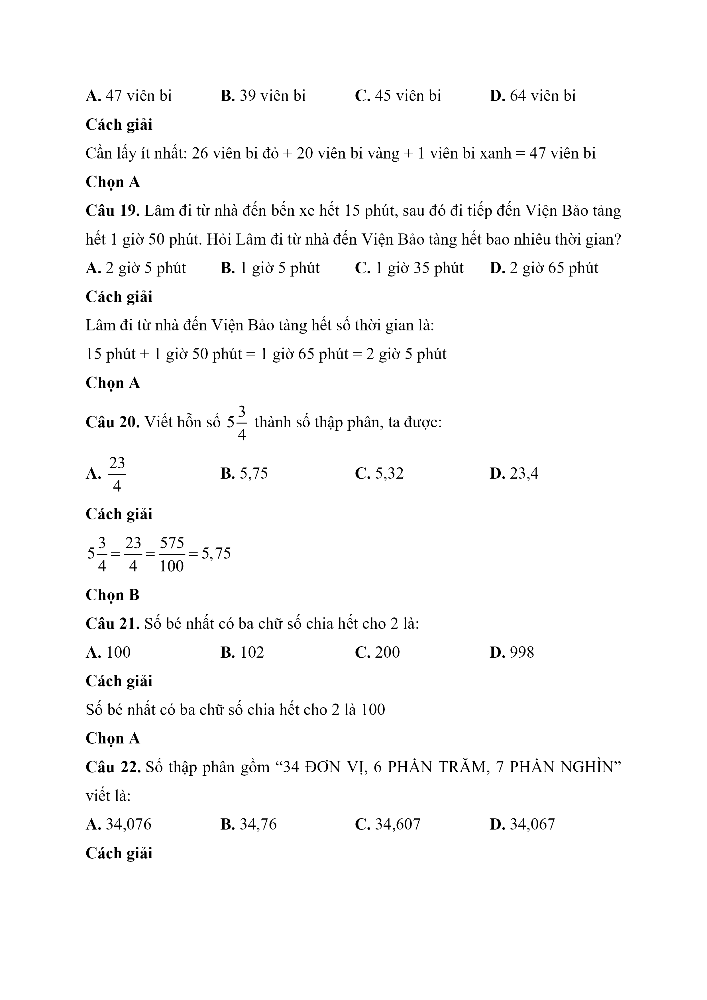
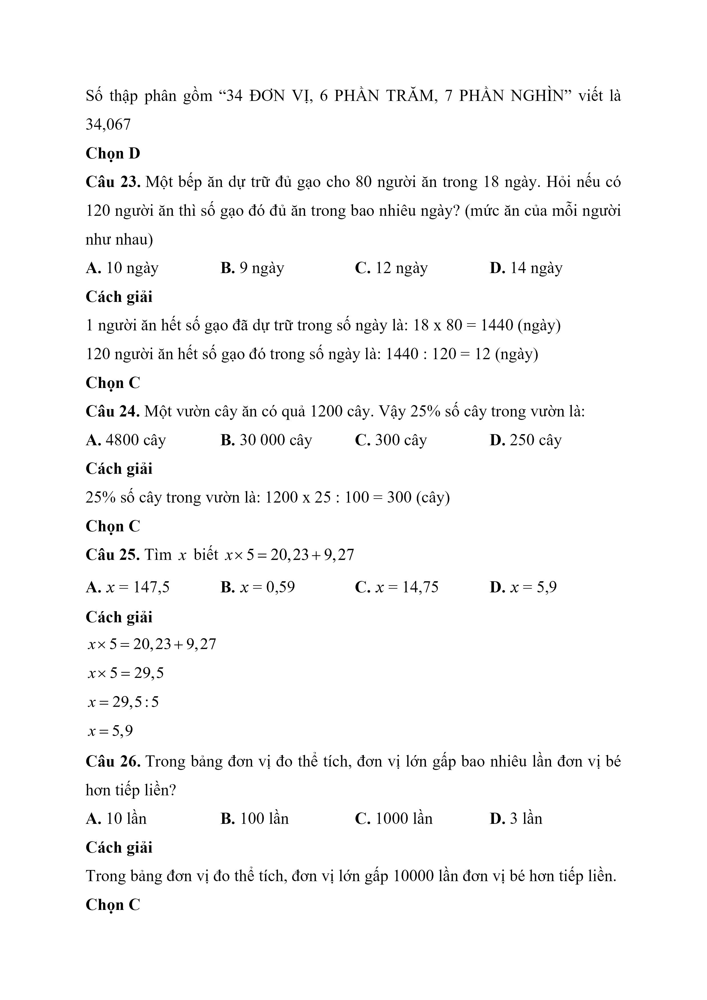
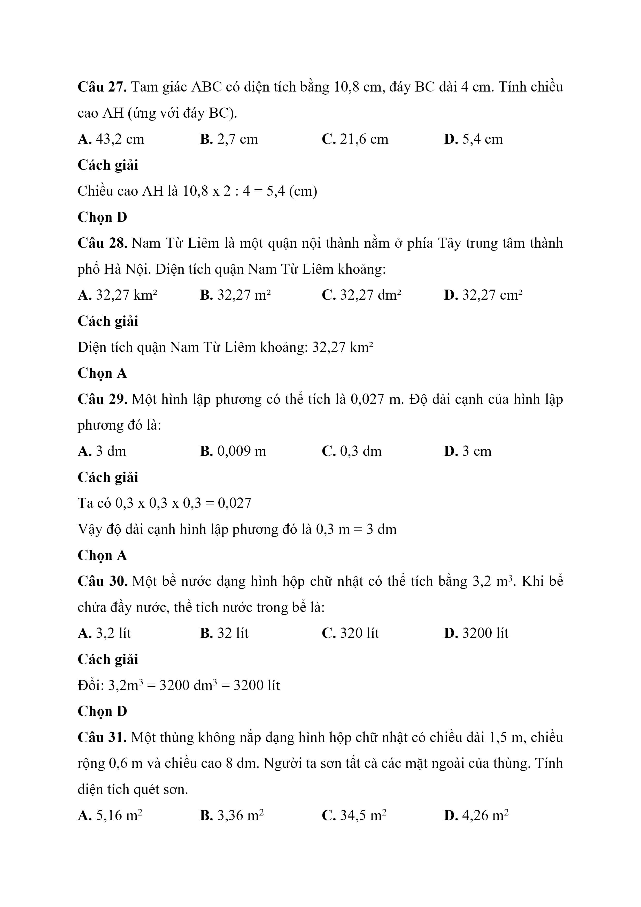
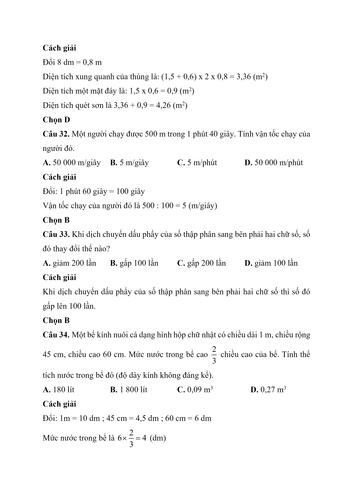
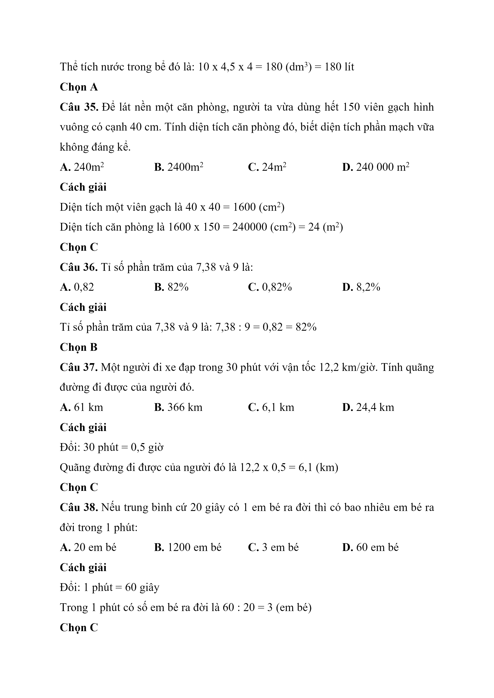

# Đề Toán vào 6 — Marie Curie (2023)

Câu 1. Vận tốc bay của một con chim đại bàng là 96 km/giờ. Tính thời gian để con đại bàng đó bay được quãng đường 57,6 km.

A. 6 phút

B. 36 phút

C. 0,6 phút

D. 6 giờ

Câu 2. Tổng của hai số là 2023, biết số lớn gấp 4 lần số bé. Số lớn là:

A. 505,75

B. 161,84

C. 404,6

D. 1618,4

Câu 3. Một cửa hàng bỏ ra 60 000 000 đồng tiền vốn. Biết cửa hàng đó lãi 20%. Tính số tiền lãi.

A. 1 200 000 đồng

B. 12 000 000 đồng

C. 60 012 000 đồng

D. 120 000 000 đồng

Câu 4. Nếu gấp bán kính của hình tròn lên 6 lần thì diện tích hình tròn đó gấp lên số lần là:

A. 12 lần

B. 6 lần

C. 113,04 lần

D. 36 lần

Câu 5. Chu vi hình tròn có bán kính bằng 2 $$\dfrac{1}{5}$$ cm là:

A. 13,816 cm

B. 6,908 cm

C. 2,2 cm

D. 34,54 cm

Câu 6. Đáp án nào dưới đây không phải là đơn vị đo độ dài?

A. dam

B. hm

C. ha

D. mm

Câu 7. 21,6 km/giờ = … m/giây. Số thích hợp điền vào chỗ chấm là:

A. 6

B. 36

C. 360

D. 60

Câu 8. Phải nhân 46 với số nào để được kết quả là 4646?

A. 101

B. 1001

C. 406

D. 1000

Câu 9. Gấp số đo 9,5 kg lên 10 lần, ta được:

A. 9,5 yến

B. 95 yến

C. 0,95 kg

D. 9,05 kg

Câu 10. 13 dam = … km. Số thích hợp điển vào chỗ chấm là:

A. 1,3

B. 0,013

C. 0,13

D. 1300

Câu 11. Phân số 5 4 viết thành phân số thập phân là:

A. 1,25

B. 125 100

C. 100 80

D. 1 1 4

Câu 12. Kết quả của phép tính 2 ngày 12 giờ × 3 là:

A. 6 ngày 12 giờ

B. 5 ngày 12 giờ

C. 3 ngày 12 giờ

D. 7 ngày 12 giờ

Câu 13. Hình thang là:

A. Hình tứ giác có một cặp cạnh đối diện song song và có 3 góc tù.

B. Hình tứ giác có hai cặp cạnh đối diện song song và có 3 góc tù.

C. Hình tứ giác có một cặp cạnh đối diện song song.

D. Hình tứ giác có hai đường chéo song song.

Câu 14. trường THCS Marie Curie kỷ niệm 30 năm thành lập vào năm 2022. Hỏi trường THCS Marie Curie được thành lập vào thế kỉ nào?

A. Thế kỷ XIX

B. Thế kỷ XXI

C. Thế kỷ XII

D. Thế kỷ XX

Câu 15. Có 60 viên bi, trong đó có 20 viên bi màu đỏ, 12 viên bi màu xanh, 15 viên bi màu vàng, còn lại là màu trắng. Như vậy $$\dfrac{1}{5}$$ số viên bi có màu:

A. Trắng

B. Xanh

C. Vàng

D. Đỏ

Câu 16. 2 giờ 40 phút = ……. giờ. Số thích hợp điền vào chỗ chấm là:

A. 4 3

B. 8 3

C. 5 3

D. 7 3

Câu 17. Một hình chữ nhật có chiều dài và chiều rộng lần lượt là 20 cm và 15 cm. Một hình thoi có độ dài hai đường chéo lần lượt là 25 cm và 16 cm. Tỉ số phần trăm diện tích hình chữ nhật và diện tích hình thoi đó là:

A. 75%

B. 0,75%

C. 150%

D. 1,5%

Câu 18. Trong hộp có 20 viên bi vàng, 18 viên bi xanh, 26 viên bi đỏ có kích thước giống nhau. Không nhìn vào hộp, hỏi cần lấy ra ít nhất bao nhiêu viên bi để chắc chắn trong số các viên bi lấy ra có đủ ba màu?

A. 47 viên bi

B. 39 viên bi

C. 45 viên bi

D. 64 viên bi

Câu 19. Lâm đi từ nhà đến bến xe hết 15 phút, sau đó đi tiếp đến Viện Bảo tảng hết 1 giờ 50 phút. Hỏi Lâm đi từ nhà đến Viện Bảo tàng hết bao nhiêu thời gian?

A. 2 giờ 5 phút

B. 1 giờ 5 phút

C. 1 giờ 35 phút

D. 2 giờ 65 phút

Câu 20. Viết hỗn số 5 3 4 thành số thập phân, ta được:

A. 23 4

B. 5,75

C. 5,32

D. 23,4

Câu 21. Số bé nhất có ba chữ số chia hết cho 2 là:

A. 100

B. 102

C. 200

D. 998

Câu 22. Số thập phân gồm “34 ĐƠN VỊ, 6 PHẦN TRĂM, 7 PHẦN NGHÌN” viết là:

A. 34,076

B. 34,76

C. 34,607

D. 34,067

Câu 23. Một bếp ăn dự trữ đủ gạo cho 80 người ăn trong 18 ngày. Hỏi nếu có 120 người ăn thì số gạo đó đủ ăn trong bao nhiêu ngày? (mức ăn của mỗi người như nhau)

A. 10 ngày

B. 9 ngày

C. 12 ngày

D. 14 ngày

Câu 24. Một vườn cây ăn có quả 1200 cây. Vậy 25% số cây trong vườn là:

A. 4800 cây

B. 30 000 cây

C. 300 cây

D. 250 cây

Câu 25. Tìm x biết x × 5 = 20 , 23 + 9 , 27

A. 𝑥 = 147,5

B. 𝑥 = 0,59

C. 𝑥 = 14,75

D. 𝑥 = 5,9

Câu 26. Trong bảng đơn vị đo thể tích, đơn vị lớn gấp bao nhiêu lần đơn vị bé hơn tiếp liền?

A. 10 lần

B. 100 lần

C. 1000 lần

D. 3 lần

Câu 27. Tam giác ABC có diện tích bằng 10,8 cm, đáy BC dài 4 cm. Tính chiều cao AH (ứng với đáy BC).

A. 43,2 cm

B. 2,7 cm

C. 21,6 cm

D. 5,4 cm

Câu 28. Nam Từ Liêm là một quận nội thành nằm ở phía Tây trung tâm thành phố Hà Nội. Diện tích quận Nam Từ Liêm khoảng:

A. 32,27 km²

B. 32,27 m²

C. 32,27 dm²

D. 32,27 cm²

Câu 29. Một hình lập phương có thể tích là 0,027 m. Độ dải cạnh của hình lập phương đó là:

A. 3 dm

B. 0,009 m

C. 0,3 dm

D. 3 cm

Câu 30. Một bể nước dạng hình hộp chữ nhật có thể tích bằng $$3{,}2\,\mathrm{m}^{3}$$ . Khi bể chứa đầy nước, thể tích nước trong bể là:

A. 3,2 lít

B. 32 lít

C. 320 lít

D. 3200 lít

Câu 31. Một thùng không nắp dạng hình hộp chữ nhật có chiều dài 1,5 m, chiều rộng 0,6 m và chiều cao 8 dm. Người ta sơn tất cả các mặt ngoài của thùng. Tính diện tích quét sơn.

A. $$5{,}16\,\mathrm{m}^{2}$$

B. $$3{,}36\,\mathrm{m}^{2}$$

C. $$34{,}5\,\mathrm{m}^{2}$$

D. $$4{,}26\,\mathrm{m}^{2}$$

Câu 32. Một người chạy được 500 m trong 1 phút 40 giây. Tính vận tốc chạy của người đó.

A. $$\dfrac{50}{000}$$ m/giây

B. 5 m/giây

C. 5 m/phút

D. $$\dfrac{50}{000}$$ m/phút

Câu 33. Khi dịch chuyển dấu phẩy của số thập phân sang bên phải hai chữ số, số đó thay đổi thế nào?

A. giảm 200 lần

B. gấp 100 lần

C. gấp 200 lần

D. giảm 100 lần

Câu 34. Một bể kính nuôi cá dạng hình hộp chữ nhật có chiều dài 1 m, chiều rộng 45 cm, chiều cao 60 cm. Mức nước trong bể cao $$\dfrac{2}{3}$$ chiều cao của bể. Tính thể tích nước trong bể đó (độ dày kính không đáng kể).

A. 180 lít

B. 1 800 lít

C. $$0{,}09\,\mathrm{m}^{3}$$

D. $$0{,}27\,\mathrm{m}^{3}$$

Câu 35. Để lát nền một căn phòng, người ta vừa dùng hết 150 viên gạch hình vuông có cạnh 40 cm. Tính diện tích căn phòng đó, biết diện tích phần mạch vữa không đáng kể.

A. $$240\,\mathrm{m}^{2}$$

B. $$2400\,\mathrm{m}^{2}$$

C. $$24\,\mathrm{m}^{2}$$

D. 240 $$000\,\mathrm{m}^{2}$$

Câu 36. Tỉ số phần trăm của 7,38 và 9 là:

A. 0,82

B. 82%

C. 0,82%

D. 8,2%

Câu 37. Một người đi xe đạp trong 30 phút với vận tốc 12,2 km/giờ. Tính quãng đường đi được của người đó.

A. 61 km

B. 366 km

C. 6,1 km

D. 24,4 km

Câu 38. Nếu trung bình cứ 20 giây có 1 em bé ra đời thì có bao nhiêu em bé ra đời trong 1 phút:

A. 20 em bé

B. 1200 em bé

C. 3 em bé

D. 60 em bé

Câu 39. Một hình chữ nhật có chiều dài gấp 1,5 lần chiều rộng. Biết rằng nếu chiều rộng tăng thêm 1,2 dm và chiều dài gấp lên 1,5 lần thì chu vi hình đó tăng thêm 3,3 dm. Tính diện tích hình chữ nhật ban đầu.

A. $$0{,}54\,\mathrm{dm}^{2}$$

B. $$1{,}5\,\mathrm{dm}^{2}$$

C. $$2{,}25\,\mathrm{dm}^{2}$$

D. $$2{,}4\,\mathrm{dm}^{2}$$

Câu 40. Kết quả của phép tính 76,4 : 0,25 là:

A. 3056

B. 30 560

C. 19,1

D. 305,6

## Hình minh họa

*(Ảnh trang đề / scan — có thể là cả trang)*

