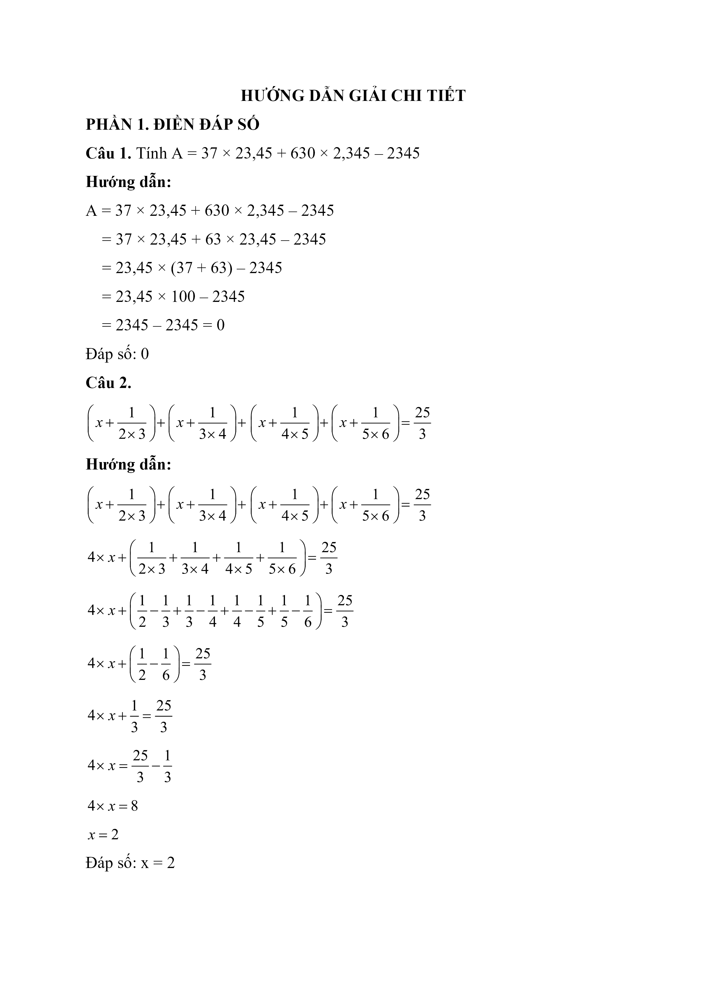
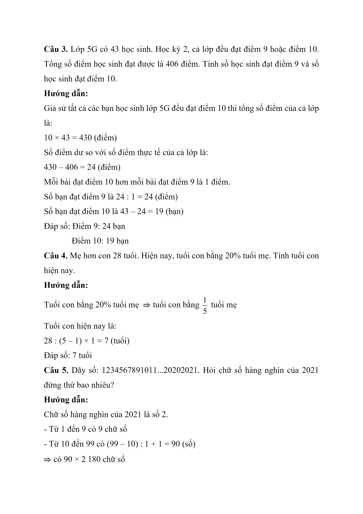
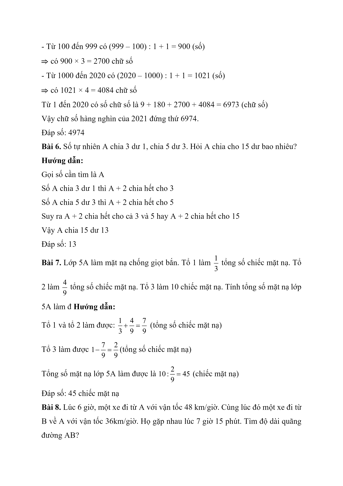
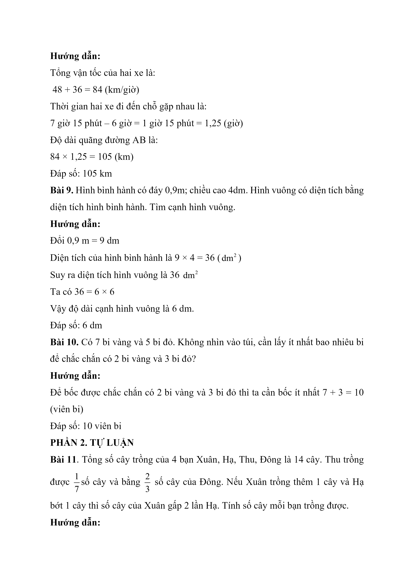
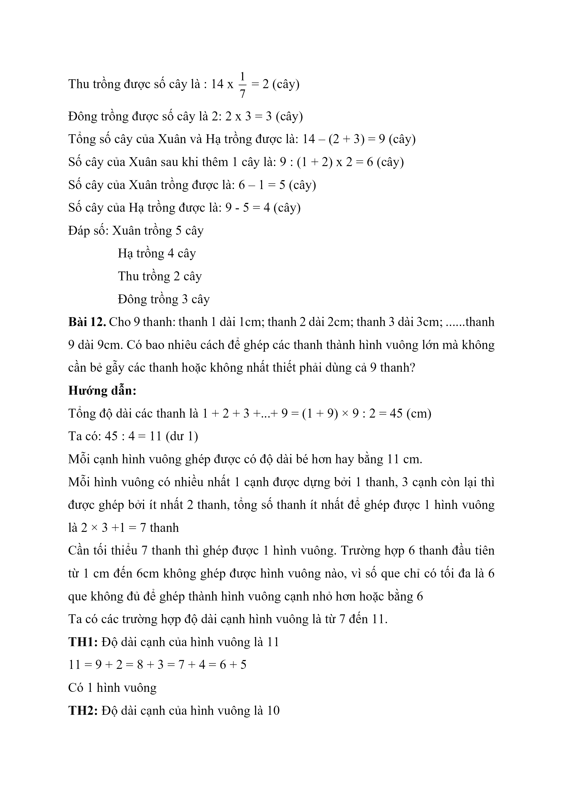
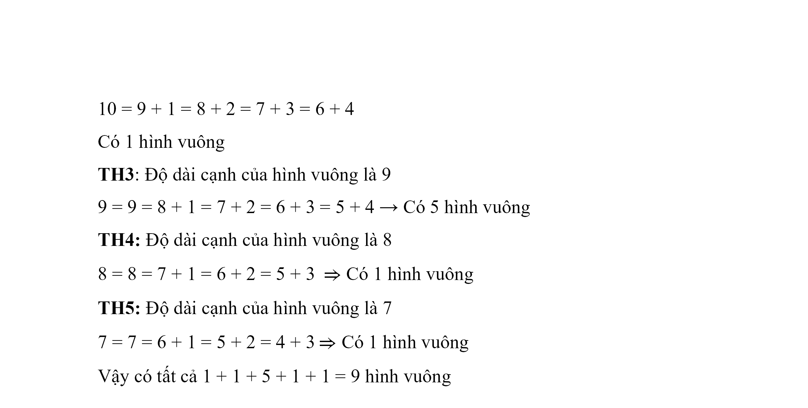

# Đề Toán vào 6 — Nam Từ Liêm (2020)

PHẦN 1. ĐIỀN ĐÁP SỐ

Câu 1. Tính A = 37 x 23,45 + 630 x 2,345 – 2345

Câu 2.

x × 1 2 × 3 + x + 1 3 × 4 + x + 1 4 × 5 + x + 1 5 × 6 = 25 3

Câu 3. Lớp 5G có 43 học sinh. Học kỳ 2, cả lớp đều đạt điểm 9 hoặc điểm 10. Tổng số điểm học sinh đạt được là 406 điểm. Tính số học sinh đạt điểm 9 và số học sinh đạt điểm 10.

Câu 4. Mẹ hơn con 28 tuổi. Hiện nay, tuổi con bằng 20% tuổi mẹ. Tính tuổi con hiện nay.

Câu 5. Dãy số: 1234567891011...20202021. Hỏi chữ số hàng nghìn của 2021 đứng thứ bao nhiêu?

Bài 6. Số tự nhiên A chia 3 dư 1, chia 5 dư 3. Hỏi A chia cho 15 dư bao nhiêu?

Bài 7. Lớp 5A làm mặt nạ chống giọt bắn. Tổ 1 làm $$\dfrac{1}{3}$$ tổng số chiếc mặt nạ. Tổ 2 làm $$\dfrac{4}{9}$$ tổng số chiếc mặt nạ. Tổ 3 làm 10 chiếc mặt nạ. Tính tổng số mặt nạ lớp 5A làm được.

Bài 8 . Lúc 6 giờ, một xe đi từ A với vận tốc 48 km/giờ. Cùng lúc đó một xe đi từ B về A với vận tốc 36km/giờ. Họ gặp nhau lúc 7 giờ 15 phút. Tìm độ dài quãng đường AB?

Bài 9. Hình bình hành có đáy 0,9m; chiều cao 4dm. Hình vuông có diện tích bằng diện tích hình bình hành. Tìm cạnh hình vuông.

Bài 10. Có 7 bi vàng và 5 bi đỏ. Không nhìn vào túi, cần lấy ít nhất bao nhiêu bi để chắc chắn có 2 bi vàng và 3 bi đỏ?

PHẦN 2. TỰ LUẬN

Bài 11. Tổng số cây trồng của 4 bạn Xuân, Hạ, Thu, Đông là 14 cây. Thu trồng được $$\dfrac{1}{7}$$ số cây và bằng $$\dfrac{2}{3}$$ số cây của Đông. Nếu Xuân trồng thêm 1 cây và Hạ bớt 1 cây thì số cây của Xuân gấp 2 lần Hạ. Tính số cây mỗi bạn trồng được.

Bài 12 . Cho 9 thanh: thanh 1 dài 1cm; thanh 2 dài 2cm; thanh 3 dài 3cm; ......thanh 9 dài 9cm. Có bao nhiêu cách để ghép các thanh thành hình vuông lớn mà không cần bẻ gẫy các thanh hoặc không nhất thiết phải dùng cả 9 thanh?

## Hình minh họa

*(Ảnh trang đề / scan — có thể là cả trang)*

