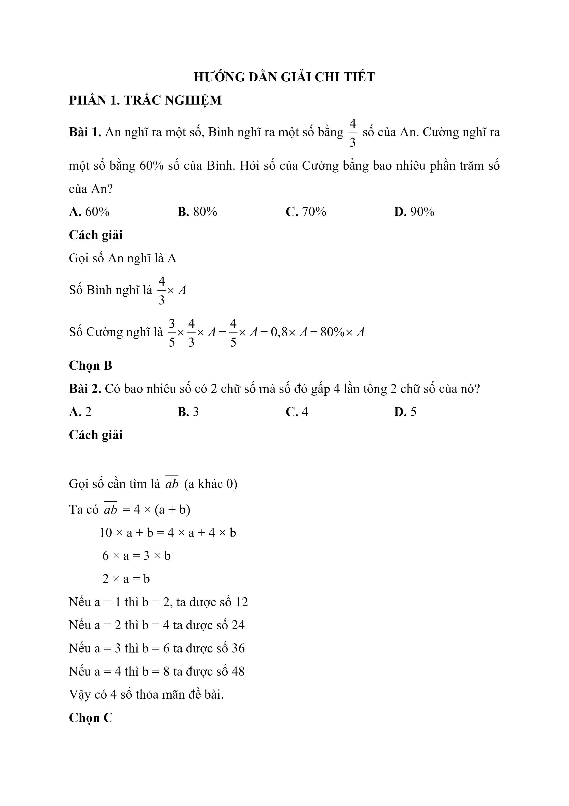
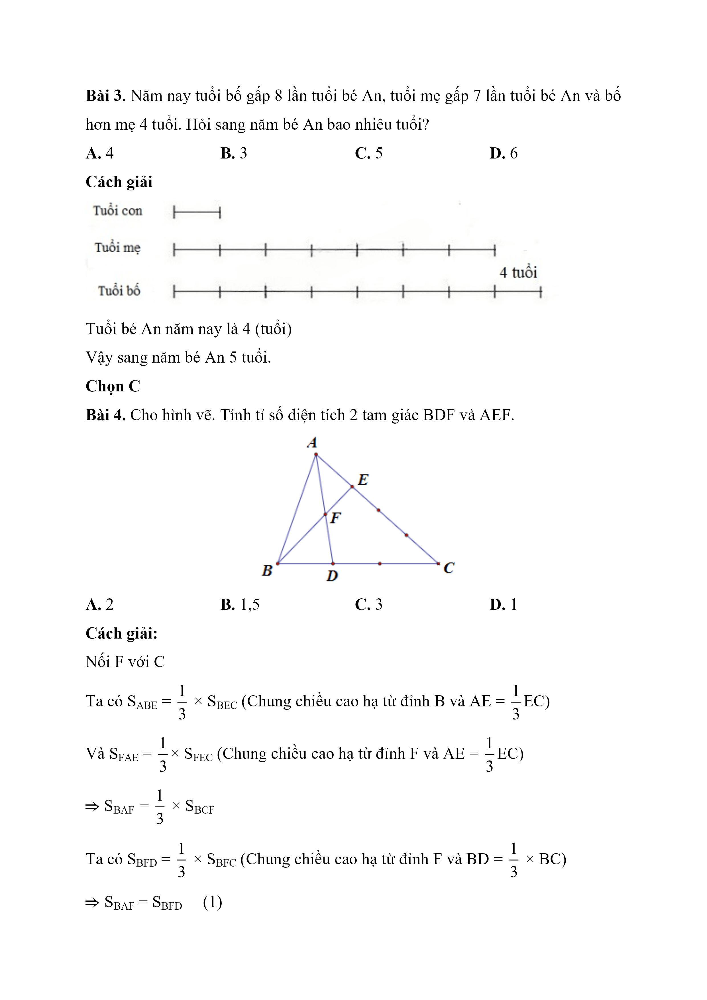
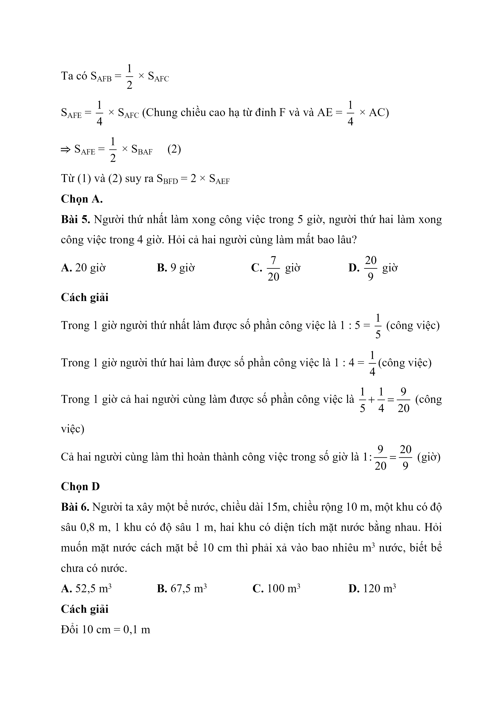
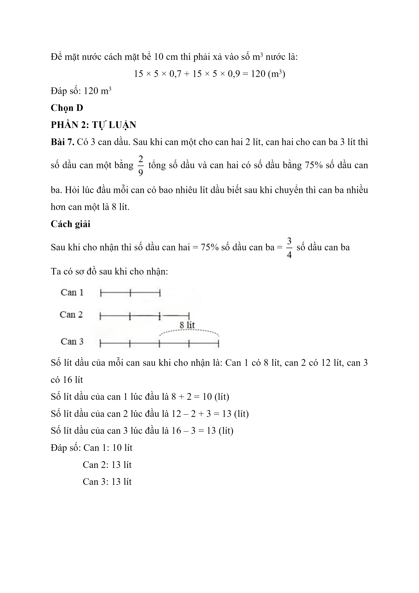
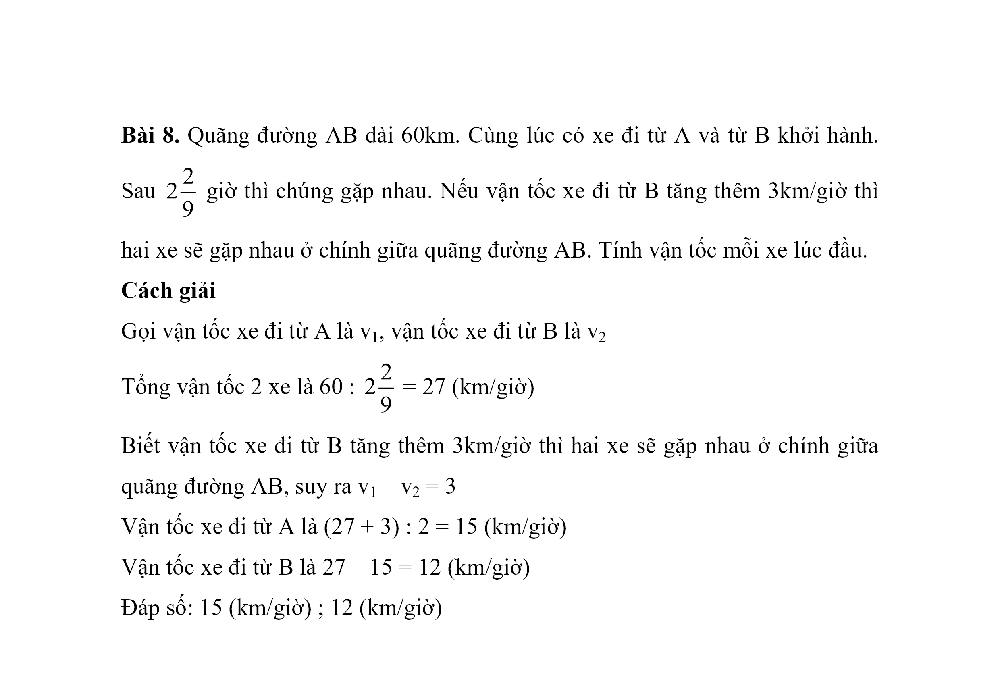

# Đề Toán vào 6 — Chuyên Ngoại ngữ (2019)

PHẦN 1: TRẮC NGHIỆM

Bài 1. An nghĩ ra một số, Bình nghĩ ra một số bằng $$\dfrac{4}{3}$$ số của An. Cường nghĩ ra một số bằng 60% số của Bình. Hỏi số của Cường bằng bao nhiêu phần trăm số của An?

A. 60%

B. 80%

C. 70%

D. 90%

Bài 2. Có bao nhiêu số có 2 chữ số mà số đó gấp 4 lần tổng 2 chữ số của nó?

A. 2

B. 3

C. 4

D. 5

Bài 3. Năm nay tuổi bố gấp 8 lần tuổi bé An, tuổi mẹ gấp 7 lần tuổi bé An và bố hơn mẹ 4 tuổi. Hỏi sang năm bé An bao nhiêu tuổi?

A. 4

B. 3

C. 5

D. 6

Bài 4. Cho hình vẽ. Tính tỉ số diện tích 2 tam giác BDF và AEF.

A. 2

B. 1,5

C. 3

D. 1

Bài 5. Người thứ nhất làm xong công việc trong 5 giờ, người thứ hai làm xong công việc trong 4 giờ. Hỏi cả hai người cùng làm mất bao lâu?

A. 20 giờ

B. 9 giờ

C. 7 20 giờ

D. 20 9 giờ

Bài 6. Người ta xây một bể nước, chiều dài 15m, chiều rộng 10 m, một khu có độ sâu 0,8 m, 1 khu có độ sâu 1 m, hai khu có diện tích mặt nước bằng nhau. Hỏi muốn mặt nước cách mặt bể 10 cm thì phải xả vào bao nhiêu m 3 nước, biết bể chưa có nước.

A. $$52{,}5\,\mathrm{m}^{3}$$

B. $$67{,}5\,\mathrm{m}^{3}$$

C. $$100\,\mathrm{m}^{3}$$

D. $$120\,\mathrm{m}^{3}$$

PHẦN 2: TỰ LUẬN

Bài 7. Có 3 can dầu. Sau khi can một cho can hai 2 lít, can hai cho can ba 3 lít thì số dầu can một bằng $$\dfrac{2}{9}$$ tổng số dầu và can hai có số dầu bằng 75% số dầu can ba. Hỏi lúc đầu mỗi can có bao nhiêu lít dầu biết sau khi chuyển thì can ba nhiều hơn can một là 8 lít.

Bài 8. Quãng đường AB dài 60km. Cùng lúc có xe đi từ A và từ B khởi hành. Sau 2 2 9 giờ thì chúng gặp nhau. Nếu vận tốc xe đi từ B tăng thêm 3km/giờ thì hai xe sẽ gặp nhau ở chính giữa quãng đường AB. Tính vận tốc mỗi xe lúc đầu.

## Hình minh họa

*(Ảnh trang đề / scan — có thể là cả trang)*

