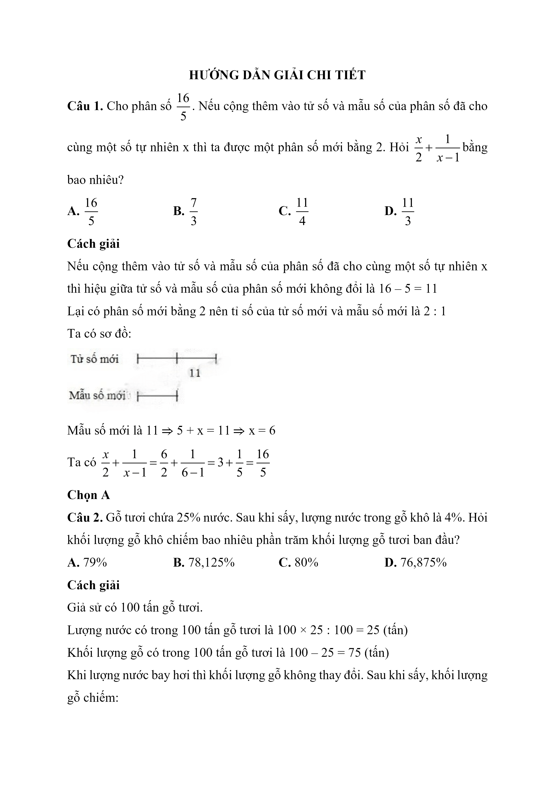
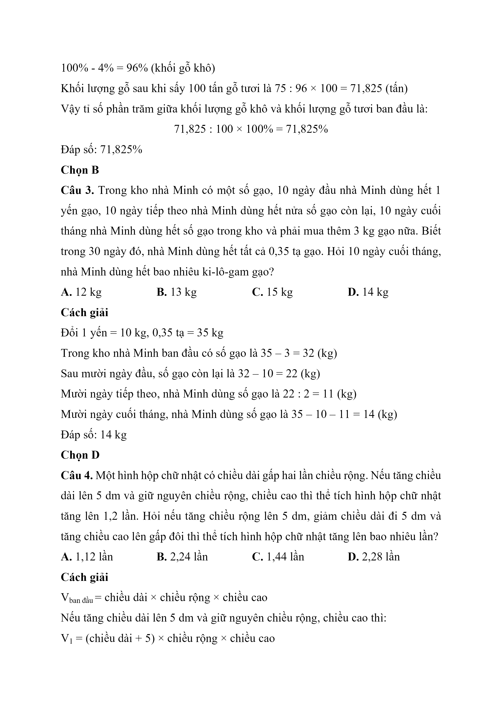
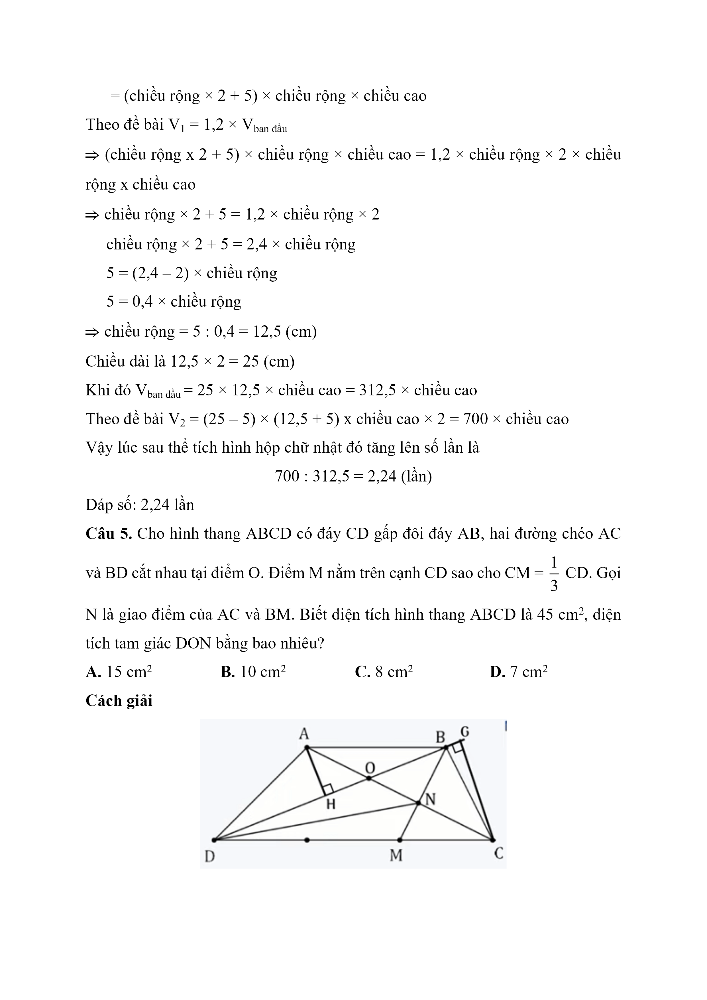
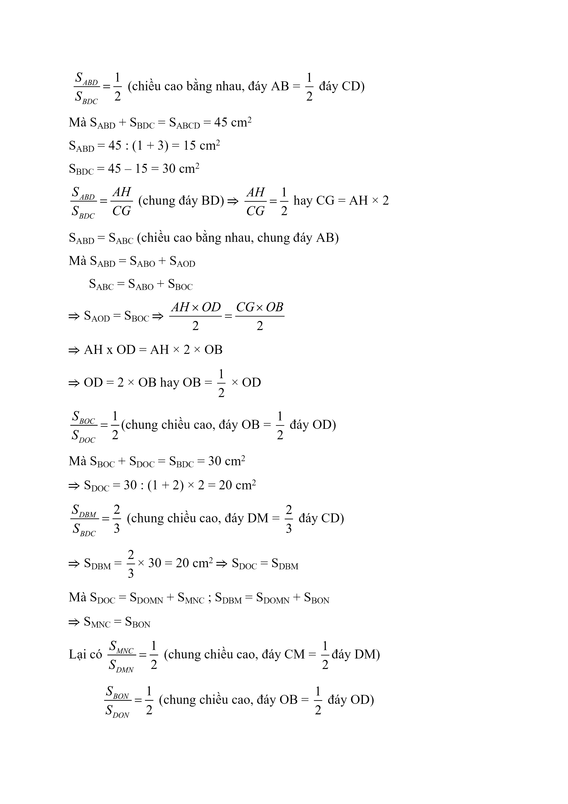
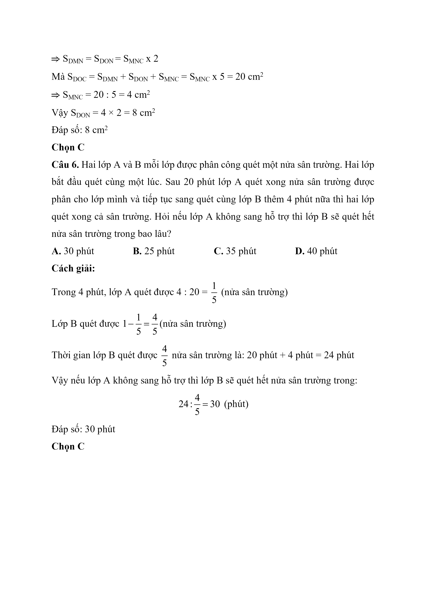

# Đề Toán vào 6 — Chuyên Ngoại ngữ (2021)

Câu 1. Cho phân số 16 5 . Nếu cộng thêm vào tử số và mẫu số của phân số đã cho cùng một số tự nhiên x thì ta được một phân số mới bằng 2. Hỏi x 2 + 1 x - 1 bằng bao nhiêu?

A. 16 5

B. 7 3

C. 11 4

D. 11 3

Câu 2. Gỗ tươi chứa 25% nước. Sau khi sấy, lượng nước trong gỗ khô là 4%. Hỏi khối lượng gỗ khô chiếm bao nhiêu phần trăm khối lượng gỗ tươi ban đầu?

A. 79%

B. 78,125%

C. 80%

D. 76,875%

Câu 3. Trong kho nhà Minh có một số gạo, 10 ngày đầu nhà Minh dùng hết 1 yến gạo, 10 ngày tiếp theo nhà Minh dùng hết nửa số gạo còn lại, 10 ngày cuối tháng nhà Minh dùng hết số gạo trong kho và phải mua thêm 3 kg gạo nữa. Biết trong 30 ngày đó, nhà Minh dùng hết tất cả 0,35 tạ gạo. Hỏi 10 ngày cuối tháng, nhà Minh dùng hết bao nhiêu ki-lô-gam gạo?

A. 12 kg

B. 13 kg

C. 15 kg

D. 14 kg

Câu 4. Một hình hộp chữ nhật có chiều dài gấp hai lần chiều rộng. Nếu tăng chiều dài lên 5 dm và giữ nguyên chiều rộng, chiều cao thì thể tích hình hộp chữ nhật tăng lên 1,2 lần. Hỏi nếu tăng chiều rộng lên 5 dm, giảm chiều dài đi 5 dm và tăng chiều cao lên gấp đôi thì thể tích hình hộp chữ nhật tăng lên bao nhiêu lần?

A. 1,12 lần

B. 2,24 lần

C. 1,44 lần

D. 2,28 lần

Câu 5. Cho hình thang ABCD có đáy CD gấp đôi đáy AB, hai đường chéo AC và BD cắt nhau tại điểm O. Điểm M nằm trên cạnh CD sao cho CM = 1 3 CD. Gọi N là giao điểm của AC và BM. Biết diện tích hình thang ABCD là $$45\,\mathrm{cm}^{2}$$ , diện tích tam giác DON bằng bao nhiêu?

A. $$15\,\mathrm{cm}^{2}$$

B. $$10\,\mathrm{cm}^{2}$$

C. $$8\,\mathrm{cm}^{2}$$

D. $$7\,\mathrm{cm}^{2}$$

Câu 6. Hai lớp A và B mỗi lớp được phân công quét một nửa sân trường. Hai lớp bắt đầu quét cùng một lúc. Sau 20 phút lớp A quét xong nửa sân trường được phân cho lớp mình và tiếp tục sang quét cùng lớp B thêm 4 phút nữa thì hai lớp quét xong cả sân trường. Hỏi nếu lớp A không sang hỗ trợ thì lớp B sẽ quét hết nửa sân trường trong bao lâu?

A. 30 phút

B. 25 phút

C. 35 phút

D. 40 phút

## Hình minh họa

*(Ảnh trang đề / scan — có thể là cả trang)*

