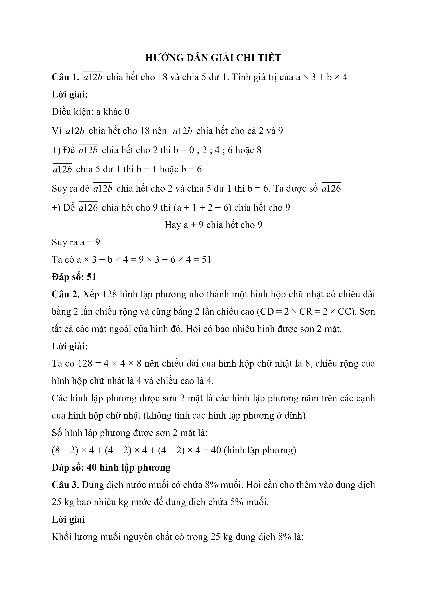
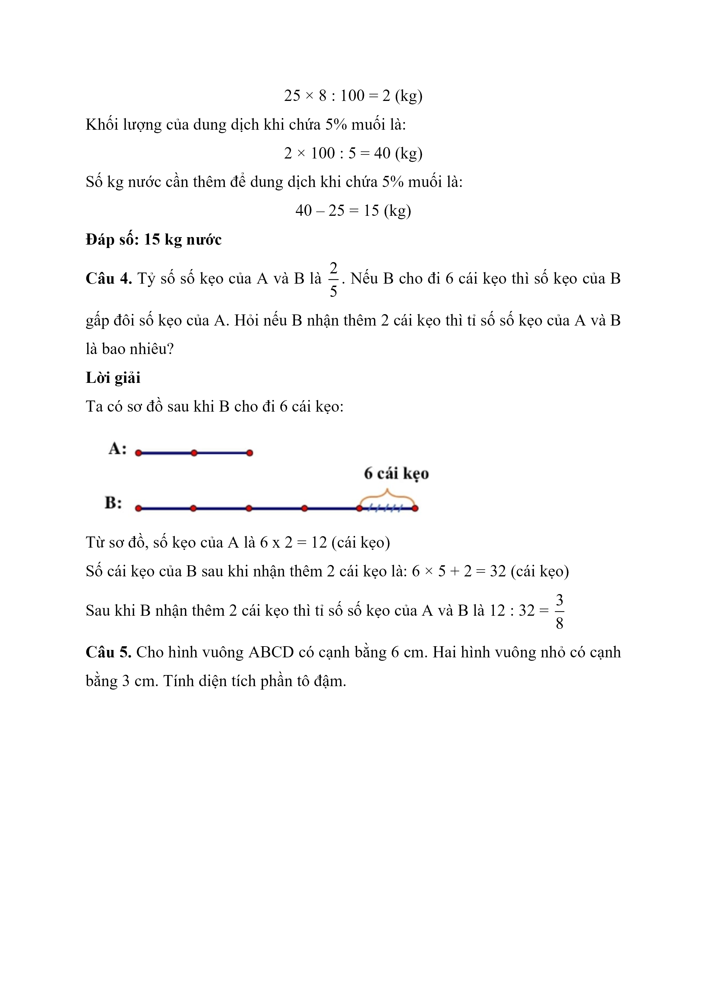
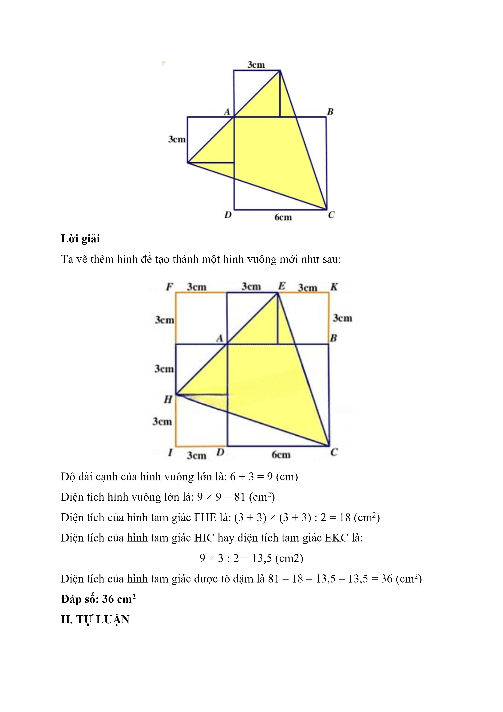
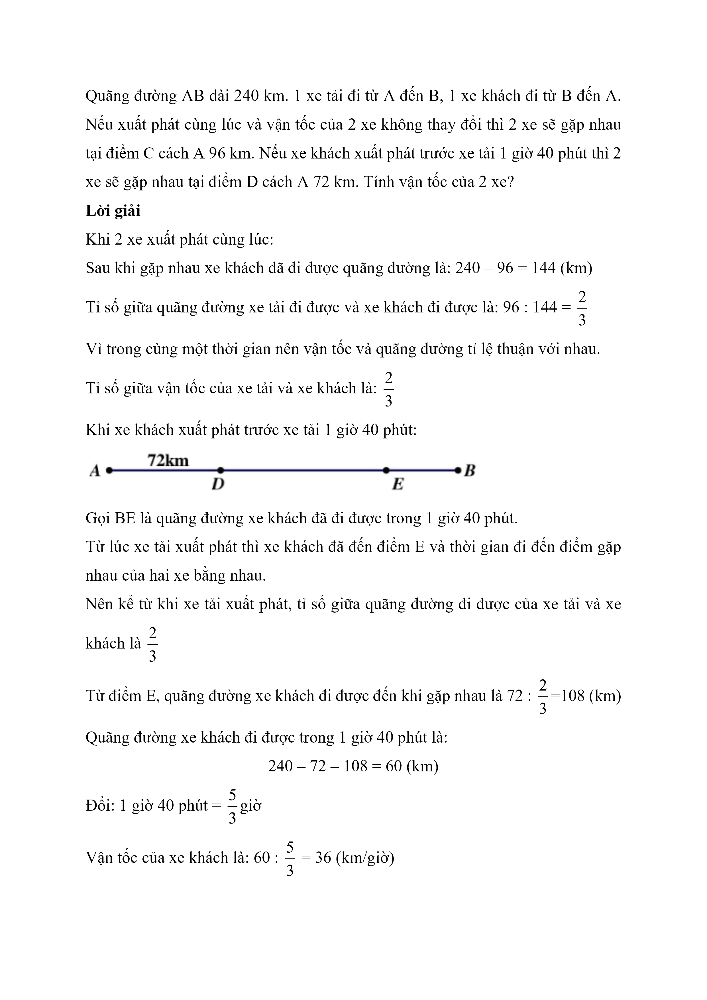
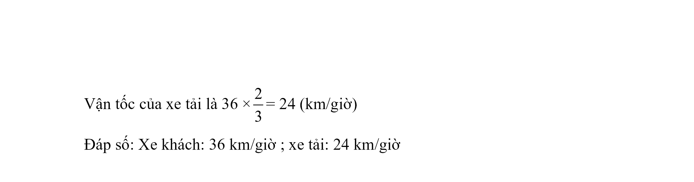

# Đề Toán vào 6 — Chuyên Ngoại ngữ (2023)

I. TRẮC NGHIỆM

Câu 1. $$\overline{a12b}$$ chia hết cho 18 và chia 5 dư 1. Tính giá trị của a × 3 + b × 4

Câu 2. Xếp 128 hình lập phương nhỏ thành một hình hộp chữ nhật có chiều dài bằng 2 lần chiều rộng và cũng bằng 2 lần chiều cao (CD = 2 × CR = 2 × CC). Sơn tất cả các mặt ngoài của hình đó. Hỏi có bao nhiêu hình được sơn 2 mặt.

Câu 3. Dung dịch nước muối có chứa 8% muối. Hỏi cần cho thêm vào dung dịch 25 kg bao nhiêu kg nước để dung dịch chứa 5% muối.

Câu 4. Tỷ số số kẹo của A và B là 2 5 . Nếu B cho đi 6 cái kẹo thì số kẹo của B gấp đôi số kẹo của A. Hỏi nếu B nhận thêm 2 cái kẹo thì tỉ số số kẹo của A và B là bao nhiêu?

Câu 5. Cho hình vuông ABCD có cạnh bằng 6 cm. Hai hình vuông nhỏ có cạnh bằng 3 cm. Tính diện tích phần tô đậm.

II. TỰ LUẬN

Quãng đường AB dài 240 km. 1 xe tải đi từ A đến B, 1 xe khách đi từ B đến A. Nếu xuất phát cùng lúc và vận tốc của 2 xe không thay đổi thì 2 xe sẽ gặp nhau tại điểm C cách A 96 km. Nếu xe khách xuất phát trước xe tải 1 giờ 40 phút thì 2 xe sẽ gặp nhau tại điểm D cách A 72 km. Tính vận tốc của 2 xe?

## Hình minh họa

*(Ảnh trang đề / scan — có thể là cả trang)*

