# Đề Toán vào 6 — Nguyễn Tất Thành (2018-2019)

Câu 1. Số liệu thống kê xếp loại học lực của học sinh trường THCS&THPT Nguyễn Tất Thành trong
4 năm được cho trong bảng dưới đây. Biết rằng học lực của học sinh được chia làm ba
loại: Giỏi, Khá và Trung bình. Hỏi năm học nào tỉ lệ học sinh xếp loại Trung bình của
 trường là cao nhất?

Năm học

2014–2015

2015–2016

2016–2017

2017–2018

Xếp loại học

lực Giỏi

69,8%

79,6%

83,4%

85,7%

Xếp loại học

lực Khá
  28,5%
19,4%
16,2%
 13,4%

A. năm học 2014 – 2015

B. năm học 2015 – 2016

C. năm học 2016 – 2017

D. năm học 2017 – 2018

Câu 2. Đội tình nguyện trường THCS&THPT Nguyễn Tất Thành làm từ thiện tại một trường học của
tỉnh Hà Giang. Theo kế hoạch, đội sẽ dọn cỏ ở một mảnh đất hình chữ nhật dài 220m,
rộng 130m trong khuôn viên của trường. Đội đã dọn được cỏ với diện tích 1,2 héc-ta
 (ha). Hỏi diện tích phần đất còn lại chưa được dọn cỏ?

A 16,6 ha

B. 12,6 ha

C 1,66 ha

D 28,6 ha

Câu 3. Hưởng ứng dự án “Áo ấm cho học sinh vùng khó khăn ở tỉnh Hà Giang” của
 trường THCS&THPT Nguyễn Tất Thành, lớp 6A phân công các bạn tự làm bữa sáng để cả lớp cùng ăn, tiết kiệm tiền để thực hiện dự án. Đến lượt nhóm của bạn An làm bánh mì kẹp, An cùng nhóm trộn thịt xay với khoai tây nghiền với tỉ lệ 3:2 để làm 4 kilôgam nhân bánh. Hỏi nhóm của An đã dùng bao nhiêu kilôgam thịt xay?

A. 2,4 kg

B. 2,5 kg

C. 1,6 kg

D. 1,5 kg
Câu 4. Viết liên tiếp câu “trường THCS&THPT Nguyễn Tất Thành” 20 lần. Hỏi âm Ê cuối
 cùng đứng ở vị trí thứ mấy?

A. 400

B. 325

C. 350

D. 391
B. TRẢ LỜI NGẮN
 Viết đáp số của bài toán vào ô để trống.
 Câu 5 (0,5 điểm). Xe ô tô chở đoàn từ thiện của trường THCS&THPT Nguyễn Tất Thành rời Hà Nội lúc 6 giờ sáng và đi lên tỉnh Hà Giang với vận tốc trung bình là 55 km/h. Cùng lúc đó, một xe tải đi từ tỉnh Hà Giang về Hà Nội trên cùng tuyến đường và hai xe gặp nhau lúc 9 giờ. Hỏi vận tốc trung bình của xe tải? Biết quãng đường từ Hà Nội tới Hà Giang là 300km.
Câu 6 (0,5 điểm). Trong đợt đăng kí tham gia các câu lạc bộ (CLB) ở trường THCS&THPT Nguyễn Tất Thành, mỗi học sinh được đăng kí tham gia từ 1 đến 2 CLB. Có tổng số 30 học sinh lớp 6 đăng kí vào CLB Phóng viên và CLB Khoa học, trong đó có 15 học sinh đăng kí CLB Phóng viên, 20 học sinh đăng kí CLB Khoa học. Hỏi có ít nhất bao nhiêu học sinh lớp 6 đăng kí tham gia cả hai CLB?
Câu 7 (0,75 điểm). Các bạn trong Câu lạc bộ Khoa học đố nhau cùng giải một bài toán: Một thùng rỗng hình hộp chữ nhật dài 60 cm, rộng 50 cm, đặt trong đó 3 khối lập phương kim loại cạnh 10 cm (như hình vẽ). Sau đó đổ được vào thùng từ một vòi với tốc độ chảy 4 lít/phút thì sau 15 phút thùng đầy nước. Hỏi chiều cao của thùng là bao nhiêu centimet?
Câu 8 (0,75 điểm). Trên cây ở sân trường THCS&THPT Nguyễn Tất Thành có 10 con chim đang đậu ở hai cành cây. Có 1 con từ cành trên bay xuống cành dưới và 3 con bay từ cành dưới lên cành trên, khi ấy số chim ở cành trên bằng hai phần ba số chim ở cành dưới. Hỏi lúc đầu cành dưới có bao nhiêu con chim?
Câu 9 (0,75 điểm). Nhà trường tổ chức hội chợ để gây quỹ ủng hộ “Vì Trường Sa thân yêu”. Lớp 6A vẽ một bức tranh và đem bán đấu giá với giá dự kiến là 280000 đồng. Người thứ nhất trả cao hơn giá dự kiến 10%, người thứ hai trả cao hơn giá người thứ nhất đưa ra là 10%, người thứ ba trả cao hơn giá người thứ hai đưa ra là 5% và mua được bức tranh. Hỏi cuối cùng, bức tranh được bán với giá bao nhiêu?
Câu 10 (0,75 điểm). Lớp 6A đi từ thiện tại Bệnh viện Huyết Học, Ban tổ chức cần mua 200 hộp sữa và 50 gói bánh. Biết rằng một hộp sữa giá 5000 đồng, một gói bánh giá 25000 đồng. Cửa hàng khuyến mại mua 5 hộp sữa được tặng 1 hộp, mua 10 gói bánh được tặng 1 gói. Hỏi tổng số tiền Ban tổ chức phải trả là bao nhiêu?

C. TỰ LUẬN
 Học sinh thực hiện yêu cầu ở phần bỏ trống dưới mỗi câu hỏi.
 Câu 11 (2 điểm). Trong số học sinh tham gia dự án chăm sóc hoa, cây cảnh ở khuôn
viên trường THCS&THPT Nguyễn Tất Thành, số học Sinh 9 chiếm 2/5, số học sinh lớp 8 chiếm 1/3, còn lại là số học sinh lớp 7 và lớp 6. Biết rằng tổng số học sinh lớp 6, 7, 8 tham gia là 126, số học sinh lớp 6 tham gia bằng 3/4 số học sinh lớp 7. Hãy tìm số học sinh lớp 6 đã tham gia dự án?

Câu 12 (2 điểm). Mỗi sáng Nam cùng anh chạy bộ quanh bờ hồ Nghĩa Tân. Hai anh em chạy cùng chiều với vận tốc không đổi, xuất phát cùng một lúc, từ cùng một điểm thì sau 45 phút lại gặp nhau. Tính vận tốc trung bình của Nam. Biết rằng một vòng quanh bờ hồ dài 3km, Nam chạy chậm hơn anh và nếu chạy ngược chiều thì sau 10 phút lại gặp nhau.

Tải xuống

-->

## Hình minh họa

*(Ảnh trang đề / scan — có thể là cả trang)*

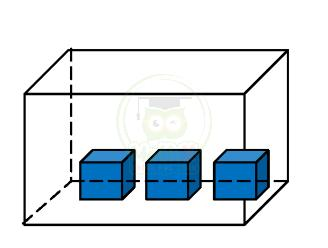

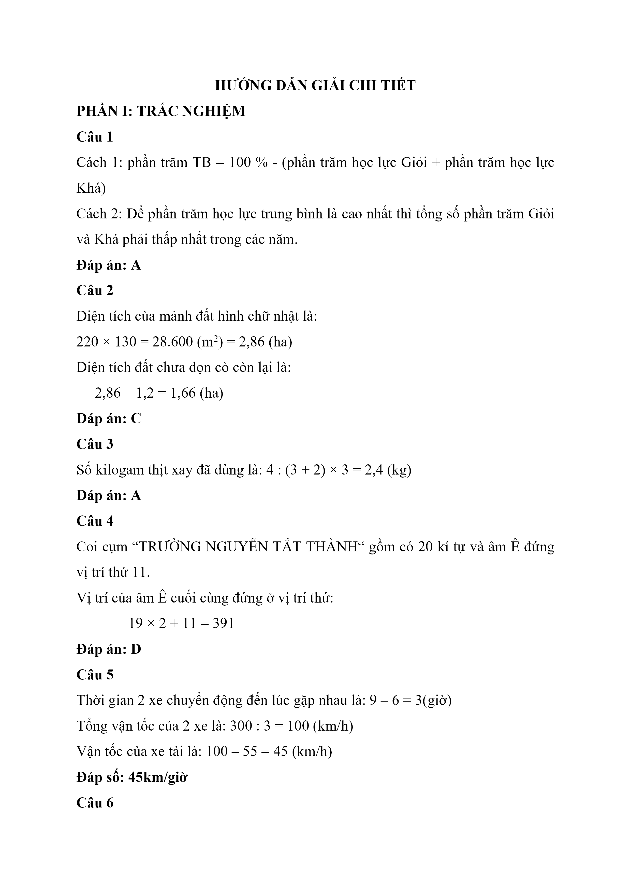

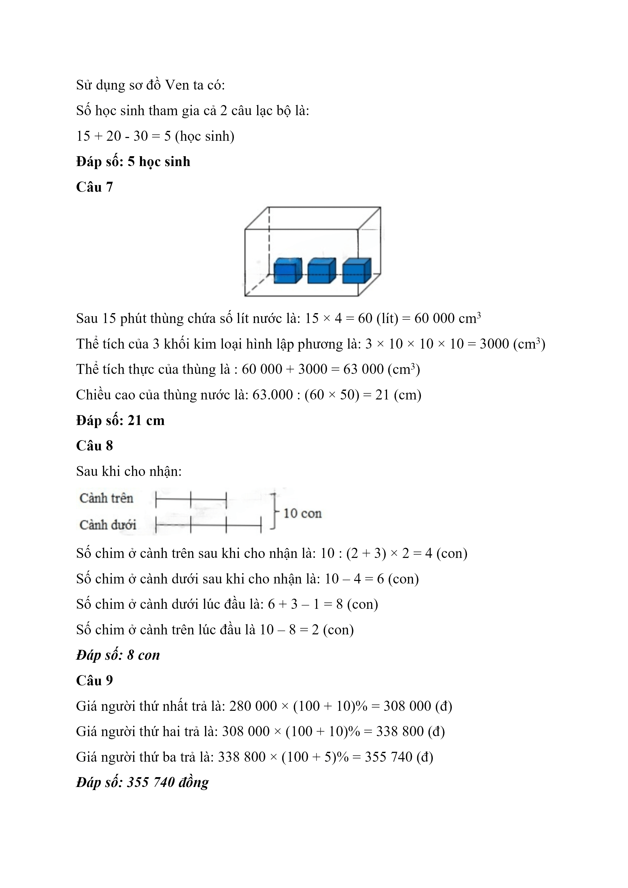

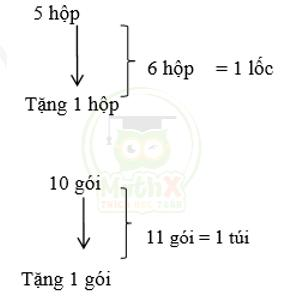

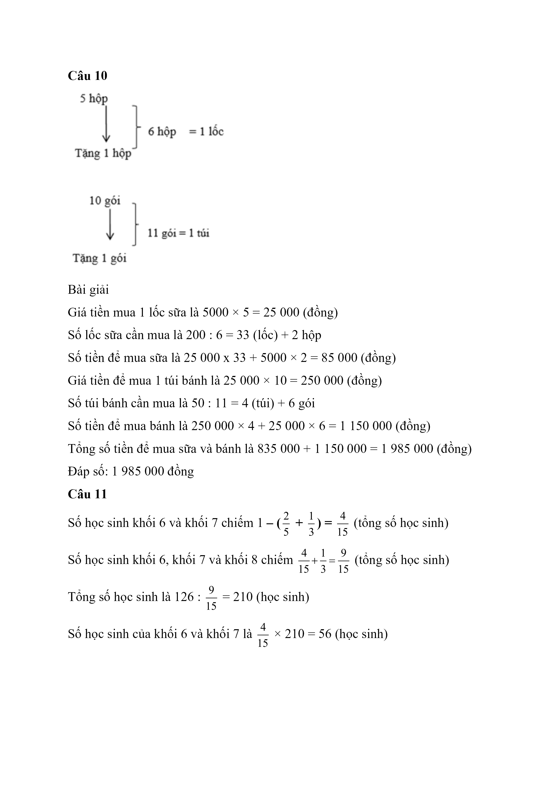

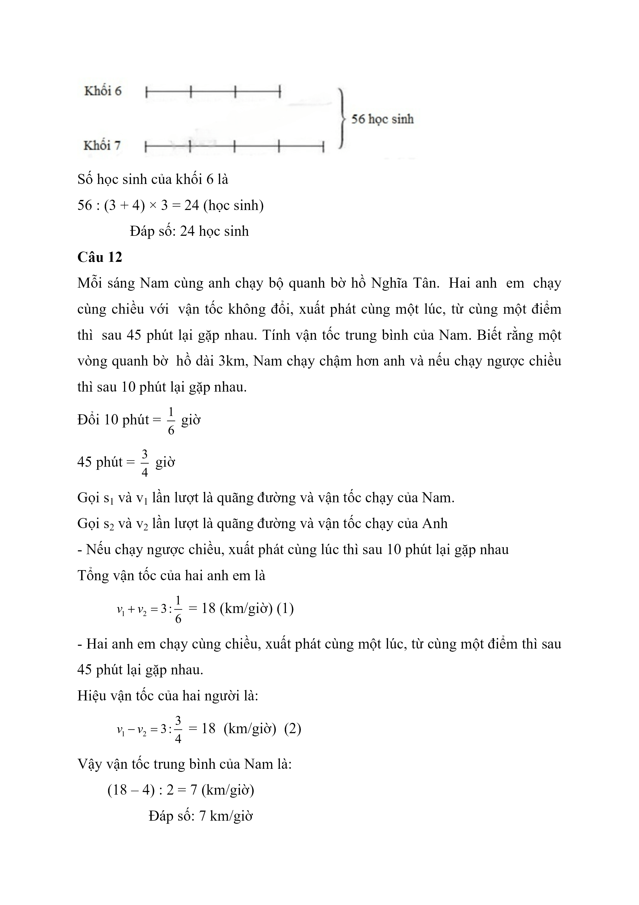

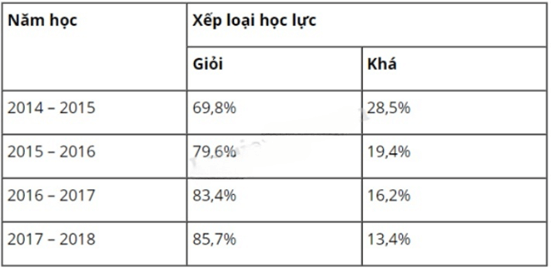

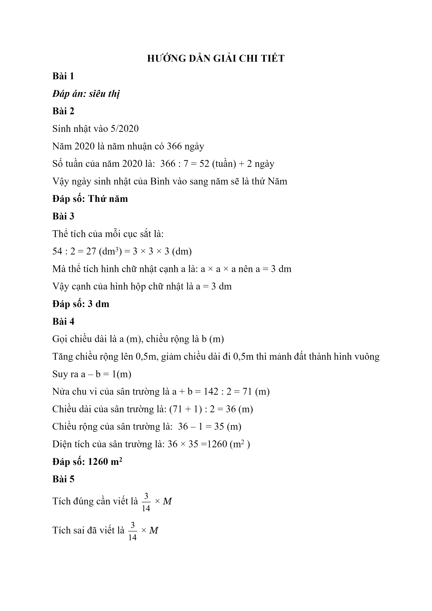

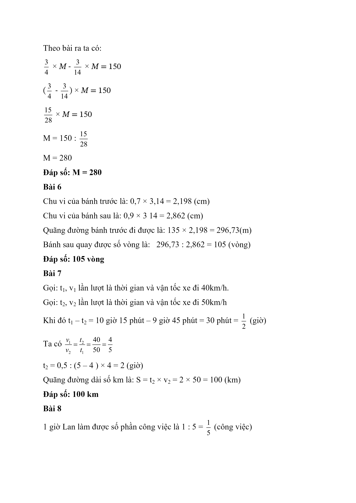

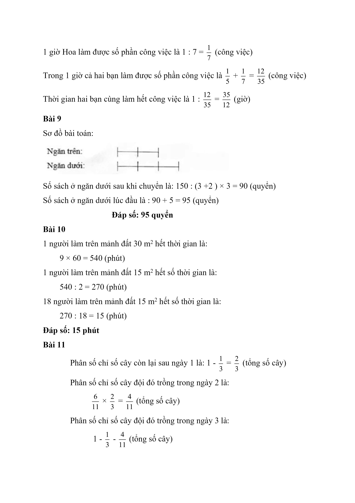

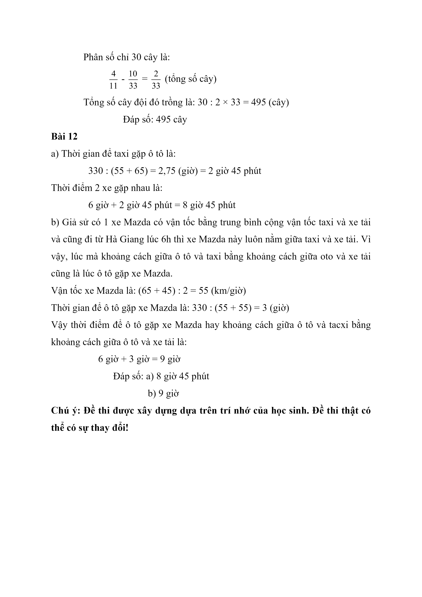
