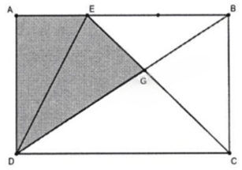
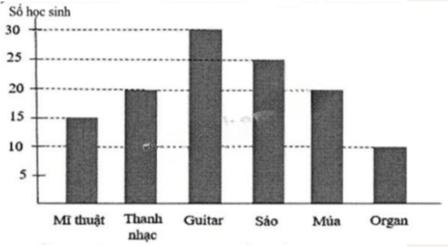
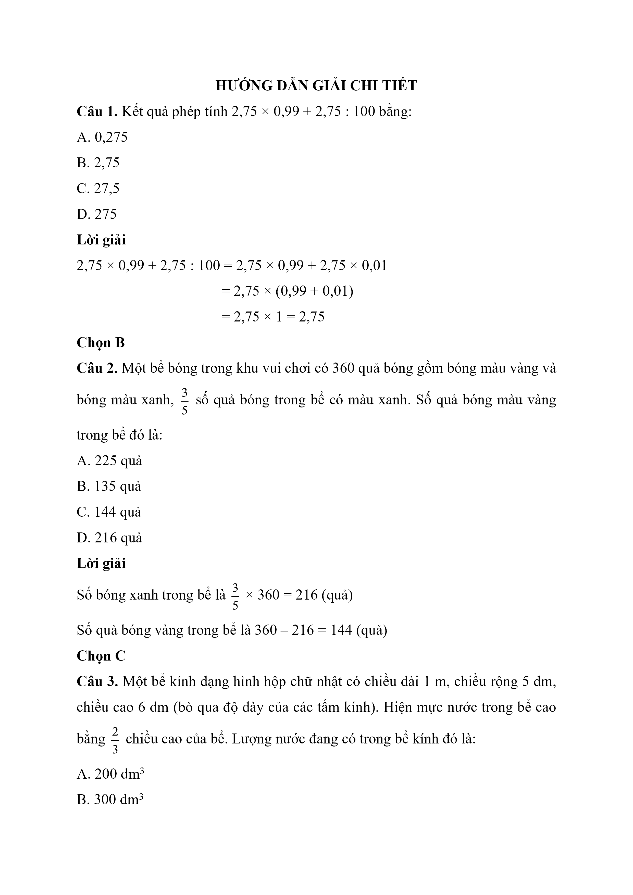
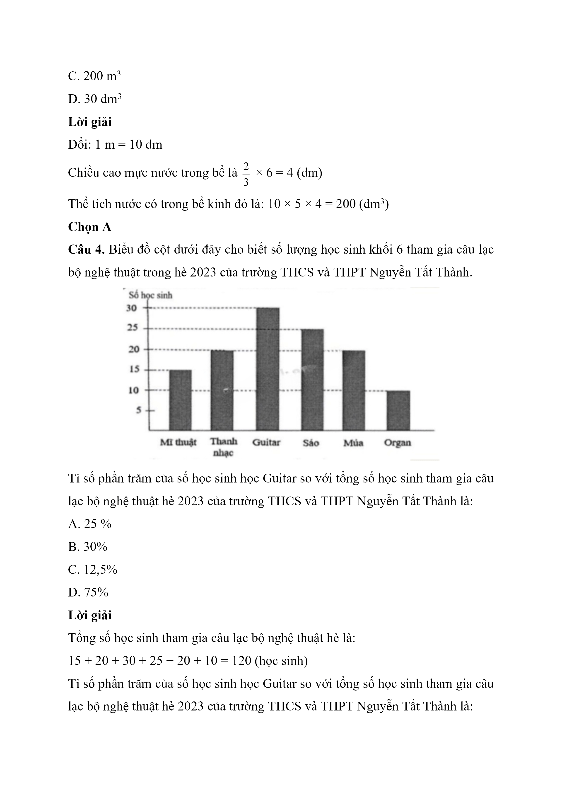
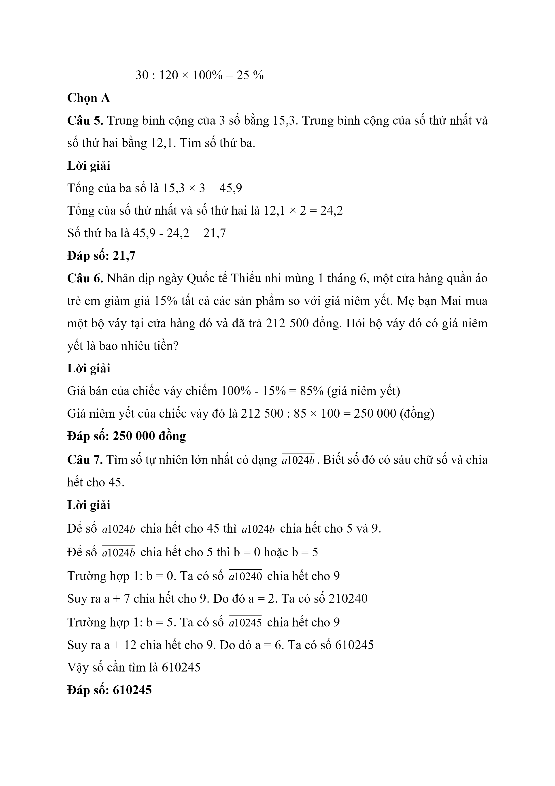
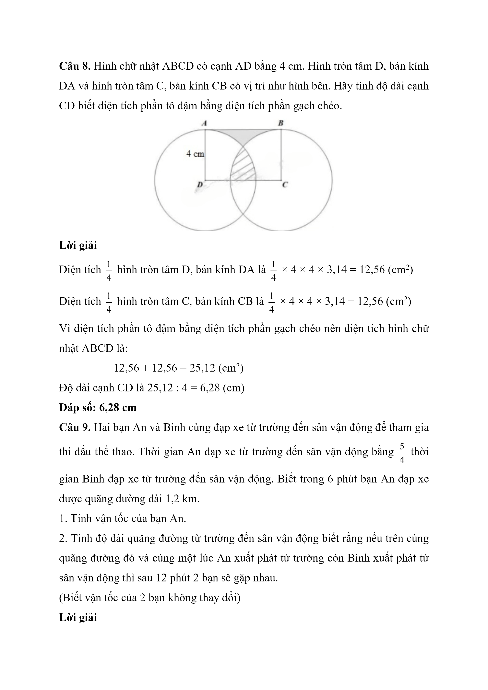
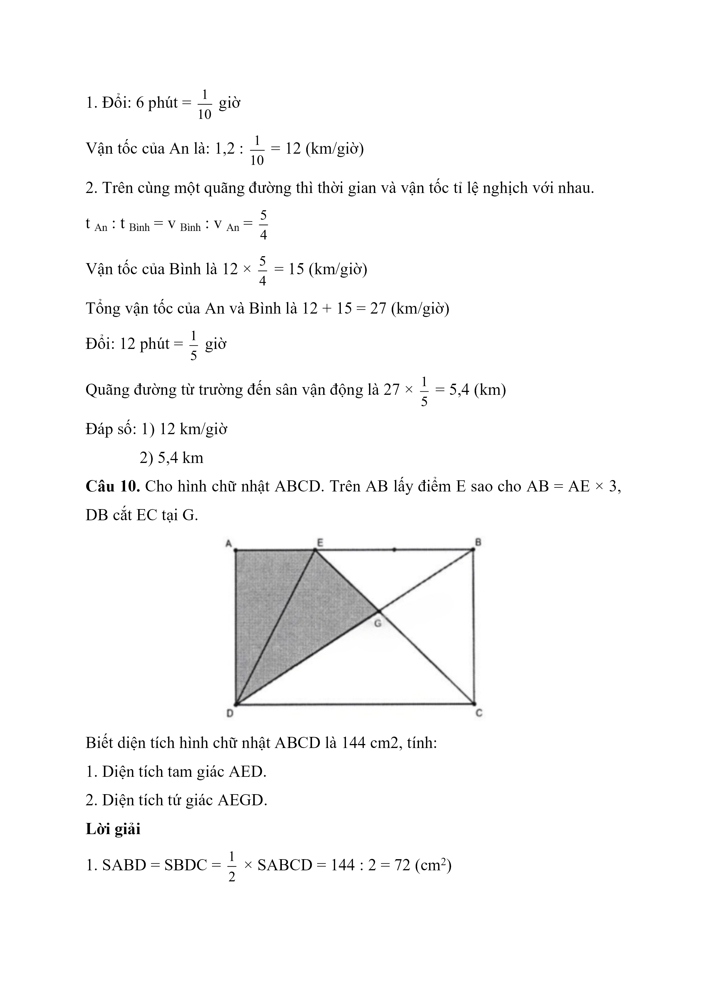
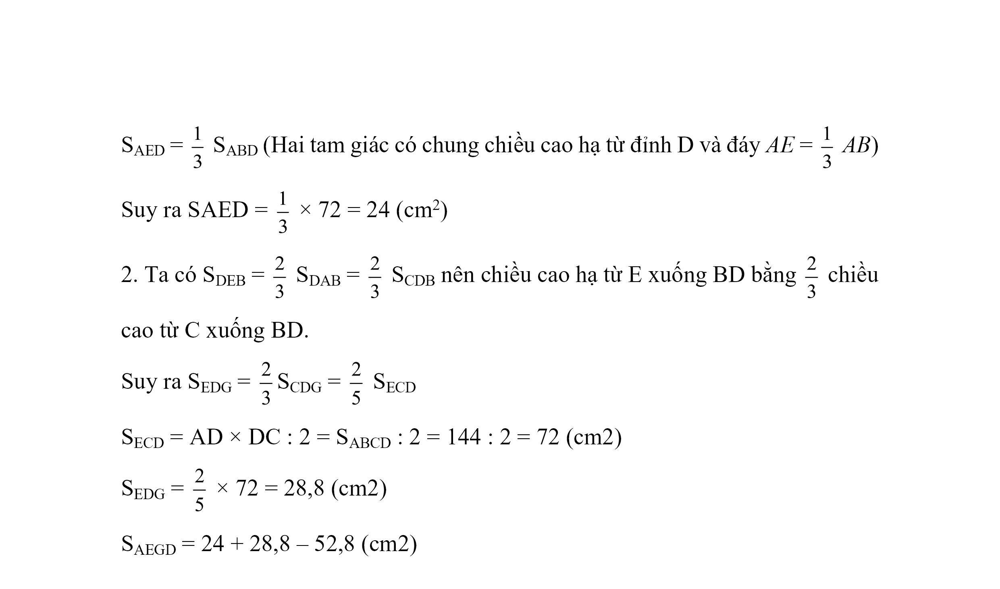

# Đề Toán vào 6 — Nguyễn Tất Thành (2023)

I. TRẮC NGHIỆM (Khoanh vào chữ cái trước đáp án đúng từ Câu 1 đến Câu 4)

Câu 1. Kết quả phép tính $$2{,}75 \times 0{,}99 + 2{,}75 : 100$$ bằng:

A. 0,275

B. 2,75

C. 27,5

D. 275

Câu 2. Một bể bóng trong khu vui chơi có 360 quả bóng bao gồm bóng màu vàng và bóng màu xanh, $$\dfrac{3}{5}$$ số quả bóng trong bể có màu xanh. Số quả bóng màu vàng trong bể đó là:

A. 225 quả

B. 135 quả

C. 144 quả

D. 216 quả

Câu 3. Một bể kính dạng hình hộp chữ nhật có chiều dài 1 m, chiều rộng 5 dm, chiều cao 6 dm (bỏ qua độ dày của các tấm kính). Hiện mực nước trong bể cao bằng $$\dfrac{2}{3}$$ chiều cao của bể. Lượng nước đang có trong bể kính đó là:

A. $$200\,\mathrm{dm}^{3}$$

B. $$300\,\mathrm{dm}^{3}$$

C. $$200\,\mathrm{m}^{3}$$

D. $$30\,\mathrm{dm}^{3}$$

Câu 4. Biểu đồ cột dưới đây cho biết số lượng học sinh khối 6 tham gia câu lạc bộ nghệ thuật trong hè 2023 của trường THCS và THPT Nguyễn Tất Thành.

Tỉ số phần trăm của số học sinh học Guitar so với tổng số học sinh tham gia câu lạc bộ nghệ thuật hè 2023 của trường THCS và THPT Nguyễn Tất Thành là:

A. 25 %

B. 30%

C. 12.5%

D. 75%

II. TRẢ LỜI NGẮN (Viết đáp số của bài toán vào ô trống từ Câu 5 đến Câu 8)

Câu 5. Trung bình cộng của 3 số bằng 15,3. Trung bình cộng của số thứ nhất và số thứ hai bằng 12,1. Tìm số thứ ba.

Câu 6. Nhân dịp ngày Quốc tế Thiếu nhi mùng 1 tháng 6, một cửa hàng quần áo trẻ em giảm giá 15% tất cả các sản phẩm so với giá niêm yết. Mẹ bạn Mai mua một bộ váy tại hàng đó và đã trả 212 500 đồng. Hỏi bộ váy đó có giá niêm yết là bao nhiêu tiền?

Câu 7. Tìm số tự nhiên lớn nhất có dạng $$\overline{a1024b}$$ . Biết số đó có sáu chữ số và chia hết cho 45.

Câu 8. Hình chữ nhật ABCD có cạnh AD bằng 4 cm. Hình tròn tâm D, bán kính DA và hình tròn tâm C , bán kính CB có vị trí như hình bên. Hãy tính độ dài cạnh CD biết diện tích phần tô đậm bằng diện tích phần gạch chéo.

III. TỰ LUẬN (Trình bày chi tiết lời giải Câu 9 và Câu 10)

Câu 9. Hai bạn An và Bình cùng đạp xe từ trường đến sân vận động để tham gia thi đấu thể thao. Thời gian An đạp xe từ trường đến sân vận động bằng $$\dfrac{5}{4}$$ thời gian Bình đạp xe từ trường đến sân vận động. Biết trong 6 phút bạn An đạp xe được quãng đường dài 1,2 km.

1. Tính vận tốc của bạn An.

2. Tính độ dài quãng đường từ trường đến sân vận động biết rằng nếu trên cùng quãng đường đó và cùng một lúc An xuất phát từ trường còn Bình xuất phát từ sân vận động thì sau 12 phút 2 bạn sẽ gặp nhau.

(Biết vận tốc của 2 bạn không thay đổi)

Câu 10. Cho hình chữ nhật $$ABCD$$. Trên $$AB$$ lấy điểm $$E$$ sao cho $$AB = AE \times 3$$, $$DB$$ cắt $$EC$$ tại $$G$$.

Biết diện tích hình chữ nhật ABCD là $$144\,\mathrm{cm}^{2}$$ , tính:

1. Diện tích tam giác AED.

2. Diện tích tứ giác AEGD.

## Hình minh họa

*(Ảnh trang đề / scan — có thể là cả trang)*

