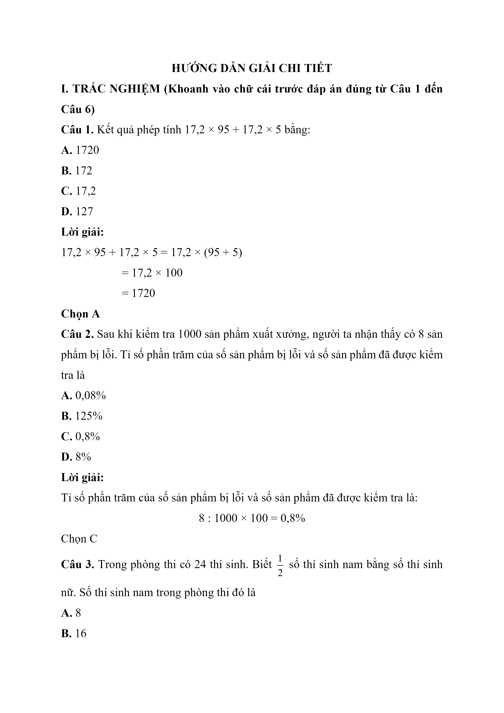
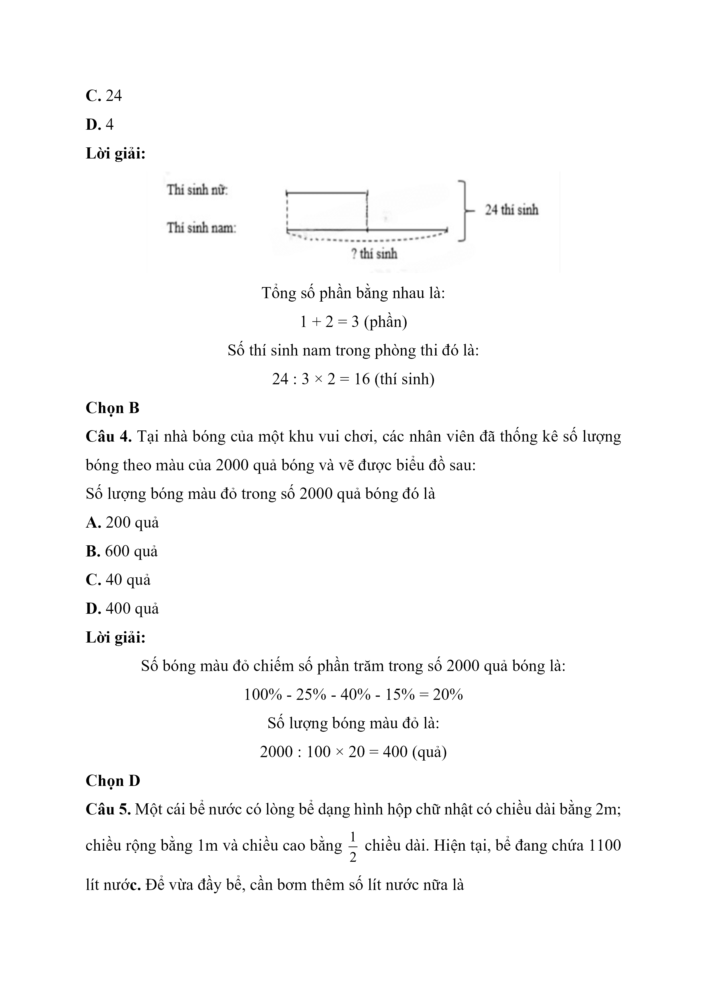
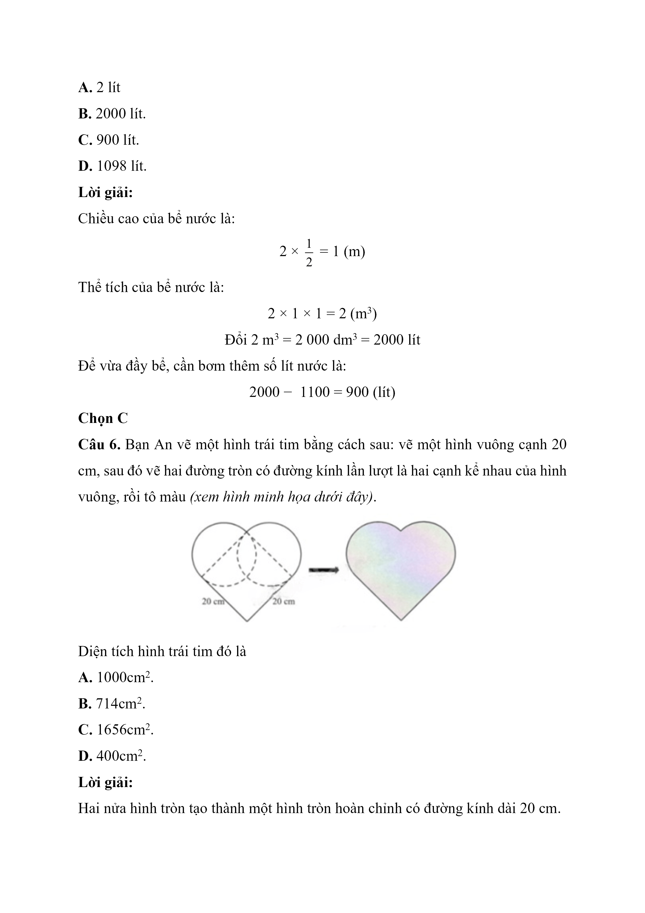
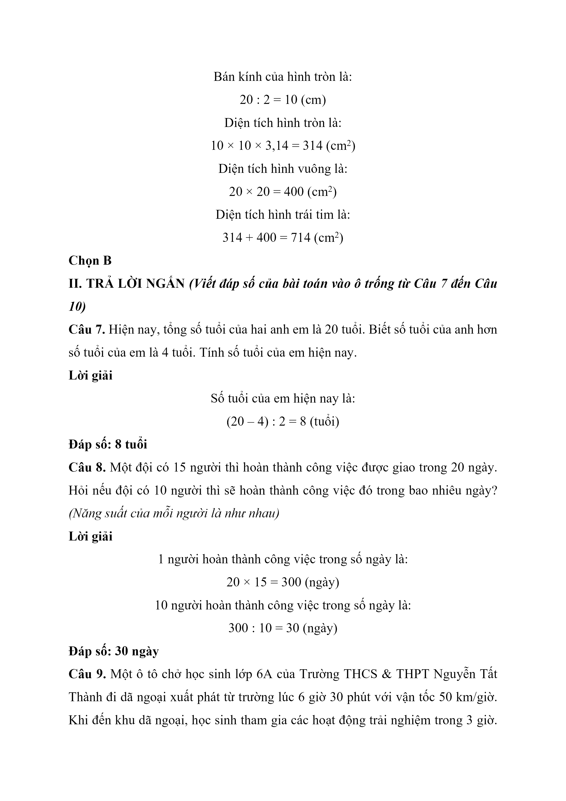
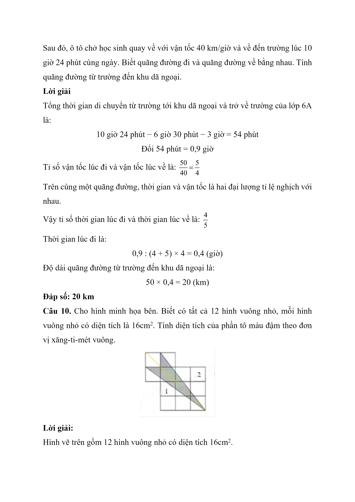
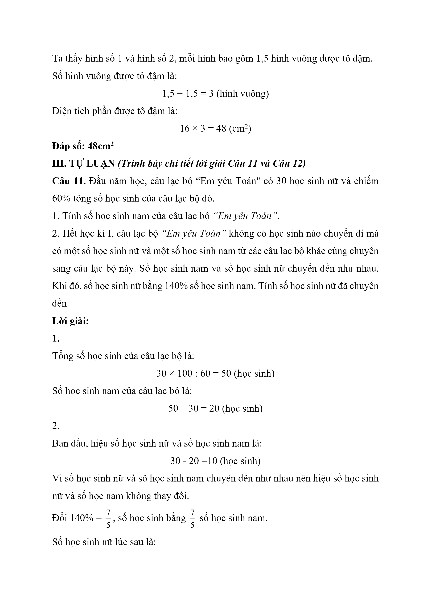
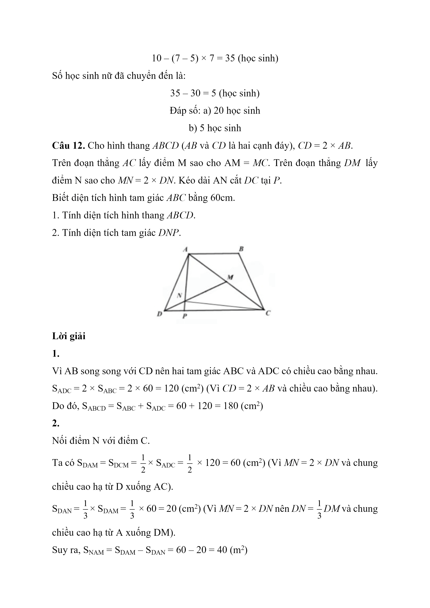
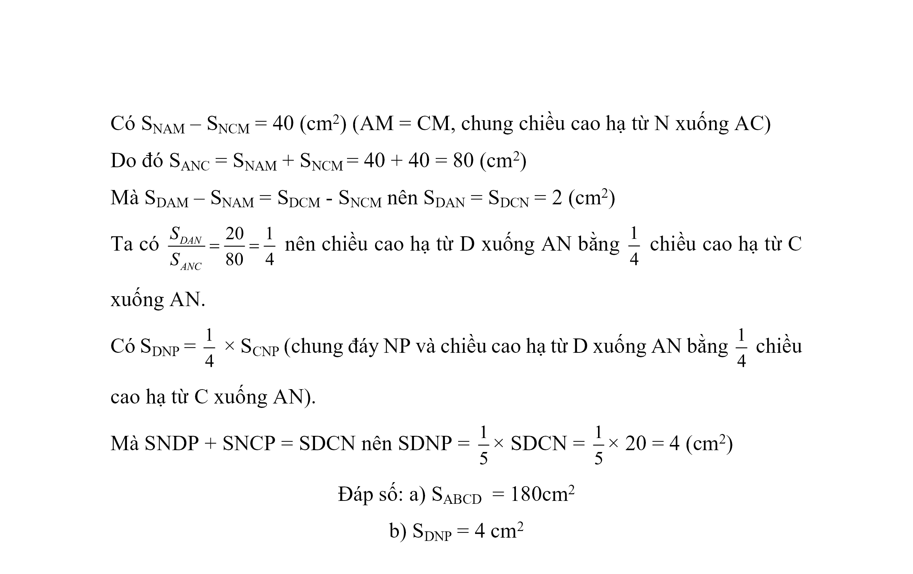

# Đề Toán vào 6 — Nguyễn Tất Thành (2024-ma-601)

I. TRẮC NGHIỆM (Khoanh vào chữ cái trước đáp án đúng từ Câu 1 đến Câu 6)

Câu 1. Kết quả phép tính 17,2 × 95 + 17,2 × 5 bằng:

A. 1720

B. 172

C. 17,2

D. 127

Câu 2. Sau khi kiểm tra 1000 sản phẩm xuất xưởng, người ta nhận thấy có 8 sản phẩm bị lỗi. Tỉ số phần trăm của số sản phẩm bị lỗi và số sản phẩm đã được kiểm tra là

A. 0,08%

B. 125%

C. 0,8%

D. 8%

Câu 3. Trong phòng thi có 24 thí sinh. Biết $$\dfrac{1}{2}$$ số thí sinh nam bằng số thí sinh nữ. Số thí sinh nam trong phòng thi đó là

A. 8

B. 16

C. 24

D. 4

Câu 4. Tại nhà bóng của một khu vui chơi, các nhân viên đã thống kê số lượng bóng theo màu của 2000 quả bóng và vẽ được biểu đồ sau:

Số lượng bóng màu đỏ trong số 2000 quả bóng đó là

A. 200 quả

B. 600 quả

C. 40 quả

D. 400 quả

Câu 5. Một cái bể nước có lòng bể dạng hình hộp chữ nhật có chiều dài bằng 2m; chiều rộng bằng 1m và chiều cao bằng $$\dfrac{1}{2}$$ chiều dài. Hiện tại, bể đang chứa 1100 lít nước. Để vừa đầy bể, cần bơm thêm số lít nước nữa là

A. 2 lít

B. 2000 lít.

C. 900 lít.

D. 1098 lít.

Câu 6. Bạn An vẽ một hình trái tim bằng cách sau: vẽ một hình vuông cạnh 20 cm, sau đó vẽ hai đường tròn có đường kính lần lượt là hai cạnh kể nhau của hình vuông, rồi tô màu (xem hình minh họa dưới đây).

Diện tích hình trái tim đó là

A. $$1000\,\mathrm{cm}^{2}$$ .

B. $$714\,\mathrm{cm}^{2}$$ .

C. $$1656\,\mathrm{cm}^{2}$$ .

D. $$400\,\mathrm{cm}^{2}$$ .

II. TRẢ LỜI NGẮN (Viết đáp số của bài toán vào ô trống từ Câu 7 đến Câu 10)

Câu 7. Hiện nay, tổng số tuổi của hai anh em là 20 tuổi. Biết số tuổi của anh hơn số tuổi của em là 4 tuổi. Tính số tuổi của em hiện nay.

Câu 8. Một đội có 15 người thì hoàn thành công việc được giao trong 20 ngày. Hỏi nếu đội có 10 người thì sẽ hoàn thành công việc đó trong bao nhiêu ngày? (Năng suất của mỗi người là như nhau)

Câu 9. Một ô tô chở học sinh lớp 6A của Trường THCS & THPT Nguyễn Tất Thành đi dã ngoại xuất phát từ trường lúc 6 giờ 30 phút với vận tốc 50 km/giờ. Khi đến khu dã ngoại, học sinh tham gia các hoạt động trải nghiệm trong 3 giờ. Sau đó, ô tô chở học sinh quay về với vận tốc 40 km/giờ và về đến trường lúc 10 giờ 24 phút cùng ngày. Biết quãng đường đi và quãng đường về bằng nhau. Tính quãng đường từ trường đến khu dã ngoại.

Câu 10. Cho hình minh họa bên. Biết có tất cả 12 hình vuông nhỏ, mỗi hình vuông nhỏ có diện tích là $$16\,\mathrm{cm}^{2}$$ . Tính diện tích của phần tô màu đậm theo đơn vị xăng-ti-mét vuông.

III. TỰ LUẬN (Trình bày chi tiết lời giải Câu 11 và Câu 12)

Câu 11. Đầu năm học, câu lạc bộ “Em yêu Toán" có 30 học sinh nữ và chiếm 60% tổng số học sinh của câu lạc bộ đó.

1. Tính số học sinh nam của câu lạc bộ “Em yêu Toán” .

2. Hết học kì I, câu lạc bộ “Em yêu Toán” không có học sinh nào chuyển đi mà có một số học sinh nữ và một số học sinh nam từ các câu lạc bộ khác cùng chuyển sang câu lạc bộ này. Số học sinh nam và số học sinh nữ chuyển đến như nhau. Khi đó, số học sinh nữ bằng 140% số học sinh nam. Tính số học sinh nữ đã chuyển đến.

Câu 12. Cho hình thang ABCD (AB và CD là hai cạnh đáy), CD = 2 × AB.

Trên đoạn thẳng AC lấy điểm M sao cho AM = MC. Trên đoạn thẳng DM lấy điểm N sao cho MN = 2 × DN. Kéo dài AN cắt DC tại P.

Biết diện tích hình tam giác ABC bằng 60cm.

1. Tính diện tích hình thang ABCD.

2. Tính diện tích tam giác DN.

## Hình minh họa

*(Ảnh trang đề / scan — có thể là cả trang)*

