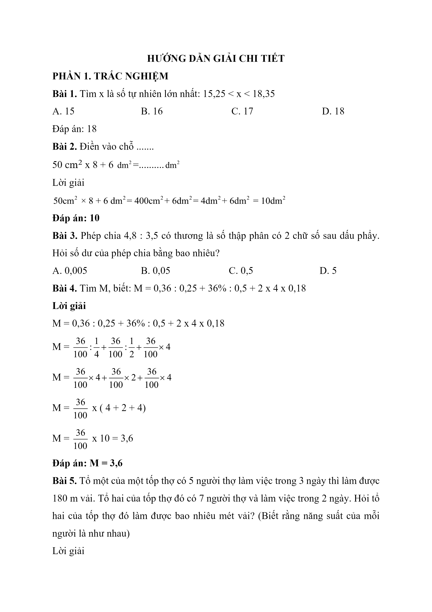
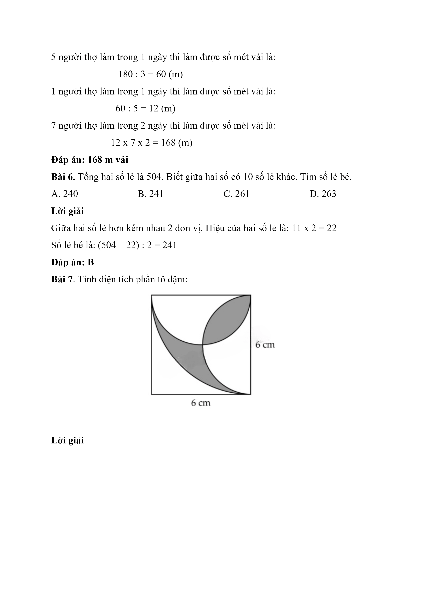
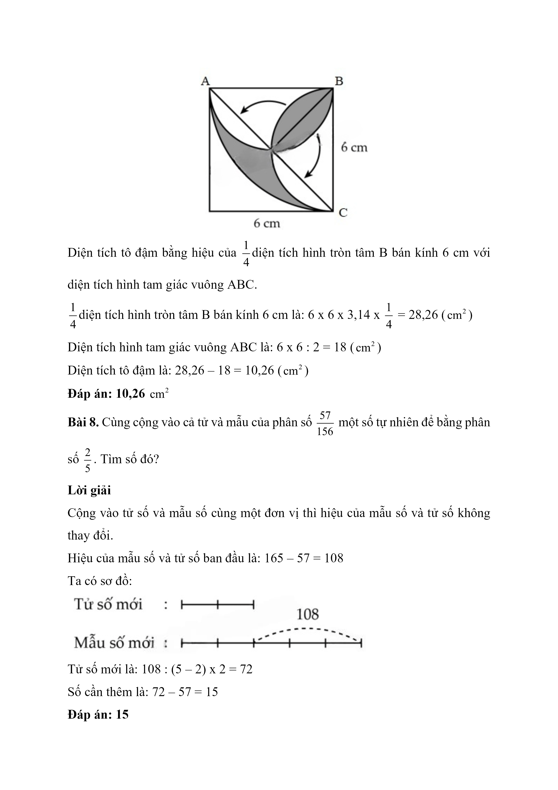
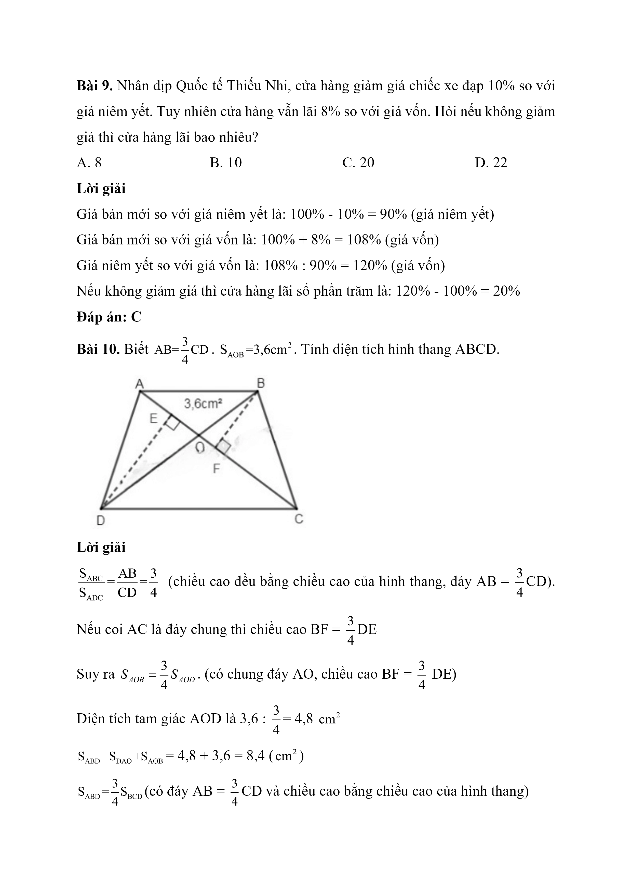
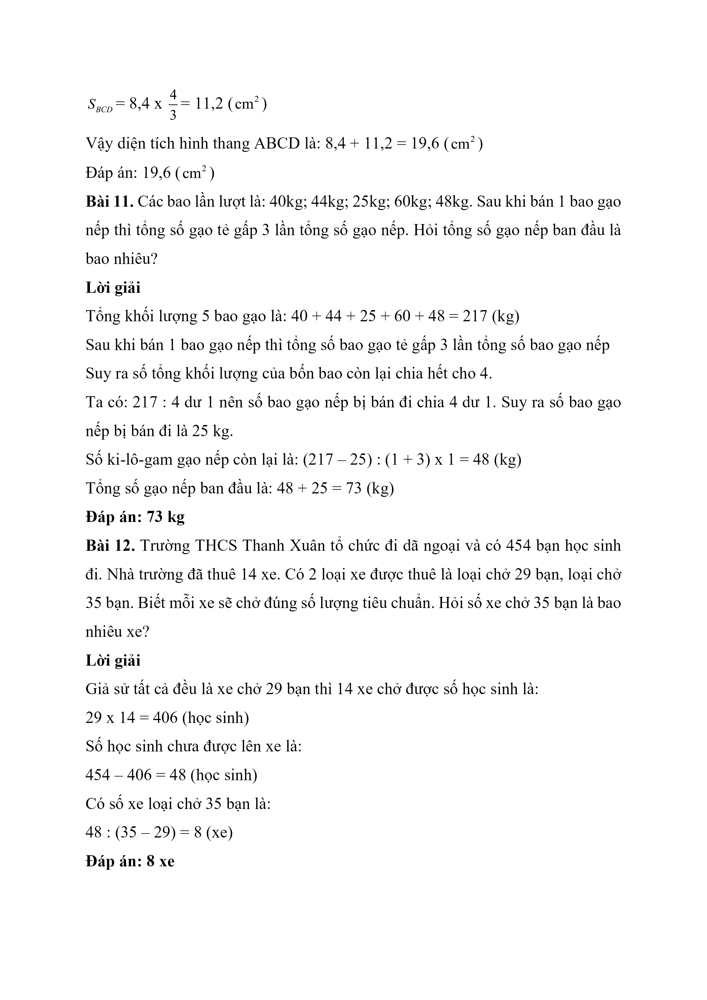
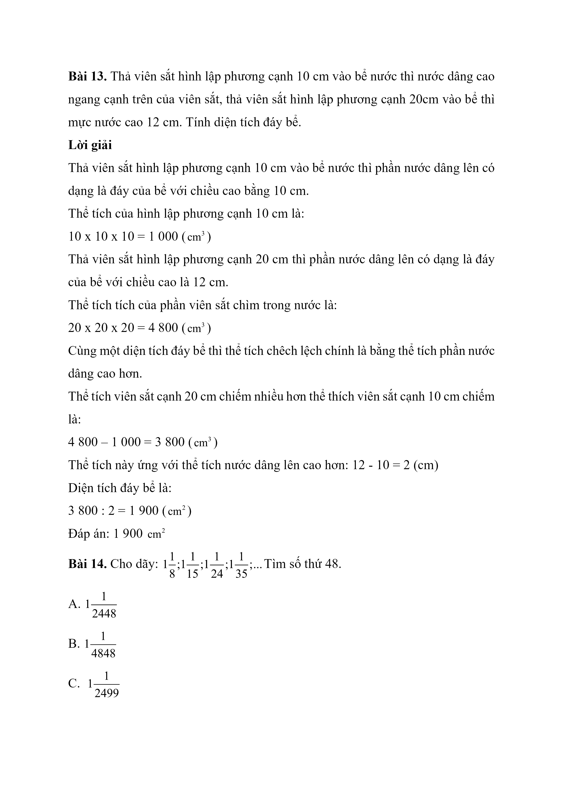
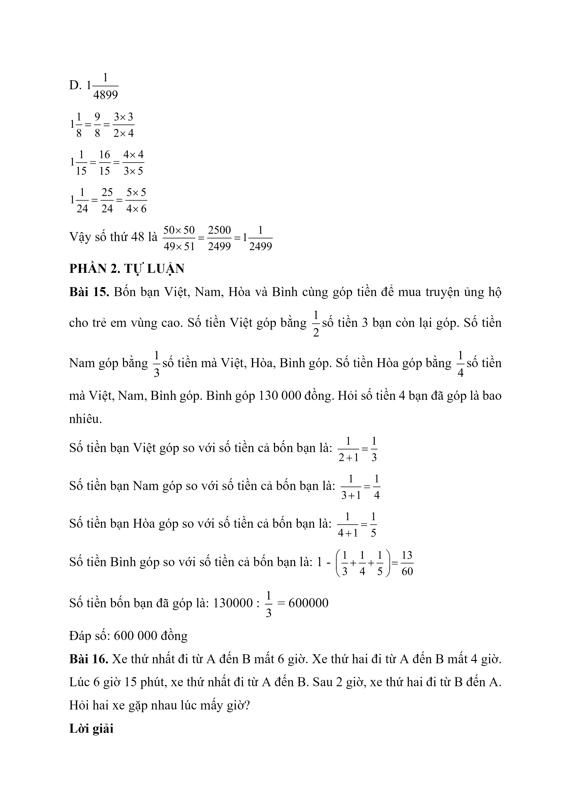
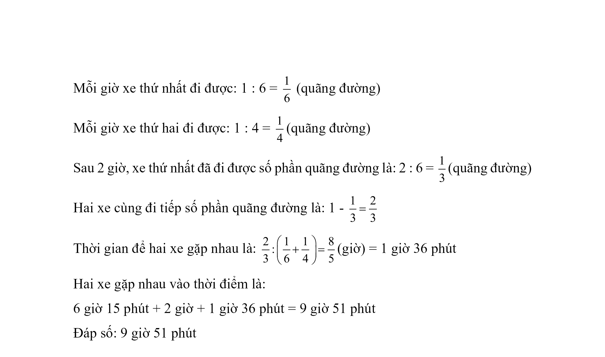

# Đề + đáp án Toán vào 6 — THCS Thanh Xuân 2023–2024

> Thời gian: 40 phút

Thời gian làm bài: 40 phút

PHẦN I: TRẮC NGHIỆM CHỌN ĐÁP ÁN ĐÚNG

Câu 1 . Số nào dưới đây có chữ số 9 ở hàng phần trăm?

A. 321,89.

B. 931,28.

C. 321,98.

D. 931,82.

Câu 2 . Điền số thích hợp vào chỗ trống: $$20\,\mathrm{dm}^{2}$$ $$23\,\mathrm{cm}^{2}$$ =….m2

A. 20,23.

B. 20,0023.

C. 0,2023.

D. 2023.

Đáp số : C. 0,2023

Câu 3:

A. 2,25.

B. 2.

C. 3,25.

D. 3.

Câu 4 . Một thư viện có 1000 quyển sách. Sau mỗi năm, số sách tăng thêm 10%. Sau 2 năm thư viện có bao nhiều quyền sách?

A. 1100 quyển.

B. 1210 quyển.

C. 2310 quyển.

D. 1310 quyển.

Câu 5 . Tổng hai số thập phân là 8,3 . Nếu số thứ nhất tăng lên 3 lần, giữ nguyên số thứ hai thì tổng là 17,9. Tìm số thứ hai.

A. 4,8.

B. 4,5.

C. 3,8.

D. 3,5.

Câu 6 . Nhà Nam gần bến xe. Thời gian Nam đi từ nhà đến bến xe mất 5 phút. Thời gian của một chuyến tàu là 20 phút. Thời gian từ điểm dừng chuyến tàu đến trường mất 5 phút. Thời gian mà Nam phải đến trường là 7 giờ 30 phút. Các chuyến tàu bắt đầu từ 6 giờ và cứ 10 phút có một chuyến. Tính thời gian muộn nhất Nam có thể đi?

A. 6 giờ 55 phút.

B. 7 giờ.

C. 7 giờ 5 phút.

D. 7 giờ 10 phút.

Câu 7 . Cạnh của một hình lập phương là 8 cm. Nếu tăng cạnh hình lập phương lên 3 lần thì diện tích toàn phần tăng lên bao nhiêu lần?

A. 7 lần.

B. 8 lần.

C. 9 lần.

D. 10 lần.

Câu 8 . Một bể nước hình hộp chữ nhật có chiều dài 60 cm, chiều rộng 40 cm. Trong bể có 96 lít nước. Tính chiều cao của mực nước.

A. 4cm.

B. 4dm.

C. 6cm.

D. 6dm.

Câu 9 . Khối 1 quyên góp 134 quyển, khối 2 quyên góp 98 quyển, khối 3 quyên góp 87 quyển, khối 4 quyên góp 81 quyển. Khối 5 quyên góp nhiều hơn trung bình cả năm khối 20 quyển. Tính số quyển khối 5 quyên góp.

A. 105 quyển.

B. 110 quyển.

C. 125 quyển.

D. 120 quyển.

PHẦN II: TRẮC NGHIỆM ĐIỀN ĐÁP ÁN

Câu 10 . Một mảnh vườn hình thang vuông có đáy bé bằng $$\dfrac{3}{5}$$ đáy lớn. Nếu tăng đáy bé 6m thì mảnh vườn đó thành hình vuông. Tính diện tích mảnh vườn ban đầu.

Câu 11 . Có một số quả cam. Lần thứ nhất bán 4 quả, lần thứ hai bán $$\dfrac{1}{2}$$ số quả còn lại và 2 quả, lần thứ ba bán $$\dfrac{1}{2}$$ số quả còn lại và 2 quả, lần thứ tư bán $$\dfrac{1}{2}$$ số quả còn lại, cuối cùng còn lại 2 quả. Tính số cam ban đầu.

Câu 12 . Tìm x, biết: x : 4 x 36 – x : 7 x 28 + x : 4 x 20 = 180.

Câu 13 . Cho hình vẽ bên.

Biết AD = 8cm và diện tích hai phần tô màu bằng nhau. Tính AB.

Câu 14 . Cho dãy số sau:  $$\dfrac{1}{8};\dfrac{1}{{35}};\dfrac{1}{{80}};\dfrac{1}{{143}};....\$$

Tìm số thứ 23 của dãy.

PHẦN III: TỰ LUẬN

Câu 15 . Trường THCS Thanh Xuân lập một đội 32 học sinh dự định trồng cây trong 15 ngày. Làm được 5 ngày thì đội bổ sung thêm một số học sinh nên hoàn thành sớm hơn dự định 2 ngày. Tính số học sinh được bổ sung thêm.

Câu 16 . Bác Thanh đi từ A đến B. Nếu đi với vận tốc 30 km/giờ thì muộn 30 phút, còn đi với vận tốc 40 km/giờ thì sớm 15 phút. Tìm vận tốc của bác Thanh để đến B đúng giờ.

## Hình minh họa

*(Ảnh trang đề / scan — có thể là cả trang)*

