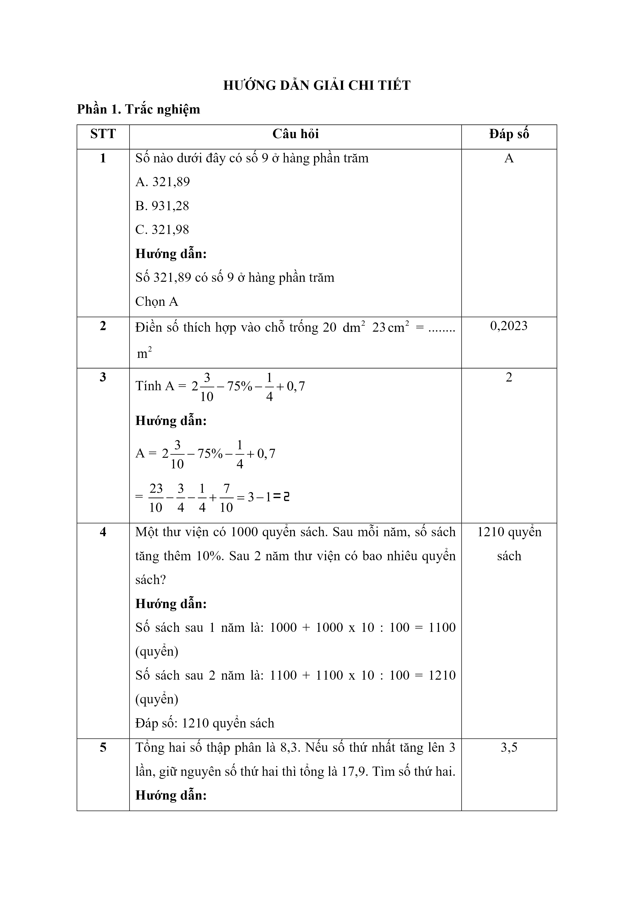
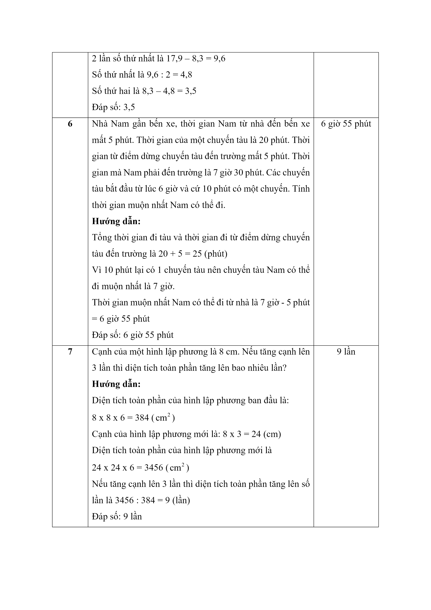
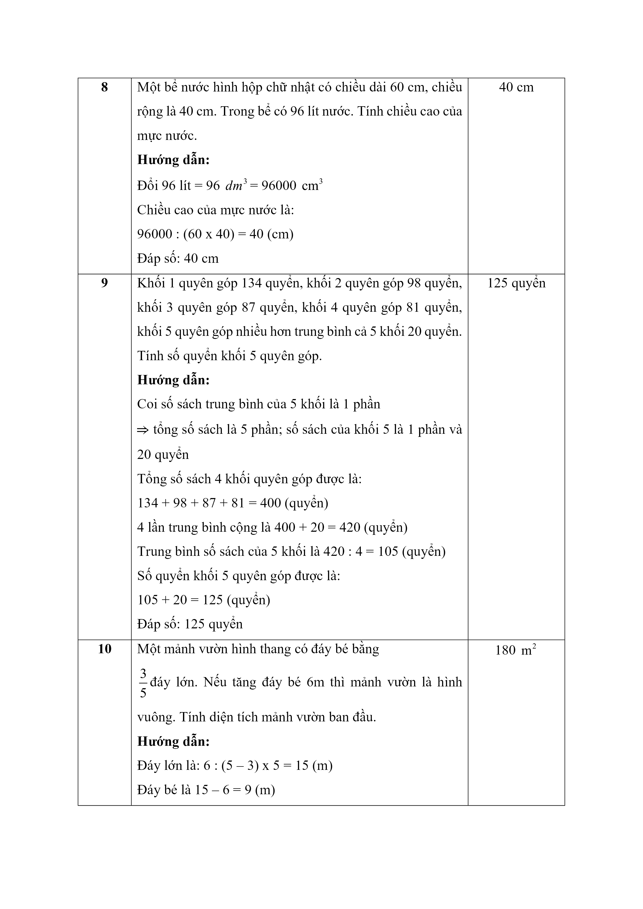
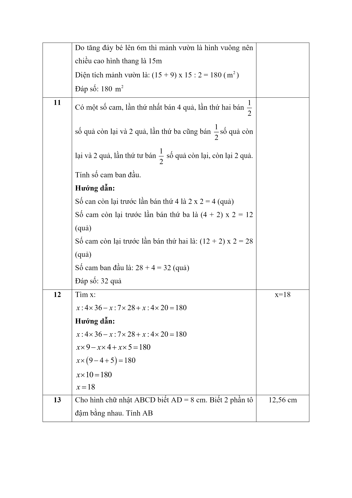
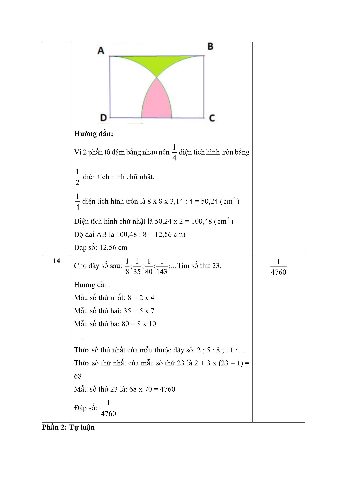
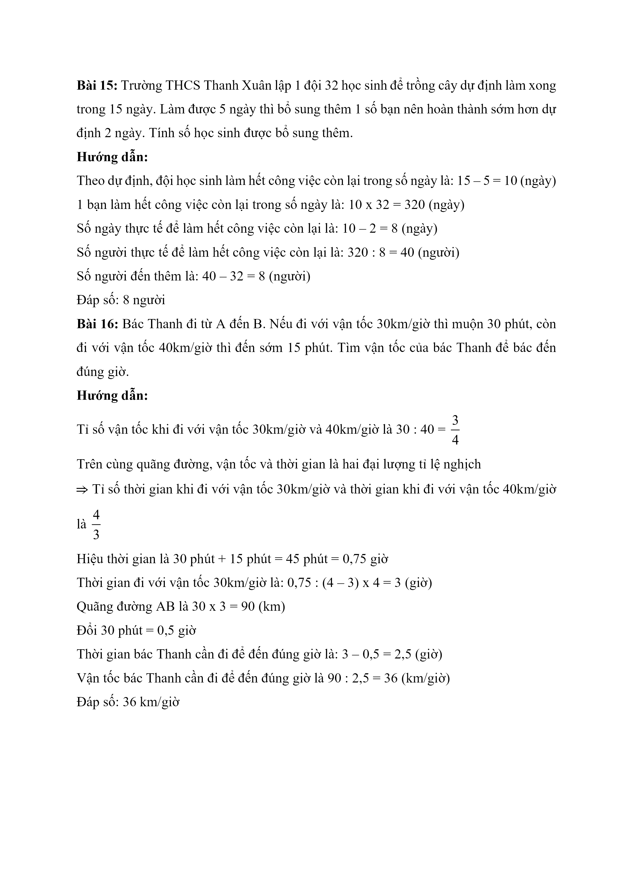

# Đề Toán vào 6 — Thanh Xuân (2023)

Bài 15: Trường THCS Thanh Xuân lập 1 đội 32 học sinh để trồng cây dự định làm xong trong 15 ngày. Làm được 5 ngày thì bổ sung thêm 1 số bạn nên hoàn thành sớm hơn dự định 2 ngày. Tính số học sinh được bổ sung thêm.

Bài 16: Bác Thanh đi từ A đến B. Nếu đi với vận tốc 30km/giờ thì muộn 30 phút, còn đi với vận tốc 40km/giờ thì đến sớm 15 phút. Tìm vận tốc của bác Thanh để bác đến đúng giờ.

## Hình minh họa

*(Ảnh trang đề / scan — có thể là cả trang)*

