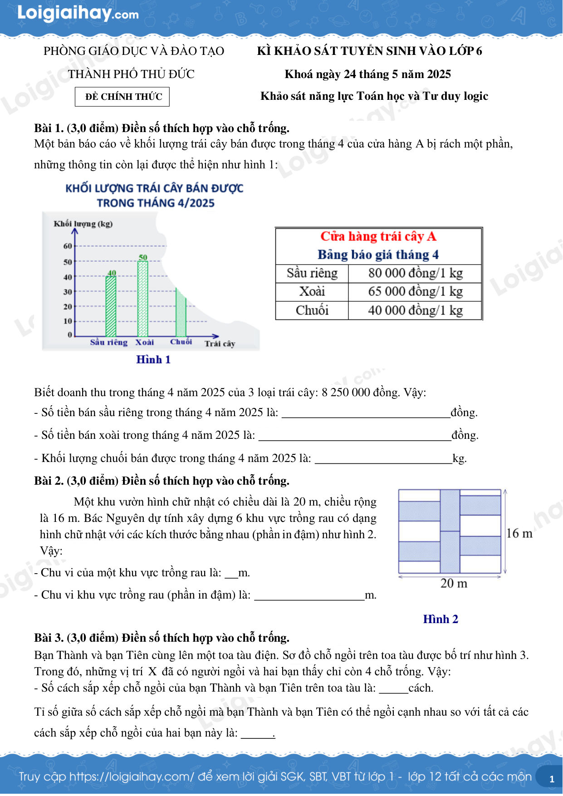
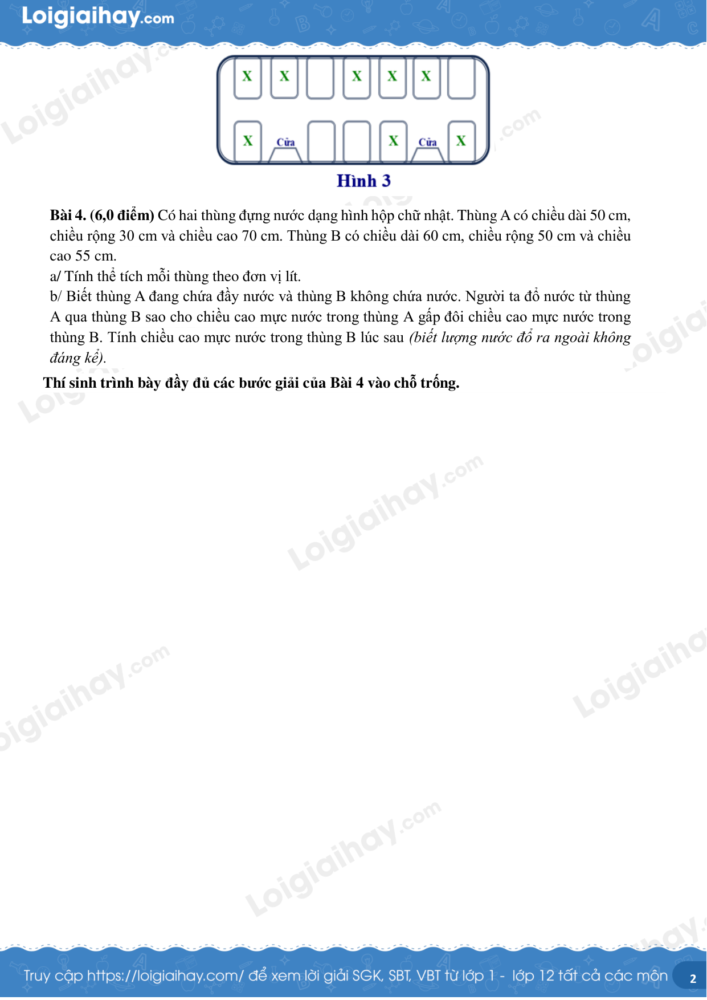
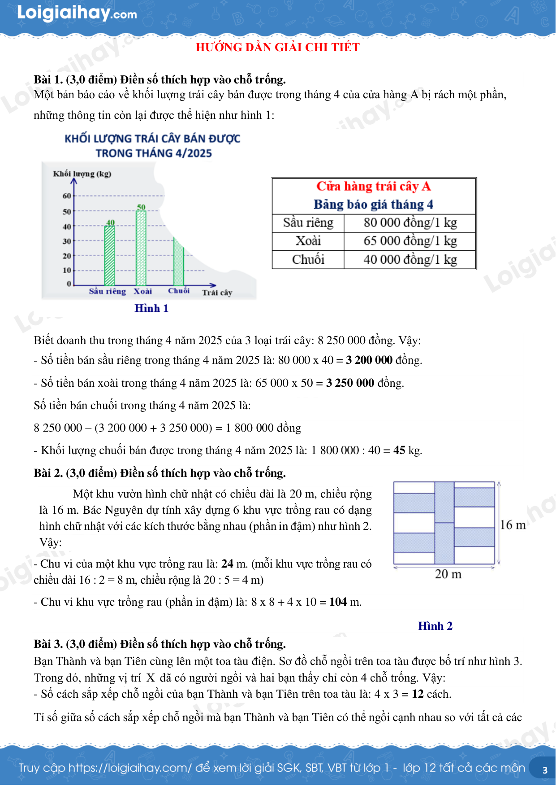
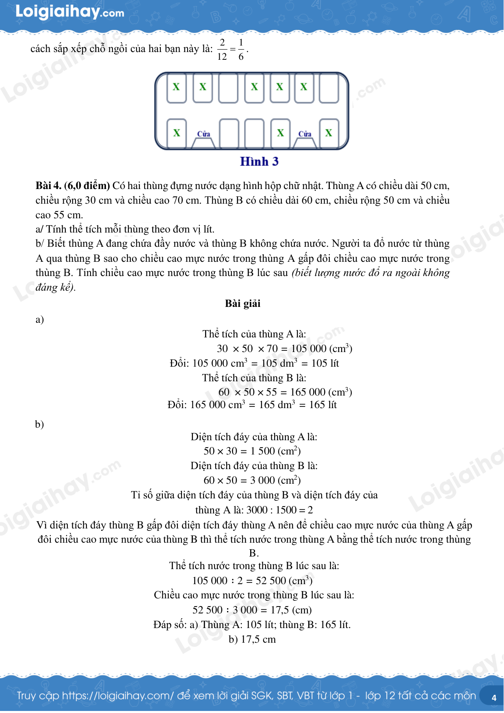

# Đề Toán vào lớp 6 — Khảo sát TP Thủ Đức 2025

> Ngày thi: 24/5/2025 (theo báo chí)
> Ghi chú: Đề có hình minh họa (hình 1–3) — xem PDF/ảnh kèm.
> File này: chỉ đề (đáp án xem file `*-dap-an.md`).

---

Bài 1. (3,0 điểm) Điền số thích hợp vào chỗ trống.

Một bản báo cáo về khối lượng trái cây bán được trong tháng 4 của cửa hàng A bị rách một phần, những thông tin còn lại được thể hiện như hình 1:

Biết doanh thu trong tháng 4 năm 2025 của 3 loại trái cây: 8 250 000 đồng. Vậy:

- Số tiền bán sầu riêng trong tháng 4 năm 2025 là:                                                             đồng.

- Số tiền bán xoài trong tháng 4 năm 2025 là:                                                                     đồng.

- Khối lượng chuối bán được trong tháng 4 năm 2025 là:                                                  kg.

Bài 2. (3,0 điểm) Điền số thích hợp vào chỗ trống.

Một khu vườn hình chữ nhật có chiều dài là 20 m, chiều rộng là 16 m. Bác Nguyên dự tính xây dựng 6 khu vực trồng rau có dạng hình chữ nhật với các kích thước bằng nhau (phần in đậm) như hình 2. Vậy:

- Chu vi của một khu vực trồng rau là:      m.

- Chu vi khu vực trồng rau (phần in đậm) là:                                        m.

Bài 3. (3,0 điểm) Điền số thích hợp vào chỗ trống.

Bạn Thành và bạn Tiên cùng lên một toa tàu điện. Sơ đồ chỗ ngồi trên toa tàu được bố trí như hình 3. Trong đó, những vị trí X đã có người ngồi và hai bạn thấy chỉ còn 4 chỗ trống. Vậy:

- Số cách sắp xếp chỗ ngồi của bạn Thành và bạn Tiên trên toa tàu là:            cách.

Tỉ số giữa số cách sắp xếp chỗ ngồi mà bạn Thành và bạn Tiên có thể ngồi cạnh nhau so với tất cả các cách sắp xếp chỗ ngồi của hai bạn này là:            .

Bài 4. (6,0 điểm) Có hai thùng đựng nước dạng hình hộp chữ nhật. Thùng A có chiều dài 50 cm, chiều rộng 30 cm và chiều cao 70 cm. Thùng B có chiều dài 60 cm, chiều rộng 50 cm và chiều cao 55 cm.

a/ Tính thể tích mỗi thùng theo đơn vị lít.

b/ Biết thùng A đang chứa đầy nước và thùng B không chứa nước. Người ta đổ nước từ thùng A qua thùng B sao cho chiều cao mực nước trong thùng A gấp đôi chiều cao mực nước trong thùng B. Tính chiều cao mực nước trong thùng B lúc sau (biết lượng nước đổ ra ngoài không đáng kể).

Thí sinh trình bày đầy đủ các bước giải của Bài 4 vào chỗ trống.

## Hình minh họa

*(Ảnh cả trang đề — khảo sát Thủ Đức chung)*

