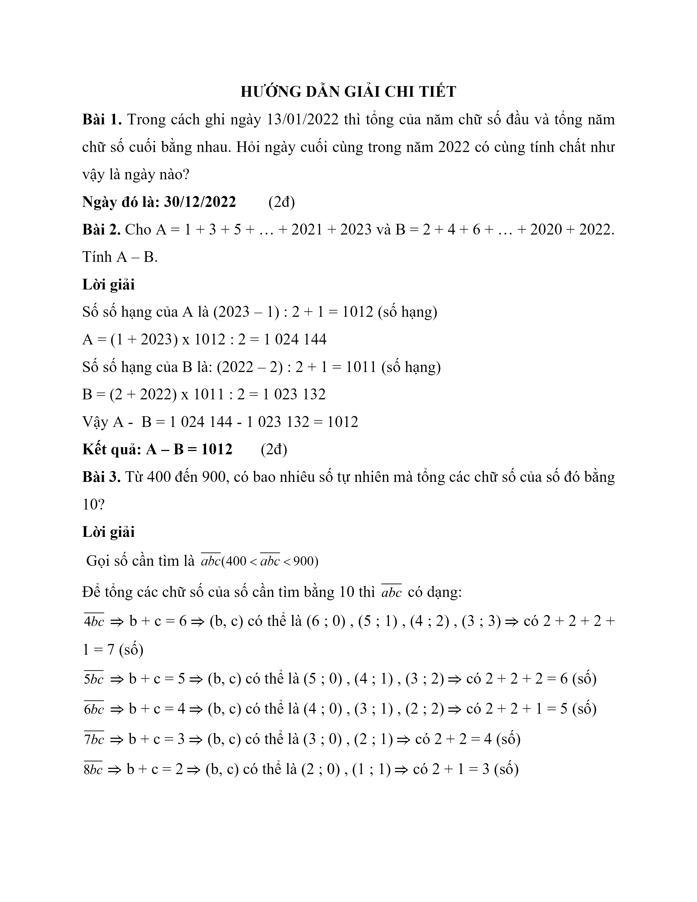
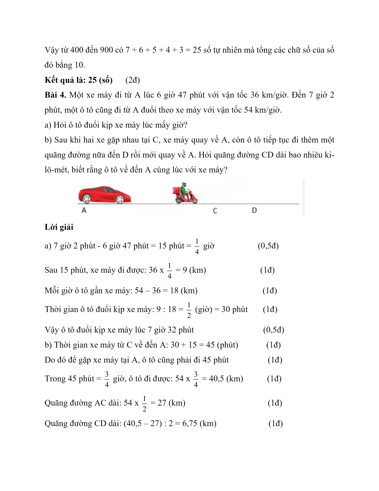

# Đề Toán vào 6 — Trần Đại Nghĩa (2022)

Bài 1. Trong cách ghi ngày 13/01/2022 thì tổng của năm chữ số đầu và tổng năm chữ số cuối bằng nhau. Hỏi ngày cuối cùng trong năm 2022 có cùng tính chất như vậy là ngày nào?

Ngày đó là: ………………………

Bài 2. Cho A = 1 + 3 + 5 + … + 2021 + 2023 và B = 2 + 4 + 6 + … + 2020 + 2022. Tính A – B.

Kết quả: A – B = …………………

Bài 3. Từ 400 đến 900, có bao nhiêu số tự nhiên mà tổng các chữ số của số đó bằng 10?

Kết quả là:.................................. số

Bài 4. Một xe máy đi từ A lúc 6 giờ 47 phút với vận tốc 36 km/giờ. Đến 7 giờ 2 phút, một ô tô cũng đi từ A đuổi theo xe máy với vận tốc 54 km/giờ.

a) Hỏi ô tô đuổi kịp xe máy lúc mấy giờ?

b) Sau khi hai xe gặp nhau tại C, xe máy quay về A, còn ô tô tiếp tục đi thêm một quãng đường nữa đến D rồi mới quay về A. Hỏi quãng đường CD dài bao nhiêu ki-lô-mét, biết rằng ô tô về đến A cùng lúc với xe máy?

## Hình minh họa

*(Ảnh cả trang đề)*

