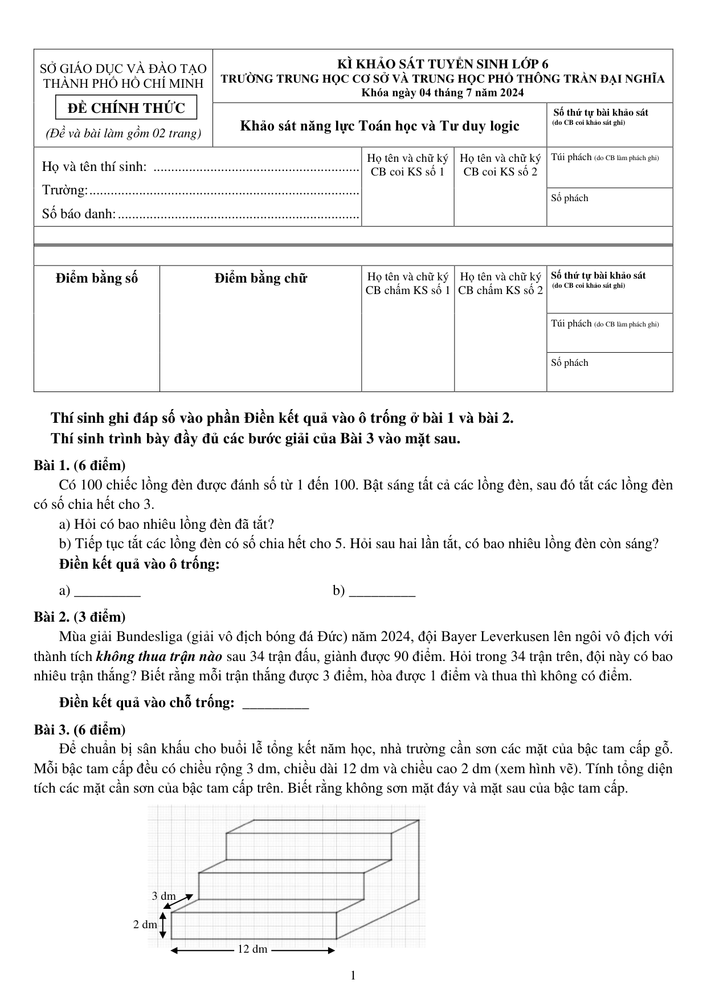
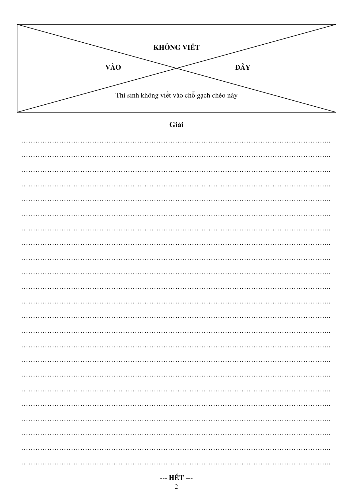
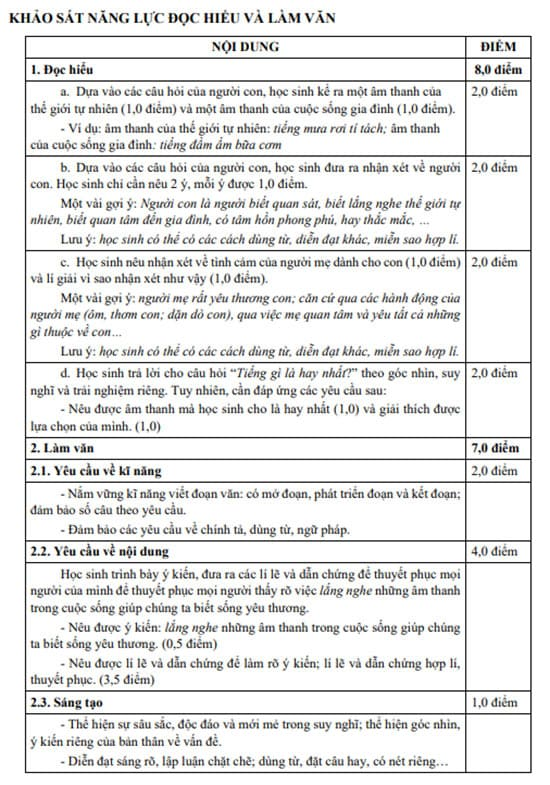
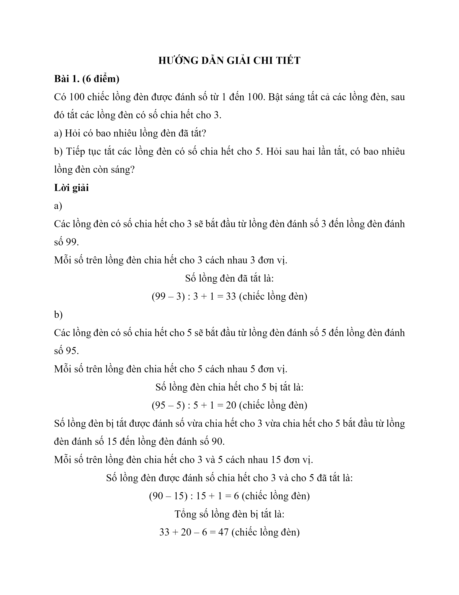
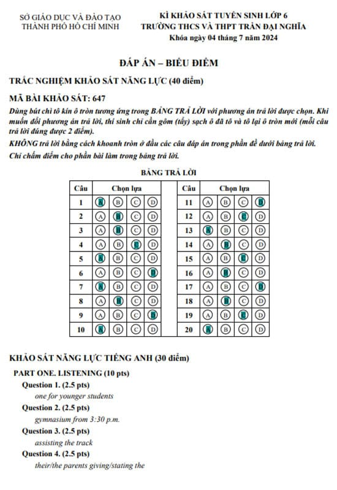
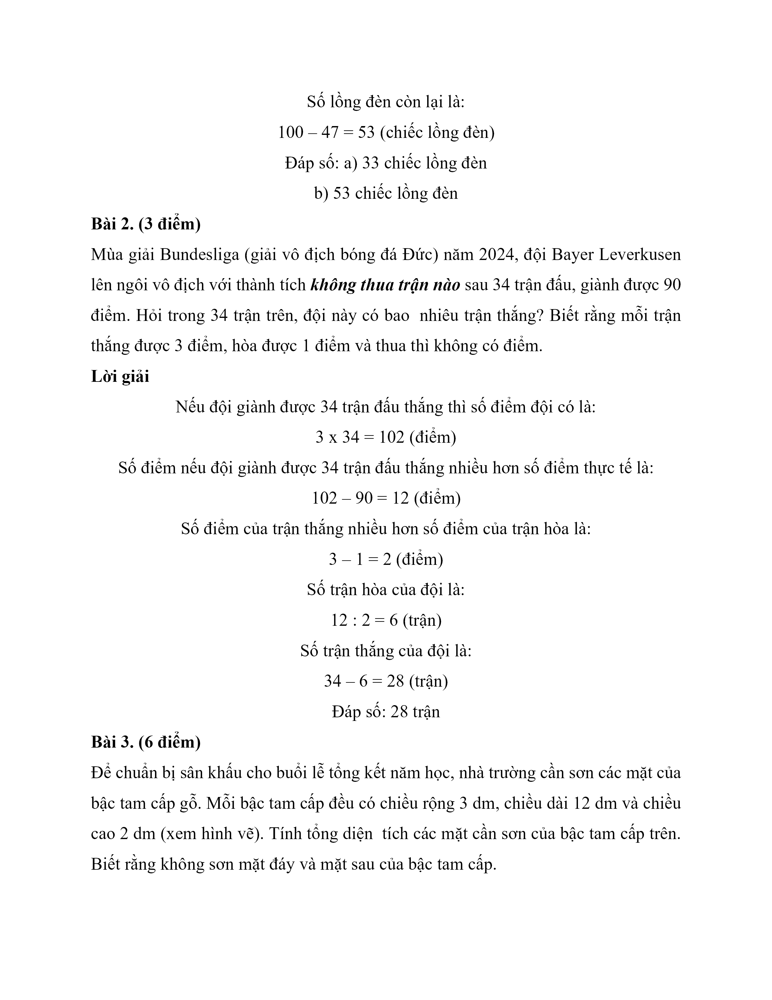
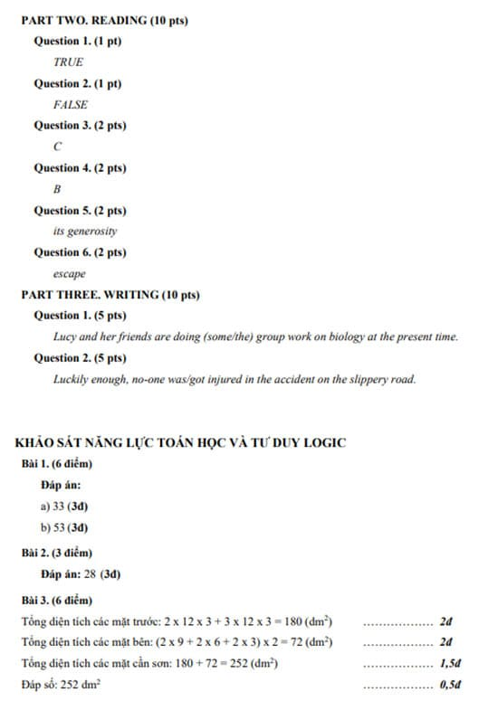
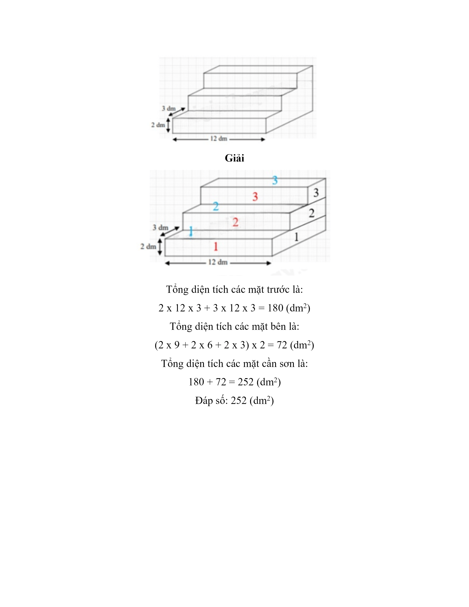
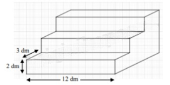

# Đề Toán vào 6 — Trần Đại Nghĩa (2024)

Bài 1. (6 điểm)

Có 100 chiếc lồng đèn được đánh số từ 1 đến 100. Bật sáng tất cả các lồng đèn, sau đó tắt các lồng đèn có số chia hết cho 3.

a) Hỏi có bao nhiêu lồng đèn đã tắt?

b) Tiếp tục tắt các lồng đèn có số chia hết cho 5. Hỏi sau hai lần tắt, có bao nhiêu lồng đèn còn sáng?

Bài 2. (3 điểm)

Mùa giải Bundesliga (giải vô địch bóng đá Đức) năm 2024, đội Bayer Leverkusen lên ngôi vô địch với thành tích không thua trận nào sau 34 trận đấu, giành được 90 điểm. Hỏi trong 34 trận trên, đội này có bao nhiêu trận thắng? Biết rằng mỗi trận thắng được 3 điểm, hòa được 1 điểm và thua thì không có điểm.

Bài 3. (6 điểm)

Để chuẩn bị sân khấu cho buổi lễ tổng kết năm học, nhà trường cần sơn các mặt của bậc tam cấp gỗ. Mỗi bậc tam cấp đều có chiều rộng 3 dm, chiều dài 12 dm và chiều cao 2 dm (xem hình vẽ). Tính tổng diện tích các mặt cần sơn của bậc tam cấp trên. Biết rằng không sơn mặt đáy và mặt sau của bậc tam cấp.

## Hình minh họa

*(Ảnh trang đề / scan — có thể là cả trang)*

