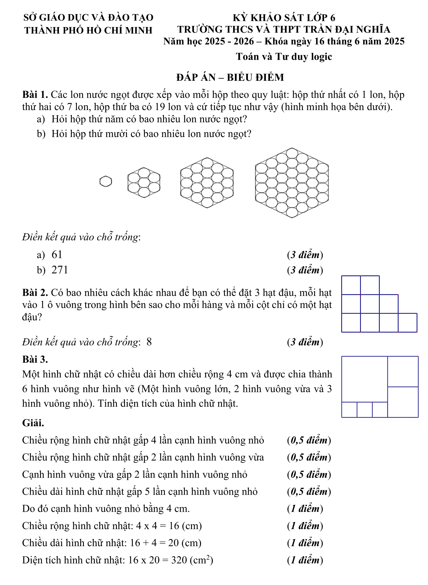
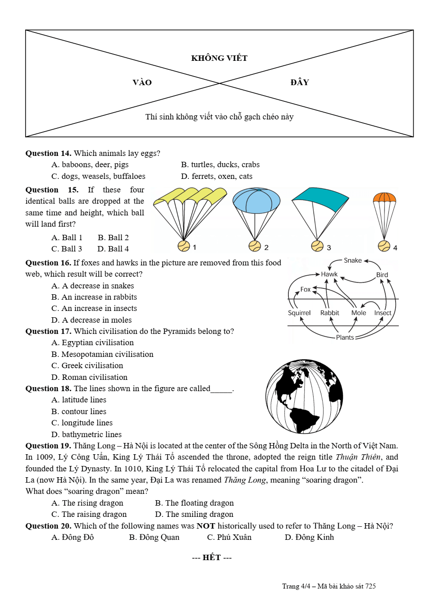
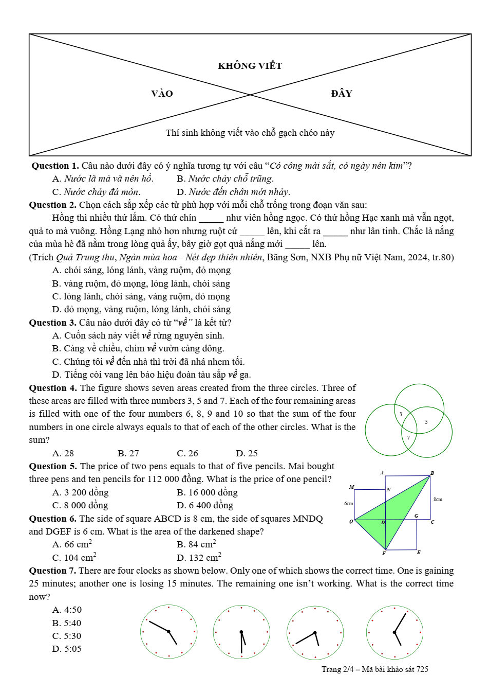
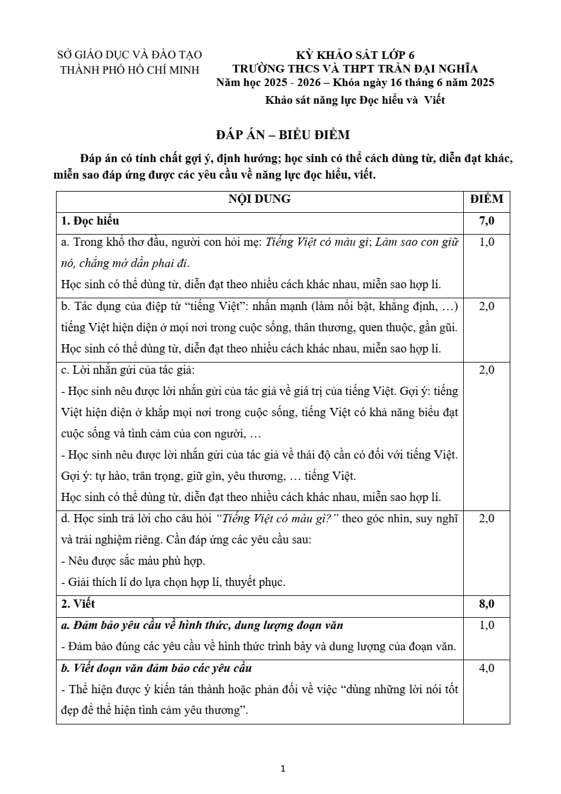
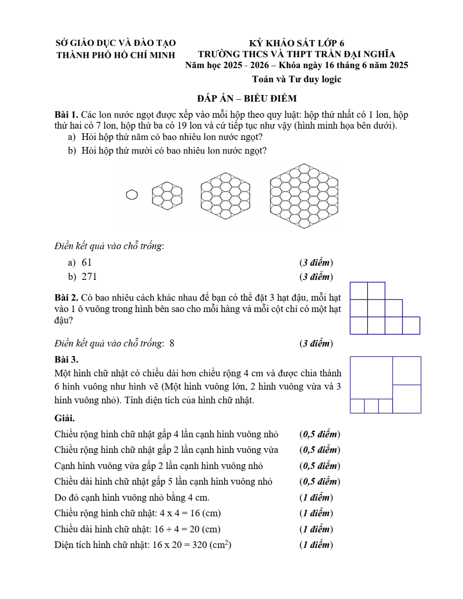
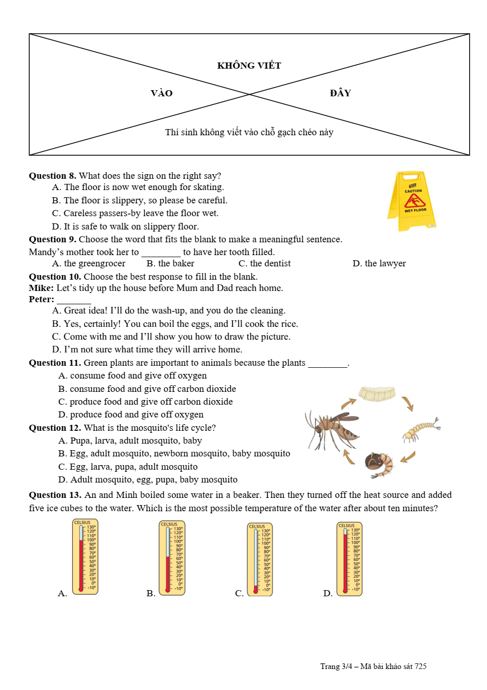
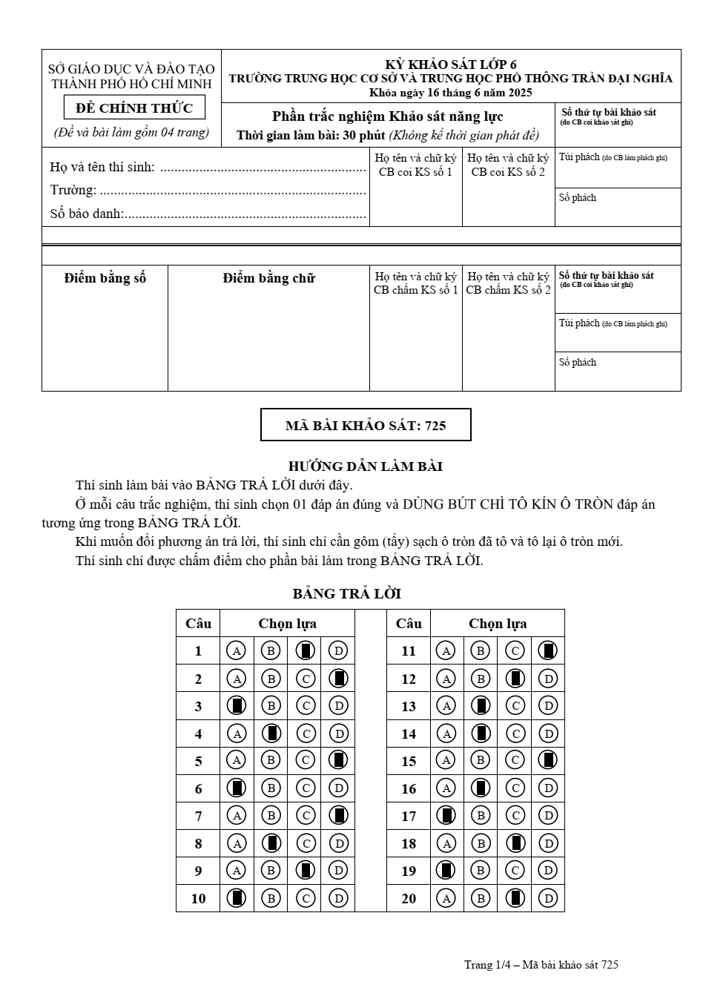
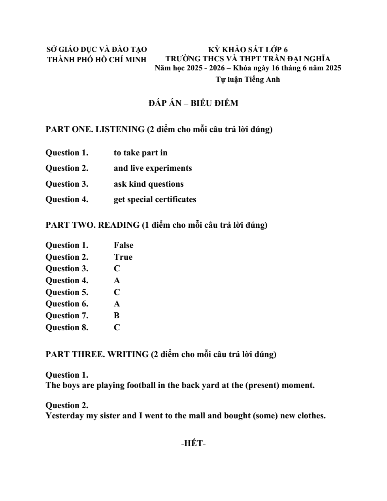

# Đề Toán học và Tư duy logic — Trần Đại Nghĩa 2025–2026

> Trường: THCS-THPT Trần Đại Nghĩa
> Ngày thi: 16/6/2025
> Năm học: 2025–2026
> Phần: Toán học và Tư duy logic (trong tự luận ~60 phút)

---

## Bài 1

Các lon nước ngọt được xếp vào các hộp theo một quy luật.

- Hộp thứ nhất có **1** lon.
- Hộp thứ hai có **7** lon.
- Hộp thứ ba có **19** lon.

Các hộp tiếp theo cũng được xếp theo quy luật như trên.

**a)** Hỏi hộp thứ **5** có bao nhiêu lon nước ngọt?

**b)** Hỏi hộp thứ **10** có bao nhiêu lon nước ngọt?

---

## Bài 2

Có một hình gồm **3 hàng** và **3 cột** ô vuông.

Bạn có **3 hạt đậu**.

Hãy đặt mỗi hạt đậu vào một ô vuông sao cho:

- Mỗi hạt nằm ở một ô khác nhau.
- Mỗi hàng chỉ có một hạt đậu.
- Mỗi cột chỉ có một hạt đậu.

**Câu hỏi**

Có tất cả bao nhiêu cách khác nhau để đặt 3 hạt đậu thỏa mãn các điều kiện trên?

---

## Bài 3

Một hình chữ nhật được chia thành **6 hình vuông**, gồm:

- **1** hình vuông lớn
- **2** hình vuông vừa
- **3** hình vuông nhỏ

theo cách sắp xếp như hình minh họa trong đề.

Biết rằng **chiều dài hình chữ nhật lớn hơn chiều rộng 4 cm**.

**Câu hỏi**

Hãy tính diện tích của hình chữ nhật.

## Hình minh họa

*(Ảnh cả trang đề)*

