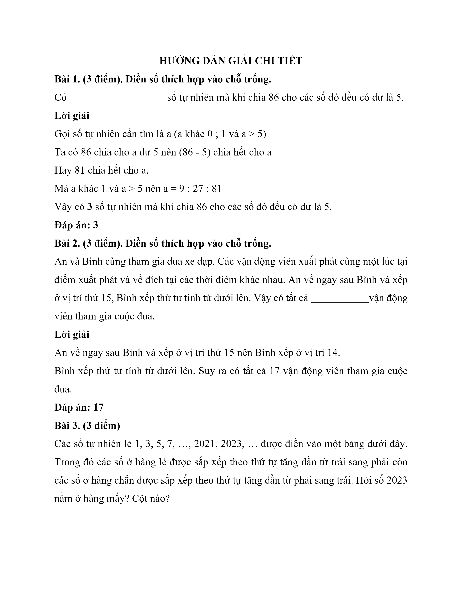

# Đề Toán vào lớp 6 — THCS Trần Quốc Toản 1 (2023)

> Không nhầm với đề khảo sát chung Thủ Đức 2025 (file `2025-toan-de.md`).

---

Bài 1. (3 điểm)
 Điền số thích hợp vào chỗ trống.

 Có                            số tự nhiên mà khi chia 86 cho các số đó đều có dư là 5.

 Bài 2. (3 điểm)
 Điền số thích hợp vào chỗ trống.

 An và Bình cùng tham gia đua xe đạp. Các vận động viên xuất phát cùng một lúc tại điểm xuất phát và về đích tại các thời điểm khác nhau. An về ngay sau Bình và xếp ở vị trí thứ 15, Bình xếp thứ tư tính từ dưới lên. Vậy có tất cả                        vận động viên tham gia cuộc đua.

 Bài 3. (3 điểm)
 Các số tự nhiên lẻ 1, 3, 5, 7, …, 2021, 2023, … được điền vào một bảng dưới đây. Trong đó các số ở hàng lẻ được sắp xếp theo thứ tự tăng dần từ trái sang phải còn các số ở hàng chẵn được sắp xếp theo thứ tự tăng dần từ phải sang trái. Hỏi số 2023 nằm ở hàng mấy? Cột nào?

 Điền đáp số vào chỗ trống.
 Hàng:                                                                    Cột:

 Bài 4. (6 điểm)
 Một mảnh đất hình chữ nhật có chiều dài gấp ba lần chiều rộng. Nếu tăng chiều dài thêm 1 m và tăng chiều rộng thêm 1 m thì được mảnh đất hình chữ nhật mới có diện tích hơn diện tích mảnh đất lúc đầu là $$17\,\mathrm{m}^{2}$$ .

 a) Vẽ một hình biểu diễn mảnh đất lúc đầu và lúc sau.

 b) Tính diện tích của mảnh đất lúc đầu.

## Hình minh họa

*(Ảnh trang đề / scan — có thể là cả trang)*

